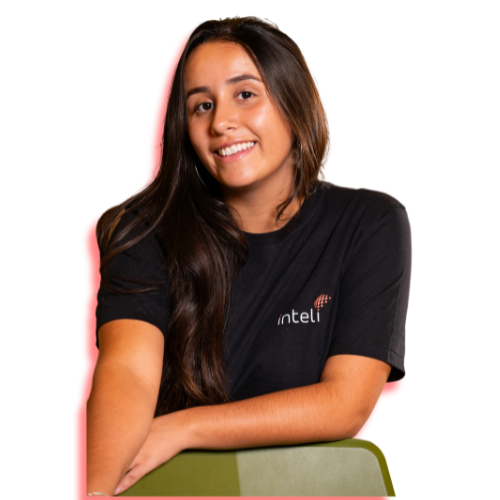

# Inteli - Instituto de Tecnologia e Liderança 

 

# Nome do Projeto: Fechadura Apontada

## Grupo 4 Apontados 

## 👨‍🎓 Integrantes: 

  <table>
    <tr>
      <td align="center"><a href="https://www.linkedin.com/in/fernando-soares-oliveira/"> <b>Fernando Oliveira</b></a></td>
      <td align="center"><a href="https://www.linkedin.com/in/bernardofmeirelles/"> <b>Bernardo Meirelles</b></a></td>
      <td align="center"><a href="https://www.linkedin.com/in/larissa-temoteo/"> <b>Larissa Temoteo</b></a></td>
      <td align="center"><a href="https://www.linkedin.com/in/j%C3%BAlia-alvesdejesus/"> <b>Júlia Alves<//b></a></td>
      <td align="center"><a href="https://www.linkedin.com/in/tainacortez/"> <b>Tainá Cortez</b></a></td>
      <td align="center"><a href="https://www.linkedin.com/in/julia-lika-ishikawa/" > <b>Julia Lika</b></a></td>
    </tr>
  </table>

## 👩‍🏫 Professores:

### Orientador(a) 
- <a href="https://www.linkedin.com/in/fabiana-martins-de-oliveira-8993b0b2/"> Fabiana Martins de Oliveira</a>
### Instrutores
- <a href="https://www.linkedin.com/in/renato-penha/">Renato penha</a>
- <a href="https://www.escavador.com/sobre/6887412/bruna-mayer-costa">Bruna Mayer</a> 
- <a href="https://www.linkedin.com/in/fernando-pizzo-208b526a/"> Fernando Pizzo</a> 
- <a href="https://www.linkedin.com/in/fillipe-resina-b2211a22/">Felipe Resina</a>
- <a href="https://www.linkedin.com/in/vthayashi/">Victor Hayashi</a> 
- <a href="https://www.linkedin.com/in/filipe-gon%C3%A7alves-08a55015b/"> Filipe Gonçalves</a>

## 📜 Descrição

A solução proposta é o desenvolvimento de um dispositivo IoT utilizando Arduino, com um leitor biométrico para controlar a entrada e saída de alunos no Instituto Apontar. O sistema realizará a autenticação dos indivíduos através de suas impressões digitais e registrará os horários de entrada e saída automaticamente. A proposta visa garantir um controle de presença preciso, eliminando a necessidade de registros manuais e proporcionando maior segurança ao restringir o acesso somente aos indivíduos autorizados.

Solução:
https://youtu.be/MeEIctXAD38

## 📁 Estrutura de Pastas

Dentre os arquivos e pastas presentes na raiz do projeto, definem-se:

- **.git**: Diretório gerado pelo Git para controle de versão do projeto. Contém arquivos de configuração e histórico de commits.

- **.venv**: Ambiente virtual configurado para o projeto, incluindo bibliotecas Python necessárias. Subdividido em:
  - **Lib**: Contém os pacotes instalados no ambiente.
  - **Scripts**: Ferramentas para execução do ambiente virtual.
  - **pyvenv.cfg**: Arquivo de configuração do ambiente virtual.

- **assets**: Contém arquivos relacionados à parte visual e gráfica do projeto, como imagens, vídeos e logotipos.

- **document**: Inclui toda a documentação do projeto. Subdividido em:
  - **outros**: Pasta para documentos complementares.
  - **documentacao.md**: Arquivo com a documentação principal.
  - **Manual de Instruções Módulo 4 - v3**: Documento específico detalhando instruções do projeto.

- **src**: Diretório com todo o código-fonte do projeto. Subdividido em:
  - **Firmware**: Arquivos do firmware necessário para o dispositivo.
  - **MQTT**: Scripts relacionados à comunicação MQTT, incluindo:
    - **mqtt-acesso.ino**
    - **mqtt-cadastro.ino**
  - **protótipo**: Contém diferentes versões de protótipos do projeto:
    - **codigowokwi.cc**: Código desenvolvido no simulador Wokwi.
    - **protótipo_v1.ino**: Primeira versão do código do protótipo.

- **.gitattributes**: Arquivo para configuração de atributos específicos no Git.

- **.gitignore**: Define os arquivos e pastas que devem ser ignorados pelo Git durante o versionamento.

- **README.md**: Arquivo principal com informações gerais e introdutórias  e explicações sobre o projeto.

## 🔧 Instalação

## 🗃 Histórico de lançamentos

* 0.5.0 - 
    - Finalização projeto 
* 0.4.0 - 
    - Backend 
* 0.3.0 - 
    - Frontend 
* 0.2.0 - 
    - Entendimento do negócio
* 0.1.0 - 
    - Encontros com o parceiro

## 📋 Licença/License

Fechadura Apontada by Inteli is licensed under <a href="https://creativecommons.org/licenses/by/4.0/?ref=chooser-v1" target="_blank" rel="license noopener noreferrer" style="display:inline-block;">CC BY 4.0</a>

