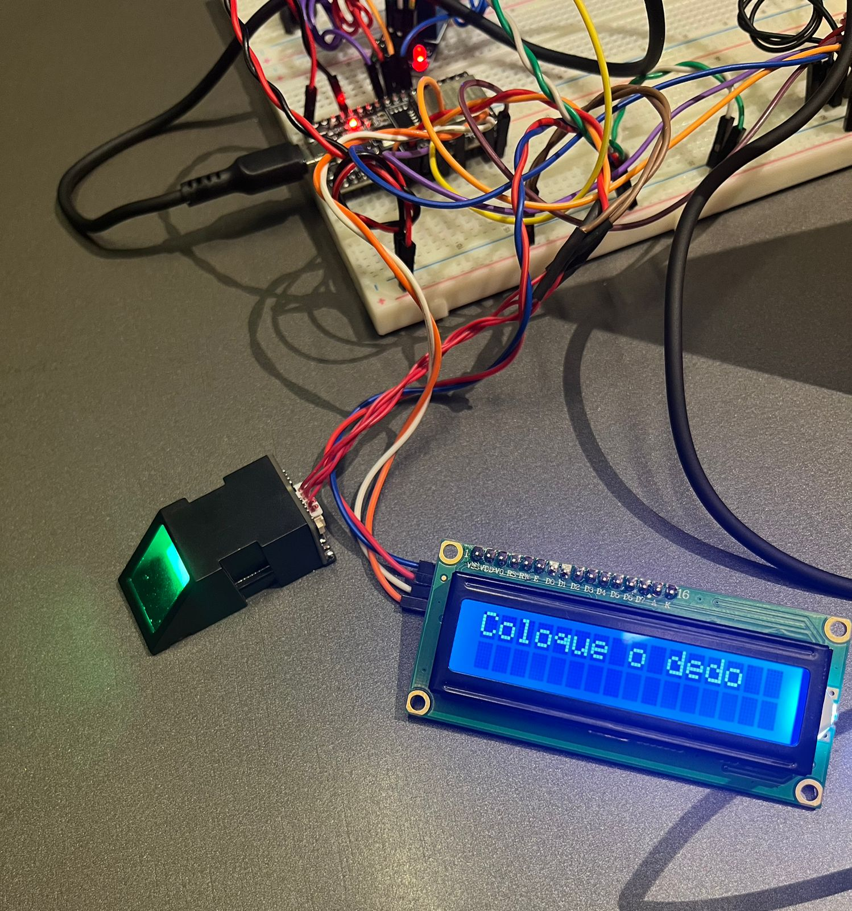

# Documentação IoTDoc - Módulo 4 - Inteli

**_Os trechos em itálico servem apenas como guia para o preenchimento da seção. Por esse motivo, não devem fazer parte da documentação final_**

## Grupo 4 -  Apontados

#### Nomes dos integrantes do grupo:
<div align="center">
  <table>
    <tr>
      <td align="center"><a href="https://www.linkedin.com/in/fernando-soares-oliveira/"><br><sub><b>Fernando Oliveira</b></sub></a></td>
      <td align="center"><a href="https://www.linkedin.com/in/bernardofmeirelles/"><br><sub><b>Bernardo Meirelles</b></sub></a></td>
      <td align="center"><a href="https://www.linkedin.com/in/larissa-temoteo/"><br><sub><b>Larissa Temoteo</b></sub></a></td>
      <td align="center"><a href="https://www.linkedin.com/in/j%C3%BAlia-alvesdejesus/"><br><sub><b>Júlia Alves<//b></sub></a></td>
      <td align="center"><a href="https://www.linkedin.com/in/tainacortez/"><br><sub><b>Tainá Cortez</b></sub></a></td>
      <td align="center"><a href="https://www.linkedin.com/in/julia-lika-ishikawa/" ><br><sub><b>Julia Lika</b></sub></a></td>
    </tr>
  </table>
</div>


## Sumário

- [1. Introdução](#c1)
  - [1.1. Objetivos](#c1.1)
  - [1.2. Proposta da Solução](#c1.2)
  - [1.3. Justificativa](#c1.3)

- [2. Metodologia](#c2)
  - [2.1. Introdução](#c2.1)
  - [2.2. Ponto de Vista Empresarial](#c2.2)
  - [2.3. Ponto de Vista de Informação](#c2.3)
  - [2.4. Ponto de Vista Computacional](#c2.4)
  - [2.5. Ponto de Vista de Engenharia](#c2.5)
  - [2.6. Ponto de Vista de Tecnologia](#c2.6)

- [3. Desenvolvimento e Resultados](#c3)
  - [3.1. Domínio de Fundamentos de Negócio](#c3.1)
    - [3.1.1. Contexto da Indústria](#c3.1.1)
      - [3.1.1.1. Cinco Forças de Porter](#c3.1.1.1)
    - [3.1.2. Análise SWOT](#c3.1.2)
      - [3.1.2.1. Introdução](#c3.1.2.1)
      - [3.1.2.2. Forças (Strengths)](#c3.1.2.2)
      - [3.1.2.3. Fraquezas (Weaknesses)](#c3.1.2.3)
      - [3.1.2.4. Oportunidades (Opportunities)](#c3.1.2.4)
      - [3.1.2.5. Ameaças (Threats)](#c3.1.2.5)
      - [3.1.2.6. Conclusão](#c3.1.2.6)
    - [3.1.3. Descrição da Solução a ser Desenvolvida](#c3.1.3)
      - [3.1.3.1. Qual é o problema a ser resolvido](#c3.1.3.1)
      - [3.1.3.2. Qual a solução proposta](#c3.1.3.2)
      - [3.1.3.3. Como a solução proposta deverá ser utilizada](#c3.1.3.3)
      - [3.1.3.4. Quais os benefícios trazidos pela solução proposta](#c3.1.3.4)
      - [3.1.3.5. Qual será o critério de sucesso e qual medida será utilizada para o avaliar](#c3.1.3.5)
    - [3.1.4. Value Proposition Canvas](#c3.1.4)
      - [3.1.4.1. Introdução](#c3.1.4.1)
      - [3.1.4.2. Seções](#c3.1.4.2)
        - [3.1.4.2.1. Tarefas do Cliente](#c3.1.4.2.1)
        - [3.1.4.2.2. Dores do Cliente](#c3.1.4.2.2)
        - [3.1.4.2.3. Ganhos do Cliente](#c3.1.4.2.3)
        - [3.1.4.2.4. Produto e Serviço](#c3.1.4.2.4)
        - [3.1.4.2.5. Aliviadores de Dores](#c3.1.4.2.5)
        - [3.1.4.2.6. Criadores de Ganhos](#c3.1.4.2.6)
      - [3.1.4.3. Conclusão](#c3.1.4.3)
    - [3.1.5. Matriz de Riscos](#c3.1.5)
    - [3.1.6. Política de Privacidade de acordo com a LGPD](#c3.1.6)
      - [3.1.6.1. INSTITUTO APONTAR](#c3.1.6.1)
        - [3.1.6.1.1. Controlador e Operador dos Dados](#c3.1.6.1.1)
        - [3.1.6.1.2. Uso de Dados Pessoais](#c3.1.6.1.2)
        - [3.1.6.1.3. Compartilhamento de Dados Pessoais com Terceiros](#c3.1.6.1.3)
        - [3.1.6.1.4. Segurança de Dados Pessoais](#c3.1.6.1.4)
        - [3.1.6.1.5. Direitos dos Titulares de Dados](#c3.1.6.1.5)
        - [3.1.6.1.6. Contato](#c3.1.6.1.6)
        - [3.1.6.1.7. Mudanças na Política de Privacidade](#c3.1.6.1.7)
    - [3.1.7. Bill of Material (BOM)](#c3.1.7)
      - [3.1.7.1. Tabela de Componentes](#c3.1.7.1)
    - [3.1.8. Tópicos adicionais identificados](#c3.1.8)
  - [3.2. Domínio de Fundamentos de Experiência de Usuário](#c3.2)
    - [3.2.1. Personas](#c3.2.1)
      - [3.2.1.1. Definição de Personas](#c3.2.1.1)
      - [3.2.1.2. Pesquisas realizadas](#c3.2.1.2)
    - [3.2.2. Jornada do Usuário e Storyboard](#c3.2.2)
  - [3.3. Solução Técnica](#c3.3)
    - [3.3.1. Requisitos Funcionais](#c3.3.1)
    - [3.3.2. Requisitos Não Funcionais](#c3.3.2)
    - [3.3.3. Arquitetura da Solução](#c3.3.3)
    - [3.3.4. Arquitetura do Protótipo](#c3.3.4)
    - [3.3.5. Arquitetura Refinada da Solução](#c3.3.5)
  - [3.4. Resultados](#c3.4)
    - [3.4.1. Protótipo Inicial do Projeto usando o Simulador Wokwi](#c3.4.1)
    - [3.4.2. Protótipo Físico do Projeto (offline)](#c3.4.2)
    - [3.4.3. Protótipo do Projeto com MQTT e I2C](#c3.4.3)
      - [3.4.3.1. Definição de MQTT e I2C](#c3.4.3.1)
      - [3.4.3.2. Configuração do Broker Privado](#c3.4.3.2)
      - [3.4.3.3. DISCLAIMER](#c3.4.3.3)
      - [3.4.3.4. Uso dos Protocolos MQTT e I2C no cadastro de digitais](#c3.4.3.4)
    - [3.4.4. Protótipo Físico do Projeto (online)](#c3.4.4)
    - [3.4.5. Protótipo Final do Projeto](#c3.4.5)

- [4. Conclusões e Recomendações](#c4)
- [5. Referências](#c5)

<br>


# <a name="c1"></a>1. Introdução (sprint 1)

&nbsp;&nbsp;&nbsp;&nbsp;O Instituto Apontar é uma organização educacional de médio porte, localizada no Rio de Janeiro, que atua no desenvolvimento de crianças e jovens com altas habilidades e superdotação. Seu trabalho é voltado para a identificação e o desenvolvimento desses indivíduos, oferecendo suporte especializado para que possam alcançar seu pleno potencial acadêmico e profissional. Posicionado como uma referência na área de educação inclusiva, o Instituto busca expandir suas operações e melhorar o controle sobre a presença de seus alunos no campus, de forma eficiente e tecnológica. O problema atual envolve a dificuldade em gerenciar e monitorar com precisão a entrada e saída dos alunos de suas dependências.

## <a name="c1.1"></a> 1.1. Objetivos

<!--_Descreva os objetivos gerais e específicos do seu parceiro de negócios, sem entrar em méritos técnicos ou especificações de tecnologia. Aqui importa o objetivo em si, não os meios para se chegar até lá._Este texto está oculto no Markdown -->


&nbsp;&nbsp;&nbsp;&nbsp;O Instituto Apontar, focado no desenvolvimento de jovens com altas habilidades, busca modernizar seus processos administrativos, especialmente no que diz respeito ao controle de presença dos alunos. Atualmente, o registro de presença é feito de forma manual, utilizando planilhas no Google Sheets, o que torna o processo suscetível a falhas humanas, como erros de digitação e inconsistência nos dados. Além disso, esse método exige um trabalho administrativo constante para atualizar e consolidar as informações, o que consome tempo e recursos da equipe.

&nbsp;&nbsp;&nbsp;&nbsp;Diante desse cenário, um dos objetivos principais do Instituto é automatizar o controle de presença, reduzindo a necessidade de registros manuais e garantindo a integridade dos dados. A automatização permitirá maior precisão no monitoramento da frequência dos alunos, além de facilitar a geração de relatórios e logs detalhados, que poderão ser utilizados para análise de desempenho e acompanhamento da assiduidade.


## <a name="c1.2"></a> 1.2. Proposta da solução

<!-- _Descreva resumidamente sua proposta de solução (em alto nível) e como essa solução pretende resolver o problema, atendendo os objetivos listados na seção anterior._ Este texto está oculto no Markdown-->

&nbsp;&nbsp;&nbsp;&nbsp;A solução proposta é o desenvolvimento de um dispositivo IoT utilizando Arduino, com um leitor biométrico para controlar a entrada e saída de alunos no Instituto Apontar. O sistema realizará a autenticação dos indivíduos através de suas impressões digitais e registrará os horários de entrada e saída automaticamente. A proposta visa garantir um controle de presença preciso, eliminando a necessidade de registros manuais e proporcionando maior segurança ao restringir o acesso somente aos indivíduos autorizados.

&nbsp;&nbsp;&nbsp;&nbsp;Especificamente, o Instituto pretende:

&nbsp;&nbsp;&nbsp;&nbsp;Eliminar o controle manual de presença, substituindo o processo atual por um sistema automatizado. Além de,facilitar a geração de relatórios sobre a presença dos alunos, com dados atualizados em tempo real, e com isso, assegurar maior eficiência e transparência na gestão da frequência, permitindo que o corpo administrativo se concentre em outras atividades.

## <a name="c1.3"></a> 1.3. Justificativa

<!--_Faça uma breve defesa de sua proposta de solução, escreva sobre seus potenciais, seus benefícios e como ela se diferencia._ -->

&nbsp;&nbsp;&nbsp;&nbsp; A solução proposta, que envolve a implementação de um dispositivo IoT com Arduino e um leitor biométrico para automatizar o controle de presença no Instituto Apontar, se justifica por diversos fatores que refletem seu potencial para otimizar o funcionamento da instituição. Atualmente, o controle manual de presença, realizado via Google Sheets, é um processo que demanda esforço e tempo, além de estar suscetível a erros humanos. Com a solução automatizada, todos esses problemas são mitigados, trazendo ganhos expressivos em eficiência e precisão.

&nbsp;&nbsp;&nbsp;&nbsp;Em primeiro lugar, a automação reduz a possibilidade de falhas no registro de entrada e saída dos alunos, garantindo maior confiabilidade nas informações. A substituição do registro manual por um sistema de biometria elimina erros de digitação e garante que apenas pessoas autorizadas possam registrar sua presença, promovendo mais segurança no acesso às dependências do Instituto.

&nbsp;&nbsp;&nbsp;&nbsp;Além disso, a proposta contempla a geração automática de relatórios e logs, facilitando o acompanhamento de frequência de maneira prática e em tempo real. Isso permite que a equipe administrativa tenha acesso rápido e preciso a dados consolidados, otimizando o processo de análise e possibilitando decisões mais embasadas sobre a assiduidade dos alunos. A capacidade de gerar logs detalhados também garante maior transparência e rastreabilidade no controle de presença, fator essencial para uma gestão eficiente.

&nbsp;&nbsp;&nbsp;&nbsp;Outro ponto importante é que a solução é escalável e de baixo custo, utilizando componentes como o Arduino, que são acessíveis financeiramente e amplamente suportados pela comunidade de desenvolvedores. Isso permite que o Instituto Apontar modernize suas operações sem precisar de grandes investimentos em infraestrutura tecnológica.

&nbsp;&nbsp;&nbsp;&nbsp;Em resumo, a solução proposta diferencia-se por sua capacidade de aumentar a eficiência operacional, melhorar a segurança e gerar dados precisos e acessíveis. Ao automatizar o controle de presença e integrar relatórios automáticos, o Instituto Apontar será capaz de reduzir o trabalho manual e se concentrar em seu objetivo principal: o desenvolvimento dos alunos com altas habilidades.

# <a name="c2"></a>2. Metodologia (sprint 3)

## <a name="c2"></a>2. Metodologia (sprint 3)

### Introdução

&nbsp;&nbsp;&nbsp;&nbsp;Este documento descreve as etapas da metodologia RM-ODP (Reference Model of Open Distributed Processing) utilizadas no desenvolvimento do sistema. A metodologia RM-ODP oferece uma abordagem estruturada para modelar sistemas distribuídos através de cinco pontos de vista principais.

### 1. Ponto de Vista Empresarial (Enterprise Viewpoint)

&nbsp;&nbsp;&nbsp;&nbsp;O ponto de vista empresarial foca nos objetivos e políticas de negócio que o sistema deve suportar. Conforme especificado na **ISO/IEC 10746-2**, ele define o propósito do sistema no contexto da organização, descrevendo o cenário de negócios e as necessidades organizacionais, além de estabelecer as políticas e regras de governança que orientam as operações do sistema. Essa abordagem permite analisar de forma estruturada os objetivos de negócios e os papéis desempenhados pelos diferentes atores.

### 2. Ponto de Vista de Informação (Information Viewpoint)

&nbsp;&nbsp;&nbsp;&nbsp;O ponto de vista de informação estrutura e descreve os dados e informações manipulados pelo sistema. De acordo com a **ISO/IEC 10746-3**, esse ponto de vista especifica os tipos de informações processadas, define as relações entre os dados e suas restrições, e considera a estrutura e o significado semântico das informações. Ele é fundamental para garantir a consistência e a integridade dos dados no sistema distribuído.

### 3. Ponto de Vista Computacional (Computational Viewpoint)

&nbsp;&nbsp;&nbsp;&nbsp;O ponto de vista computacional organiza o sistema em componentes funcionais independentes e descreve suas interações. Conforme apresentado na **ISO/IEC 10746-4**, ele abstrai aspectos de infraestrutura para focar na funcionalidade e comunicação entre componentes, detalhando as interfaces e as interações. Essa abordagem facilita o desenvolvimento de sistemas escaláveis e modulares.

### 4. Ponto de Vista de Engenharia (Engineering Viewpoint)

&nbsp;&nbsp;&nbsp;&nbsp;O ponto de vista de engenharia especifica a infraestrutura técnica que suporta a distribuição e a comunicação entre os componentes do sistema. Como descrito na **ISO/IEC 10746-5**, ele aborda aspectos como conectividade, distribuição de dados, mecanismos de segurança, controle de desempenho e serviços de suporte necessários para a interoperabilidade do sistema. Essa visão assegura que a infraestrutura técnica atenda aos requisitos do sistema distribuído.

### 5. Ponto de Vista de Tecnologia (Technology Viewpoint)

&nbsp;&nbsp;&nbsp;&nbsp;O ponto de vista de tecnologia detalha as escolhas tecnológicas utilizadas para implementar o sistema. De acordo com a **ISO/IEC 10746-6**, ele especifica plataformas, linguagens, protocolos e normas que garantem compatibilidade e interoperabilidade entre os componentes tecnológicos. A escolha de tecnologias alinhadas a padrões de mercado é essencial para a implementação eficaz do sistema.

---

### Referências

- [**ISO/IEC 10746** - Information technology — Open Distributed Processing — Reference Model.](https://committee.iso.org/sites/jtc1sc7/home/projects/flagship-standards/isoiec-10746.html)
  - Parte 2: Conceitos Fundamentais
  - Parte 3: Especificação da Arquitetura
  - Parte 4: Organização Computacional
  - Parte 5: Requisitos de Engenharia
  - Parte 6: Especificação de Tecnologia

# <a name="c3"></a>3. Desenvolvimento e Resultados 

## <a name="c3.1"></a> 3.1. Domínio de Fundamentos de Negócio

_Link para os templates de negócios: https://drive.google.com/drive/folders/1lTqisJ_gxxtc5J5aXM8ula2kQ4MsII_M?usp=sharing_

### <a name="c3.1.1"></a> 3.1.1. Contexto da Indústria

&nbsp;&nbsp;&nbsp;&nbsp;O Instituto Apontar é uma organização não governamental (ONG) que se dedica ao desenvolvimento cognitivo e emocional de crianças e adolescentes de famílias de baixa renda, com foco em altas habilidades/superdotação. O Instituto visa o atendimento social, não lucrativo, portanto, não apresenta concorrentes diretos e seu "mercado" é definido pelo público atendido, não por competição com organizações semelhantes. Outras ONGs que também atuam no campo educacional, de desenvolvimento social e apoio a famílias vulneráveis podem ser vistas mais como colaboradoras que como concorrentes.

&nbsp;&nbsp;&nbsp;&nbsp;Apesar de não se classificarem como concorrentes diretos , é importante mencionar outras instituições que atuam no mesmo campo que o Apontar se encontra e se classificam como concorrentes indiretos. Isso é fundamental para compreender o ecossistema colaborativo que caracteriza o terceiro setor. Segundo Salamon e Anheier (1997), "o terceiro setor é composto por organizações que são formalmente constituídas, têm estrutura não governamental, gestão própria, não visam lucro e utilizam significativamente mão de obra voluntária". O Instituto Ayrton Senna, a Fundação Lemann e o Instituto Rodrigo Mendes são organizações que atuam no mesmo campo que o Instituto Apontar.
  1. **Instituto Ayrton Senna:** <br>
      O Instituto Ayrton Senna foi fundado em 1994 com o objetivo de transformar a educação no Brasil, e tem seu nome inspirado no legado do piloto de Fórmula 1. Seu modelo de negócio foca na capacitação de educadores e na proposição de políticas públicas voltadas para a educação integral. O Instituto desenvolve soluções educacionais que impactam diretamente mais de 2,6 mil municípios brasileiros. Através de programas que visam melhorar a qualidade da educação pública, o Instituto busca promover experiências educacionais eficientes que possam ser replicadas em larga escala. (Instituto Ayrton Senna, 2023).

  2. **Fundação Lemann:** <br>
    A Fundação Lemann é uma organização sem fins lucrativos que visa melhorar a educação no Brasil por meio de formalçao de lideranças educacionais e do desenvolvimento de políticas públicas.  Seu modelo envolve parcerias com instituições educacionais e governos para implementar programas que promovem a inovação na área educacional. A fundação investe em projetos que buscam aumentar a equidade no acesso à educação de qualidade, além de apoiar iniciativas voltadas para a formação de professores e gestores (Fundação Lemann, 2023).

  3. **Instituto Rodrigo Mendes:** <br>
    O Instituto Rodrigo Mendes é uma ONG que trabalha para promover a inclusão de pessoas com deficiência na educação regular. Seu modelo se baseia na formação de professores e na criação de materiais pedagógicos adaptados, garantindo que todos os alunos tenham acesso ao aprendizado. A organização realiza pesquisas e desenvolve políticas públicas voltadas para a inclusão escolar, buscando sensibilizar a sociedade sobre a importância da diversidade no ambiente educacional (Instituto Rodrigo Mendes, 2023).
      
As atuais tendências do  terceiro setor refletem um movimento crescente de digitalização, personalização de serviços e sustentabilidade:
- **Digitalização**: A pandemia acelerou a adoção de tecnologias digitais nas ONGs, facilitando o acesso à educação e à gestão dos projetos sociais. Plataformas online para ensino e acompanhamento estão se tornando essenciais.
- **Personalização**: As organizações estão cada vez mais focadas em entender as necessidades específicas dos seus públicos-alvo para oferecer soluções adaptadas.
- **Sustentabilidade**: Existe uma crescente importância relacionada à sustentabilidade financeira das ONGs, com estratégias que incluem diversificação das fontes de financiamento e parcerias com empresas para garantir a continuidade dos projetos.

#### <a name="c3.1.1.1"></a> 3.1.1.1. Cinco Forças de Porter
&nbsp;&nbsp;&nbsp;&nbsp;Inserido em um setor caracterizado por uma diversidade de organizações sem fins lucrativos, o Instituto Apontar atua em um ambiente colaborativo que visa o desenvolvimento social e educacional de crianças e adolescentes com altas habilidades. A análise das Cinco Forças de Porter oferece uma visão abrangente das dinâmicas competitivas e colaborativas que o Instituto enfrenta, auxiliando na formulação de estratégias que maximizem seu impacto social.

&nbsp;&nbsp;&nbsp;&nbsp;As Cinco Forças de Porter são um modelo estratégico desenvolvido por Michael E. Porter em 1979, que analisa o ambiente competitivo de uma indústria. Essa ferramenta é útil não apenas para formular estratégias, mas também para a tomada de decisões. Para obter uma análise completa, as forças se dividem em: ameaça de entrada de novos concorrentes, ameaça de produtos substitutos, poder de negociação dos clientes, poder de negociação dos fornecedores e rivalidade entre os concorrentes.

&nbsp;&nbsp;&nbsp;&nbsp;Aplicando os conceitos das 5 Forças de Porter ao Instituto Apontar, conseguimos avaliar sua posição no ecossistema do terceiro setor e identificar os principais impulsionadores de sua atuação e os desfios existentes.

<div align="center">
  
  <sup>Figura 1 - Cinco Forças de Porter </sup>
  
  
  
  <sup>Fonte: Material produzido pelos autores (2024)</sup>
  
</div>

1. **Rivalidade entre Concorrentes**: A rivalidade é baixa. O Instituto Apontar não apresenta concorrentes diretos no sentido tradicional, ele opera em um ambiente onde outras ONGs atuam em áreas semelhantes, mas não competem pelo mesmo mercado. Instituições como o Instituto Ayrton Senna, a Fundação Lemann e o Instituto Rodrigo Mendes compartilham recursos e conhecimentos, fortalecendo a rede de apoio às crianças e adolescentes em situação vulnerável. Na visão micro, que é regionalizada, o foco está nas ONGs que atuam no Rio de Janeiro e que competem indiretamente com o Instituto. Já na visão macro, que abrange o nível nacional, entram em cena ONGs de alcance mais amplo, como o Instituto Alpha Lumen.

2. **Poder de Barganha dos Fornecedores**:  No contexto do Instituto Apontar, os "fornecedores" referem-se às fontes de financiamento(doadores) e apoio institucional.  O Instituto busca diversificar suas fontes de financiamento para reduzir a dependência de um único doador ou parceiro, fortalecendo sua posição financeira (Diário do Rio, 2023).
    
3. **Ameaça de Produtos Substitutos**: A ameaça de produtos substitutos no setor social é baixa, pois as soluções oferecidas pelo Instituto Apontar são adaptadas às necessidades específicas da população atendida, que exige serviços especializados e focados em altas habilidades e vulnerabilidade social. Embora outras formas de assistência social ou programas governamentais possam ser vistos como alternativas, a especificidade dos serviços do Instituto torna a substituição improvável. Para mitigar qualquer potencial ameaça, o Instituto deve continuar a inovar em suas abordagens educacionais e sociais.

4. **Ameaça de Novos Entrantes**: A ameaça de novos entrantes no setor é considerada baixa devido à especificidade dos serviços voltados para altas habilidades e à experiência consolidada do Instituto Apontar. Embora a entrada no terceiro setor seja relativamente fácil devido à baixa barreira à entrada, novos entrantes podem enfrentar desafios significativos relacionados à captação de recursos e à construção de credibilidade junto à comunidade atendida. O Instituto se beneficia da sua reputação construída ao longo dos anos para manter sua posição no mercado (Instituto Apontar, 2023).
    
5. **Poder de Barganha dos Clientes**: Os "clientes" do Instituto Apontar são as crianças e adolescentes atendidos, bem como suas famílias. O poder de barganha é baixo, pois muitas dessas famílias estão em situações vulneráveis e dependem da assistência oferecida pela ONG. No entanto, o feedback das famílias deve ser considerado na formulação das políticas do Instituto para garantir que suas necessidades sejam atendidas.

&nbsp;&nbsp;&nbsp;&nbsp;A análise das Cinco Forças de Porter evidencia que o Instituto Apontar atua em um ambiente colaborativo onde a rivalidade direta é limitada. Pprém,a necessidade constante de inovação e adaptação às necessidades da comunidade atendida, é fundamental para seu sucesso contínuo.

### <a name="c3.1.2"></a> 3.1.2. Análise SWOT (sprint 1)	

### <a name="c3.1.2.1"></a> 3.1.2.1. Introdução

&nbsp;&nbsp;&nbsp;&nbsp; A matriz SWOT é uma ferramenta estratégica que auxilia organizações a entenderem seu ambiente interno e externo, destacando suas forças (Strengths), fraquezas (Weaknesses), oportunidades (Opportunities) e ameaças (Threats). Ao aplicá-la, o Instituto Apontar pode identificar seus pontos de vantagem competitiva, entender onde há margem para melhorias, explorar oportunidades no ambiente educacional e preparar-se para possíveis riscos ou desafios. O objetivo da análise SWOT é fornecer uma visão clara e estruturada da posição atual da organização, facilitando a tomada de decisões mais assertivas e o planejamento estratégico futuro

A diferença entre altas habilidades e superdotação está no foco e na abrangência dos conceitos. **Altas habilidades** referem-se a indivíduos que apresentam desempenho excepcional em áreas específicas, como acadêmica, criativa, motora ou social, sem necessariamente serem altamente desenvolvidos em todas essas áreas. **Superdotação**, por outro lado, é um termo mais amplo e geralmente indica um alto potencial em múltiplos domínios, com habilidades cognitivas muito acima da média em diversas áreas. Enquanto toda pessoa superdotada apresenta altas habilidades, nem todo indivíduo com altas habilidades é considerado superdotado, já que o primeiro conceito pode ser mais localizado ou específico a uma área.

<div align="center">
  <sup>Figura 2 - Análise SWOT do Instituto Apontar.</sup>
  <br>
  
  <br>
  <sub>Fonte: Material produzido pelos autores (2024).
  </sub>
</div>

<br/>


### <a name="c3.1.2.2"></a> 3.1.2.2. Forças (Strengths)

1. **Expertise em Altas Habilidades**: O Instituto Apontar possui uma equipe especializada com profundo conhecimento no desenvolvimento de crianças com altas habilidades e superdotação, o que garante um atendimento de qualidade adaptado às necessidades específicas desse público.

2. **Impacto Emocional, Cognitivo na vida da criança**: O trabalho do Instituto tem um efeito positivo  no desenvolvimento emocional e cognitivo das crianças, proporcionando um ambiente de acolhimento que promove o bem-estar emocional e o aprendizado, pois clarea a mente da criança e justifica seu desempenho incomum perante outras crianças. Além disso evolui e suplementa (se necessário)o conhecimento do aluno Apontar

3. **Reputação e Confiança**: A reputação do Instituto como referência no atendimento a crianças superdotadas gera confiança em pais, educadores e parceiros, atraindo doadores e voluntários.

4. **Potencial de Parceria**: O Instituto tem grande potencial para formar parcerias com instituições públicas e privadas, devido ao interesse crescente nas áreas de educação, inovação e responsabilidade social corporativa. Além disso se alinha ao tópico S ( Social) do ESG


### <a name="c3.1.2.3"></a> 3.1.2.3. Fraquezas (Weaknesses)

1. **Dependência de Parcerias**: O Instituto depende significativamente de parcerias para o financiamento e expansão de suas operações, o que o torna vulnerável a mudanças nas prioridades desses parceiros.
   
2. **Recursos Limitados**: O orçamento restrito limitam a capacidade do Instituto de ampliar sua atuação e atender mais crianças em diferentes regiões do país dado que a atuação é só no Rio de Janeiro. 

3. **Atuação Regional**: A atuação do Instituto é majoritariamente regional, o que restringe o impacto em outras áreas do Brasil e a capacidade de expandir seus serviços para mais crianças.


### <a name="c3.1.2.4"></a> 3.1.2.4. Oportunidades (Opportunities)

1. **Expansão Nacional**: Existe um grande potencial para expandir o modelo do Instituto para outras regiões do Brasil, levando atendimento a mais crianças superdotadas que atualmente estão sem suporte adequado.

2. **Tecnologia Educacional**: O uso de ferramentas tecnológicas e plataformas digitais pode permitir que o Instituto alcance mais crianças, oferecendo uma educação personalizada, independente de barreiras físicas.

3. **Políticas Públicas**: O aumento da atenção das políticas públicas para a inclusão de crianças com necessidades especiais pode abrir novas parcerias e financiamentos governamentais.

4. **Apoio Corporativo**: A crescente responsabilidade social corporativa oferece oportunidades de parcerias com empresas que queiram apoiar causas educacionais, ajudando a ampliar o impacto e os recursos do Instituto.


### <a name="c3.1.2.5"></a> 3.1.2.5. Ameaças (Threats)


<div align="center">
  <sup>Figura 3 - Mapa de Ameaças do Instituto Apontar.</sup>
  <br>
  
  <br>
  <sub>Fonte: Material produzido pelos autores (2024).</sub>
</div>

<br/>


1. **Desinformação sobre Superdotação**: A falta de conhecimento da sociedade e de educadores sobre superdotação pode ser uma barreira para o Instituto, limitando a identificação e o atendimento adequado dessas crianças.

2. **Imprevisibilidade Econômica**: A instabilidade econômica do Brasil pode afetar o financiamento de projetos sociais, especialmente aqueles que dependem de doações e parcerias privadas.

3. **Concorrência com ONGs**: O aumento do número de ONGs atuando na área educacional pode aumentar a concorrência por recursos e parcerias, exigindo que o Instituto se destaque para continuar atraindo apoios.


### <a name="c3.1.2.6"></a> 3.1.2.6. Conclusão

&nbsp;&nbsp;&nbsp;&nbsp; A análise SWOT do Instituto Apontar revela um potencial significativo para crescimento e impacto na educação de crianças superdotadas. O sucesso do Instituto dependerá de maximizar suas oportunidades de parcerias, diversificar fontes de financiamento, expandir o uso de tecnologia e conscientizar a sociedade sobre superdotação.

Ampliar suas fontes de financiamento com uma estratégia de diversificação, incluindo doações corporativas, financiamento coletivo e participação em editais de inclusão educacional. A criação de um fundo de reserva pode ajudar a mitigar o impacto de crises econômicas.
Investir no uso de tecnologias educacionais, explorando plataformas online para alcançar regiões distantes e fornecer suporte contínuo e personalizado aos alunos, garantindo que mais crianças superdotadas possam ser identificadas e atendidas, independentemente de sua localização.
Desenvolver campanhas educativas com foco em conscientização, em parceria com redes de ensino, governos e meios de comunicação, para combater preconceitos e promover uma visão positiva e inclusiva das altas habilidades.
Fortalecer parcerias públicas e privadas, buscando tanto o apoio do governo quanto o engajamento de empresas comprometidas com a inclusão educacional. A participação em projetos de inovação social pode ser uma excelente forma de alavancar novas iniciativas.
Esses direcionamentos  podem não apenas garantir a continuidade e expansão do Instituto Apontar, mas também solidificar sua posição como uma referência nacional e internacional no atendimento a crianças com altas habilidades.

### <a name="c3.1.3"></a> 3.1.3. Descrição da Solução a ser Desenvolvida 	

#### <a name="c3.1.3"></a> 3.1.3.1. Qual é o problema a ser resolvido

&nbsp;&nbsp;&nbsp; O Instituto Apontar trouxe uma de suas maiores dores: a ausência de um sistema de controle de acesso e frequência, tanto de colaboradores com de atendidos. Atualmente, esse controle é feito de forma manual, com um sistema de chamada e um professor responsável por isso, o que não é muito prático. Com o monitoramento de quem entra e sai do instituto e o registro do horário de cada entrada e saída, seria possível armazenar esses dados para ter um melhor controle da presença. Isso também ajudaria a tranquilizar as famílias sobre a presença de seus filhos no local. Dessa forma, o principal problema a ser resolvido é o controle, por parte da instituição, da frequência dos alunos e colaboradores.
  
#### <a name="c3.1.3.2"></a> 3.1.3.2. Qual a solução proposta (visão de negócios)

&nbsp;&nbsp;&nbsp; A solução proposta pelo Instituto Apontar é baseada em tecnologias de IoT (Internet das Coisas) em que será implementado um sistema automatizado para controlar o acesso e frequência de atendidos e colaboradores. Esse sistema vai integrar leitores biométricos que serão usados para o controle das entradas e saídas dos alunos, além de servir como ponto eletrônico para os colaboradores. O sistema também deve gerar relatórios, em que os dados de horário de entrada, saída e permanência dos atendidos serão atualizados em uma planilha. Logo, a solução permitirá consultar rapidamente o tempo de permanência dos atendidos por diferentes períodos, trazendo uma maior precisão nos dados registrados.

#### <a name="c3.1.3.3"></a> 3.1.3.3 Como a solução proposta deverá ser utilizada

&nbsp;&nbsp;&nbsp; A solução, inicialmente, não inclui uma integração com a porta de acesso ao Instituto e, por isso, o leitor digital será instalado em um local estratégico próximo à entrada principal, de modo que os alunos e colaboradores possam registrar suas entradas e saídas. Assim, o sistema vai registrar a data, hora e identificação de cada pessoa, enviando os dados em tempo real para uma planilha sincronizada com o Google Workspace. Com as informações de fácil acesso sobre a frequência de cada pessoa no Instituto, será possível manter um controle mais organizado dos dados de acesso.

#### <a name="c3.1.3.4"></a> 3.1.3.4 Quais os benefícios trazidos pela solução proposta

&nbsp;&nbsp;&nbsp; Com a solução proposta, o principal benefício de ter um sistema automatizado é economizar tempo e evitar erros humanos, não dependendo mais do controle manual, que antes era realizado pelos professores com uma lista de presença via google forms. Além disso, se for necessário analisar a frequência de um determinado aluno, todas as informações referentes ao dia e hora em que ele esteve no Instituto estarão organizadas e serão acessadas de forma mais rápida e fácil. Por fim, o sistema também vai ajudar a tranquilizar as famílias quanto à presença de seus filhos no Instituto, já que o Apontar lida com crianças e jovens de várias idades, e essa é uma preocupação frequente dos pais.

#### <a name="c3.1.3.5"></a> 3.1.3.5 Qual será o critério de sucesso e qual medida será utilizada para o avaliar

&nbsp;&nbsp;&nbsp;Considera-se um critério de sucesso a capacidade do sistema de agilizar o registro de acesso e frequência dos alunos, bem como de armazenar os dados desses registros de forma organizada em uma planilha para controle dos colaboradores. 
 
&nbsp;&nbsp;&nbsp;Com o objetivo de avaliar o sucesso do sistema, quatro medidas foram desenvolvidas. São elas:

- Registros de entrada e saída dos alunos:
Os dados de registro de entrada e saída na planilha gerada através dos dados biométricos serão comparados com os dados reais, que são registrados pelos professores durante as aulas.

- Monitoramento de utilização:
É necessário realizar o monitoramento do funcionamento do sistema, visando garantir que tudo esteja ocorrendo como o planejado. Ou seja, o objetivo é entender se os alunos e funcionários estão sendo corretamente identificados.

- Geração de relatórios:
É importante que o sistema gere relatórios bem construídos e organizados com os dados obtidos. Dessa forma, o analista terá facilidade ao tentar entender a frequência dos alunos e colaboradores.

- Coletar feedback
Por fim, a partir de uma pesquisa que será conduzida com alunos e colaboradores, será possível medir o nível de satisfação dos usuários em geral. Com isso, pontos de melhoria serão encontrados e resolvidos, aumentando o nível de satisfação dentro da Instituição.

### <a name="c3.1.4"></a> 3.1.4. Value Proposition Canvas (sprint 1)	
#### <a name="c3.1.4.1"></a> 3.1.4.1. Introdução
&nbsp;&nbsp;&nbsp;&nbsp;A presente análise tem como objetivo detalhar as tarefas, dores, ganhos e soluções associadas ao segmento de jovens com altas habilidades em situação de vulnerabilidade socioeconômica e suas famílias. O foco é identificar as necessidades específicas desses jovens e oferecer insights sobre como o Instituto Apontar, com seus programas Arcos e A+, pode ajudar no desenvolvimento acadêmico, cultural e psicossocial, potencializando talentos e proporcionando uma inserção social adequada.

<div align="center">
<sub>Figura 4 - Canvas Proposta de Valor</sub>
<br>

<br>
<sup>Fonte: Material produzido pelo grupo Apontados (2024)</sup>
</div>

#### <a name="c3.1.4.2"></a> 3.1.4.2. Seções
##### <a name="c3.1.4.2.1"></a> 3.1.4.2.1. Tarefas do Cliente
&nbsp;&nbsp;&nbsp;&nbsp;Esta seção consiste na estipulação de tarefas que o segmento de cliente - no caso, os jovens de altas habilidades em vulnerabilidades socioeconômicas e suas famílias - precisa concluir relacionado aos problemas que estão enfrentando. Isso ajuda no melhor entendimento das necessidades dos clientes:

- **Ter que direcionar seus projetos de vida por conta própria**: Jovens com altas habilidades frequentemente se deparam com o desafio de direcionar seu futuro acadêmico e profissional sem o apoio necessário, especialmente em contextos de vulnerabilidade, onde recursos e orientação são limitados. Muitos desses jovens precisam tomar decisões importantes sem o suporte adequado, o que pode comprometer seu potencial.

- **Encontrar maneiras de estimular a retenção de conhecimento dentro da rede pública**: Jovens com altas habilidades tendem a ter necessidades de aprendizado diferenciadas, que muitas vezes não são atendidas no sistema de ensino tradicional. Encontrar formas de manter esses jovens estimulados e engajados dentro das limitações da rede pública é uma tarefa complexa tanto para eles quanto para suas famílias e professores.

##### <a name="c3.1.4.2.2"></a> 3.1.4.2.2. Dores do Cliente
&nbsp;&nbsp;&nbsp;&nbsp;Aqui serão detalhadas as frustrações dos clientes durante o processo supracitado. Identificar as dores é um passo de extrema importância para desenvolver soluções que correspondam às necessidades dos clientes:

- **Falta de recursos e apoio especializado**: Muitas famílias enfrentam a falta de acesso a programas especializados ou profissionais capacitados para orientar o desenvolvimento de jovens superdotados, o que leva ao subaproveitamento de suas habilidades.

- **Dificuldade em encontrar tarefas academicamente estimulantes para crianças com altas habilidades**: No sistema educacional convencional, é comum que esses jovens não recebam estímulos adequados, o que gera frustração e desmotivação. O desafio está em encontrar atividades que correspondam ao seu nível de habilidade e interesse.

- **Certo sentimento de incompreensão pelo fato de ter altas habilidades**: Por se tratar de jovens em situação de vulnerabilidade, muitas vezes seus pais e responsáveis não possuem recursos o suficiente para dar amparo psicológico e emocional para seus filhos de maneira adequada.

##### <a name="c3.1.4.2.3"></a> 3.1.4.2.3. Ganhos do Cliente
&nbsp;&nbsp;&nbsp;&nbsp;A seção se refere às vantagens que o Instituto Apontar oferece, com o objetivo de transformar os desafios em oportunidades para o sucesso dos jovens e suas famílias:

- **Sucesso acadêmico**: Ao oferecer programas e atividades focadas no desenvolvimento de talentos, o Instituto Apontar facilita o acesso a oportunidades educacionais que maximizam o potencial dos jovens, promovendo, por conseguinte, sua inserção social.

- **Suporte às famílias dos jovens**: Além de trabalhar com os jovens, o Instituto oferece apoio psicológico e educacional às famílias, capacitando-as a lidar melhor com os desafios de criar uma criança superdotada.

- **Potencialização de talentos/habilidades**: Por meio de atividades extracurriculares, o Instituto foca em maximizar o desenvolvimento acadêmico e pessoal desses jovens, ajudando-os a explorar ao máximo suas capacidades.

##### <a name="c3.1.4.2.4"></a> 3.1.4.2.4. Produto e Serviço
&nbsp;&nbsp;&nbsp;&nbsp;O Instituto Apontar oferece uma gama de serviços e programas que atendem diretamente às necessidades dos jovens e suas famílias:

- **Atividades extracurriculares**: São ofertadas para ampliar os horizontes dos jovens e mantê-los academicamente e culturalmente desafiados.

- **Orientação para desenvolvimento pessoal**: Apoio individualizado para ajudar cada jovem a planejar seu futuro, considerando suas habilidades e interesses.

- **Programa Arcos e A+ para identificar e acompanhar jovens com altas habilidades**: O Instituto foca na identificação precoce e acompanhamento contínuo desses jovens, oferecendo suporte personalizado para seu desenvolvimento.

##### <a name="c3.1.4.2.5"></a> 3.1.4.2.5. Aliviadores de Dores
&nbsp;&nbsp;&nbsp;&nbsp;Os aliviadores de dores referem-se às soluções oferecidas que ajudam os clientes a superar ou solucionar as dificuldades, frustrações ou desafios que enfrentam em suas atividades diárias. Eles são diretamente relacionados às dores do cliente e visam reduzir os obstáculos que impedem os clientes de alcançar seus objetivos de maneira eficaz.
- **Auxiliam as famílias a lidar com os desafios emocionais e sociais de crianças superdotadas**: Acompanhamento psicossocial é oferecido para que as famílias compreendam melhor como lidar com o potencial e os desafios emocionais e sociais dos jovens.

- **Redução da falta de oportunidades educacionais para jovens com altas habilidades**: O Instituto atua diretamente na criação de oportunidades, por meio de parcerias, programas educacionais e atividades focadas no desenvolvimento integral desses jovens.

- **Expansão de horizontes, apresentando e aprofundando áreas acadêmicas diversas que estimulam as crianças a se desenvolverem**: Através do seu contato com a educação, as crianças acabam encontrando suas áreas de aptidão e seguem desenvolvendo com o apoio do Instituto.

##### <a name="c3.1.4.2.6"></a> 3.1.4.2.6 Criadores de Ganhos
&nbsp;&nbsp;&nbsp;&nbsp;Os criadores de ganhos são os benefícios adicionais que o produto ou serviço oferece para os clientes, que vão além de simplesmente resolver suas dores. Esses ganhos podem ser novas oportunidades, melhorias no processo ou resultados positivos inesperados, que tornam a experiência dos clientes ainda mais satisfatória e ajudam a maximizar o sucesso e o bem-estar deles.
- **Desenvolvimento acadêmico e cultural de jovens superdotados**: Através de um currículo diferenciado e apoio extracurricular, o Instituto Apontar garante que esses jovens estejam preparados para enfrentar os desafios acadêmicos de maneira eficaz e inovadora.

- **Suporte psicossocial às famílias**: Oferecer suporte às famílias é uma prioridade, garantindo que os jovens tenham uma rede de apoio fortalecida e capacitada para ajudar em seu desenvolvimento.

#### <a name="c3.1.4.3"></a> 3.1.4.3. Conclusão
&nbsp;&nbsp;&nbsp;&nbsp;Através da análise das tarefas, dores e ganhos dos jovens superdotados e suas famílias, fica claro que o Instituto Apontar desempenha um papel de extrema importância no desenvolvimento dessas crianças e na preparação para o futuro. Seus programas, como o Arcos e A+, não só proporcionam suporte acadêmico e cultural, mas também psicossocial, garantindo um desenvolvimento integral e oportunidades que se alinham com as necessidades específicas de cada jovem.

### <a name="c3.1.5"></a> 3.1.5. Matriz de Riscos

&nbsp;&nbsp;&nbsp; Muito usada em gerenciamento de projetos, a matriz de risco é uma ferramenta que avalia a probabilidade de um evento acontecer e quais seriam os impactos. Cada risco é classificado em quadrantes de acordo com sua gravidade, ajudando a identificar os riscos mais graves e a desenvolver estratégias para resolvê-los. De forma parecida, a matriz de oportunidades identifica as oportunidades que podem beneficiar o projeto e as classifica também por probabilidade e impacto, permitindo que a equipe as aproveite melhor. É importante lembrar que a matriz de riscos se modifica conforme o desenvolvimento do projeto. Assim, a matriz de riscos e a de oportunidades apresentada na figura abaixo reflete a visão da Sprint 1.

<div align="center">
<sub>Figura 5 - Matriz de Risco </sub>

<sup>Fonte: Material produzido pelos autores (2024)</sup>
</div>

<div align="center">

<sub> Quadro 1  </sub>

| Riscos                                       | Análise do Risco                                                                 | Plano de Ação                                                                 |
|-----------------------------------------------|----------------------------------------------------------------------------------|-------------------------------------------------------------------------------|
| Baixa conexão na internet do Instituto                           | Compromete o funcionamento em tempo real do sistema e o envio de dados para o csv.                       | Estabelecer um backup offline temporário para sincronização posterior dos dados.|
| Falhas na identificação biométrica                          |  O leitor digital pode falhar por problemas no hardware, sujeira ou má leitura da impressão.                                            |  Manter o sistema existente de listas de presença para situações emergenciais.|
| Falhas no registro de controle de acesso/frequência             |Falha do sistema na hora de armazenar os dados.                | Verificar regularmente os dados armazenados e criar alertas para qualquer problema detectado. |
| Vazamento de dados pessoais                | Vazamento dos dados pessoais coletados pelo instituto, como nome, CPF, endereço, dados escolares e etc.    | Seguir a LGPD (Lei Geral de Proteção dos Dados) e usar criptografia no armazenamento de dados. |
| Não adaptação dos funcionários ao novo sistema                   | Funcionários podem ter dificuldades para lidar com as novas tecnologias.                 |Oferecer treinamento e suporte para se adaptarem ao novo sistema.   |
| Vulnerabilidade na segurança | Cibersegurança vulnerável, na qual pessoas conseguem invadir o sistema| Verificar regularmente a segurança do sistema e colocar antivírus. |
| Circuito apresentar alguma falha | Circuito parar de funcionar por algum problema técnico  | realizar testes e manutenção regularmente |
| Falta de suporte técnico |Não ter alguém especializado para realizar as manutenções e resolver eventuais problemas| Contratar uma pessoa para ser responsável pelo sistema|

<hr>

<sup>Fonte: Material produzido pelos autores (2024) </sup>
</div>

<div align="center">
<sub> Quadro 2  </sub>

| Oportunidades                                      | Análise das oportunidades                                                              |                                                       
|-----------------------------------------------|----------------------------------------------------------------------------------|
| Aumentar a segurança do Instituto                           | Maior controle de quem entra e sai do instituto.                       | 
| Integrar sistema de fechadura                          |  Automatizar as fechaduras e integrar com o sistema para aumentar o controle físico dos acessos.                                            |
| Complementar com o reconhecimento facial                | Uma alternativa à impressão digital, que pode melhorar o acesso.    |                                      |            

<hr>

<sup>Fonte: Material produzido pelos autores (2024)</sup>
</div>

&nbsp;&nbsp;&nbsp; Ao montar a matriz de risco, é possível visualizar com clareza todas as ameaças do projeto, desde as menores até as de maior impacto, facilitando a criação de planos de ação para cada risco e aumentando as chances de sucesso. Da mesma forma, a matriz de oportunidades ajuda a identificar e aproveitar as oportunidades do projeto.


   

### <a name="c3.1.6"></a> 3.1.6. Política de Privacidade de acordo com a LGPD (sprint 1)	

**Última atualização: Outubro de 2024**

&nbsp;&nbsp;&nbsp;&nbsp;A Política de Privacidade é um documento essencial que descreve como uma empresa coleta, utiliza, compartilha e protege as informações pessoais de seus usuários. Ela desempenha um papel fundamental ao assegurar transparência nas práticas de tratamento de dados, ajudando as pessoas a compreenderem como suas informações serão usadas e quais são seus direitos em relação a esses dados. O documento aborda aspectos importantes, como os tipos de dados coletados, as finalidades dessa coleta, com quem as informações podem ser compartilhadas e as medidas de segurança adotadas para protegê-las[^1].

&nbsp;&nbsp;&nbsp;&nbsp;Esse documento é valioso para os usuários, pois estabelece confiança entre a empresa e seus clientes, evidenciando o compromisso da organização com a privacidade e a proteção dos dados pessoais. Ele também detalha os direitos dos indivíduos sobre suas informações, como acesso, correção e exclusão de dados, além de explicar como a empresa cumpre com as exigências legais relacionadas à proteção de dados[^2].

#### <a name="c3.1.6.1"></a> 3.1.6.1. INSTITUTO APONTAR

&nbsp;&nbsp;&nbsp;&nbsp;O **INSTITUTO APONTAR**, pessoa jurídica de direito privado, com sede na **R. Morais e Vale, 111 - 1º andar Centro - Rio de Janeiro, RJ**, inscrita no **CNPJ/MF sob o nº 34.050.815/0001-05**, com o e-mail **contato@institutoapontar.org.br**, zela pela segurança e proteção de dados de todos os seus clientes, parceiros, fornecedores e usuários do site [https://institutoapontar.org.br/](https://institutoapontar.org.br/) e qualquer outro site e/ou aplicativo operado pelo Instituto.

&nbsp;&nbsp;&nbsp;&nbsp;O grupo **Apontados**, estudantes na faculdade **INTELI - Instituto de Tecnologia e Liderança**, em parceria com o Instituto Apontar, está comprometido com a proteção dos dados pessoais em conformidade com a **Lei Geral de Proteção de Dados Pessoais (LGPD)**. Trabalhamos em conjunto para assegurar que todas as práticas de tratamento de dados, desde a coleta até o armazenamento, sigam rigorosamente as disposições legais aplicáveis. Nosso objetivo é garantir que as informações dos usuários sejam tratadas de forma transparente, segura e em conformidade com as exigências regulatórias, oferecendo total confiança aos nossos clientes e parceiros.

&nbsp;&nbsp;&nbsp;&nbsp;Esta Política de Privacidade (“Política de Privacidade”) destina-se a informá-lo sobre o modo como nós utilizamos e divulgamos informações coletadas em suas visitas à nossa instituição e em mensagens que trocamos com você (“Comunicações”).

&nbsp;&nbsp;&nbsp;&nbsp;Ter seus dados pessoais bem cuidados é um direito protegido pela **Lei 13.709**, conhecida como a **Lei Geral de Proteção de Dados Pessoais (LGPD)**.

**AO ACESSAR O CONTEÚDO, ENVIAR COMUNICAÇÕES OU FORNECER QUALQUER TIPO DE DADO PESSOAL, VOCÊ DECLARA ESTAR CIENTE E DE ACORDO COM ESTA POLÍTICA DE PRIVACIDADE**, a qual descreve as finalidades e formas de tratamento de seus dados pessoais que você disponibilizar ao Instituto.

<br>

##### <a name="c3.1.6.1.1"></a> 3.1.6.1.1. Controlador e Operador dos Dados

&nbsp;&nbsp;&nbsp;&nbsp;Nesta parceria, o **INSTITUTO APONTAR** atua como **Controlador dos Dados**, sendo responsável por definir as finalidades e os meios de tratamento dos Dados Pessoais. Isso significa que o Instituto é a entidade que decide quais dados serão coletados, como serão utilizados, e com quais terceiros esses dados poderão ser compartilhados, sempre de acordo com as diretrizes estabelecidas na **Lei Geral de Proteção de Dados Pessoais (LGPD)**.

&nbsp;&nbsp;&nbsp;&nbsp;O grupo **Apontados**, por sua vez, atua como **Operador de Dados**, realizando o tratamento dos Dados Pessoais em nome do Instituto, seguindo rigorosamente as instruções fornecidas pelo Controlador. O Operador não possui autonomia para decidir sobre as finalidades e os meios de tratamento dos dados, devendo agir estritamente conforme o estabelecido pelo Instituto Apontar e em conformidade com as disposições legais.

<br>

##### <a name="c3.1.6.1.2"></a> 3.1.6.1.2. Uso de Dados Pessoais

&nbsp;&nbsp;&nbsp;&nbsp;Coletamos e usamos **Dados Pessoais** para gerenciar seu relacionamento conosco e melhor atendê-lo quando você estiver adquirindo produtos e/ou serviços no Instituto, personalizando e melhorando sua experiência. Exemplos de como usamos os dados incluem:

- Confirmar ou corrigir as informações que temos sobre você;
- Enviar informações que acreditamos ser do seu interesse;
- Personalizar o envio de publicidades para você, baseada em seu interesse em nosso Instituto;
- Entrar em contato por telefone e/ou e-mail fornecido;
- Controle de entrada e saída de alunos e colaboradores;
- Registro de presença em atividades, oficinas e aulas programadas;
- Geração de relatórios de frequência para acompanhamento das famílias e equipe pedagógica.

&nbsp;&nbsp;&nbsp;&nbsp;Além disso, os Dados Pessoais fornecidos também podem ser utilizados para:

- Cumprir exigências de processo judicial ou decisão de autoridades competentes;
- Proteger nossas operações, direitos e segurança;
- Detectar e prevenir fraude;
- Outros modos permitidos por lei.

<br>

##### <a name="c3.1.6.1.3"></a> 3.1.6.1.3. Compartilhamento de Dados Pessoais com Terceiros

&nbsp;&nbsp;&nbsp;&nbsp;Nós poderemos compartilhar seus Dados Pessoais com:

- Provedores de serviços ou parceiros para gerenciar ou suportar aspectos de nossas operações comerciais, como hospedagem e suporte de TI;
- Terceiros em casos de reorganização, fusão ou venda de parte do negócio;
- Autoridades públicas e governamentais, conforme exigido por lei;
- Outras finalidades com seu consentimento específico e prévio.

<br>

##### <a name="c3.1.6.1.4"></a> 3.1.6.1.4. Segurança de Dados Pessoais

&nbsp;&nbsp;&nbsp;&nbsp;Implementamos medidas técnicas e organizacionais apropriadas para proteger os Dados Pessoais que coletamos e tratamos, incluindo criptografia e controle restrito de acesso. Seus dados são armazenados em servidores em nuvem (como **AWS**), que seguem as melhores práticas de segurança da informação.

&nbsp;&nbsp;&nbsp;&nbsp;Os dados coletados no controle de acesso, incluindo biométricos, são integrados ao **Google Workspace** para atualização de planilhas de log de entrada e saída.

<br>

##### <a name="c3.1.6.1.5"></a> 3.1.6.1.5. Direitos dos Titulares de Dados

&nbsp;&nbsp;&nbsp;&nbsp;De acordo com a **LGPD**, você tem o direito de:

- Confirmar a existência de Tratamento de Dados Pessoais;
- Acessar seus Dados Pessoais;
- Corrigir dados incompletos, inexatos ou desatualizados;
- Solicitar a eliminação de dados desnecessários ou tratados em desconformidade com a lei;
- Revogar seu consentimento, quando aplicável.

&nbsp;&nbsp;&nbsp;&nbsp;Caso deseje exercer algum desses direitos, entre em contato conosco.

<br>

##### <a name="c3.1.6.1.6"></a> 3.1.6.1.6. Contato

&nbsp;&nbsp;&nbsp;&nbsp;Se você tiver qualquer dúvida sobre esta Política de Privacidade ou nossas práticas de privacidade, entre em contato com nosso **DPO (Data Protection Officer)**.

<br>

##### <a name="c3.1.6.1.7"></a> 3.1.6.1.7. Mudanças na Política de Privacidade

&nbsp;&nbsp;&nbsp;&nbsp;Podemos alterar esta Política de Privacidade a qualquer momento. Quando o fizermos, publicaremos a Política de Privacidade atualizada e informaremos você por meio de contato.

<br>

### <a name="c3.1.7"></a> 3.1.7. Bill of Material (BOM) 

&nbsp;&nbsp;&nbsp; Bill Of Material, também conhecido como BOM, é uma lista completa dos materiais usados na construção de um projeto específico. A BOM é muito usada na indústria em geral e é muito importante para garantir a precisão na gestão de estoques, visto que com a lista completa de materiais, é possível calcular a quantidade exata que será necessária para um determinado projeto, e assim, evitar risco de ter maior custo com excesso de materiais ou de ter algum atraso pela escassez.

&nbsp;&nbsp;&nbsp; Cada componente listado na BOM é acompanhado com informações como a quantidade de cada item, categoria, código identificador, valores e entre outros. No link a seguir, têm-se todas essas informações relacionadas ao nosso projeto: [Bill Of Materiais-Grupo Apontados ](https://docs.google.com/spreadsheets/d/1FRnbBxp7_B0XiGDTdHSvzG4CnsyZlrUR/edit?usp=sharing&ouid=113875496600920303902&rtpof=true&sd=true)

&nbsp;&nbsp;&nbsp; Portanto, com o Bill Of Material, é possível ter uma visão clara dos materiais que serão usados para compor o projeto, bem como ter uma estimativa dos custos totais do projeto, tendo assim uma boa base para o planejamento financeiro e tomada de decisão.

| **Título do Projeto** | PCB-9893-00                |
|-----------------------|----------------------------|
| **Autor**             | Grupo Apontados            |
| **Número do documento** | S/N                      |
| **Revisão**           | 0                          |
| **Total de componentes da PCI** | 0               |


## <a name="c3.1.7.1"></a>/ Tabela de Componentes

| **Categorias**           | **Quantidades** | **Referências dos componentes na PCI** | **Descrição dos componentes**                               | **Códigos dos Componentes (Fabricante)**          | **Valores dos Componentes** | **Link para compra dos materiais** |
|---------------------------|-----------------|-----------------------------------------|-------------------------------------------------------------|---------------------------------------------------|--------------------------------|-------------------------------------|
| **microcontrolador**      | 1               | ESP1                                    | Microcontrolador com Wi-Fi e Bluetooth para projetos IoT    | ESP-32-WROOM-32U                                 | 44,55                          | [link](https://www.robocore.net/wifi/esp32-wifi-bluetooth?gad_source=1&gclid=Cj0KCQjw99e4BhDiARIsAISE7P_v2w-ihlGpTsV7dimVmRgSRmSnYmcqOZ_J1Fwb34VpOHzE1Hgc91YaAp3vEALw_wcB",)                        |
| **Módulo Relê**           | 1               | RL                                      | Controla dispositivos de alta potência com sinais de baixa tensão. | -                                                 | 8,99                           | [link](https://www.ardurobotica.com.br/MLB-1461214265-modulo-rele-1-canal-arduino-5v-automaco-esp8266-_JM)                         |
| **Sensor Biométrico**     | 1               | BS                                      | Identifica pessoas por características físicas, como impressões digitais. | -                                                 | 87,09                          | [link](https://www.wjcomponentes.com.br/sensores/leitor-biometrico-leitor-digital-fpm10a?parceiro=6298&gad_source=1&gclid=Cj0KCQjw99e4BhDiARIsAISE7P_1mYBEYXEorUQSPAEnFu_N8fKKc8u_QJ-ufFj-te0v-YRzySe4Qc4aAuO4EALw_wcB)                          |
| **LCD 16X2**              | 1               | LCD                                     | Tela que exibe até 32 caracteres para visualização de informações. | LCD Display 16x2 com Backlight Azul              | 15,24                          | [link](https://www.wjcomponentes.com.br/lcd-1602)                         |
| **Protoboard**            | 2               | P1                                      | Ferramenta utilizada para prototipagem de circuitos eletrônicos | Protoboard 830 Furos, Chipsce                    | 19,76                          | [link](https://www.wjcomponentes.com.br/protoboard-830)                          |
| **Módulo sensor RFID**    | 1               | RF1                                     | É um dispositivo usado para identificar objetos, por meio de radiofrequência. | Módulo sensor RFID MFRC522 13,56 MHz             | 14,10                          | [link](https://www.wjcomponentes.com.br/sensor-rfid?parceiro=6298&gad_source=4&gclid=CjwKCAiA9bq6BhAKEiwAH6bqoJYiCw4VhPaQNOxCFQvQPOrHsPkKk0Av56HIyR15HgivuJUMTMDDthoCGiUQAvD_BwE)                          |
| **Fonte para fita led**   | 1               | F1                                      | Responsável por fornecer a energia necessária para o relé e abrir a fechadura. | Fonte Para Fita Led 2v 3a Bivolt Ac/dc Adapter 2,5mm | 26,98                          | [link](https://produto.mercadolivre.com.br/MLB-2983255118-fonte-para-fita-led-12v-3a-bivolt-acdc-adapter-25mm-_JM)                          |
| **Adaptador Femea Screw Shield** | 1         | S1                                      | Permite conectar a energia do relé, utilizando a porta de conexão normal aberta, facilitando a ligação do relé. | -                                                 | 10,99                          | [link](https://produto.mercadolivre.com.br/MLB-2983255118-fonte-para-fita-led-12v-3a-bivolt-acdc-adapter-25mm-_JM)                          |
| **Fechadura elétrica**    | 1               | FE1                                     | Garante o acesso de forma automatizada.                     | -                                                 | 39,90                          | [link](https://produto.mercadolivre.com.br/MLB-3778128073-mini-fechadura-solenoide-eletrnica-trinco-trava-12v-arduino-_JM?matt_tool=71406470&matt_word=&matt_source=google&matt_campaign_id=14302215573&matt_ad_group_id=130580036350&matt_match_type=&matt_network=g&matt_device=c&matt_creative=542969737656&matt_keyword=&matt_ad_position=&matt_ad_type=pla&matt_merchant_id=5070172846&matt_product_id=MLB3778128073&matt_product_partition_id=2272296359901&matt_target_id=pla-2272296359901&cq_src=google_ads&cq_cmp=14302215573&cq_net=g&cq_plt=gp&cq_med=pla&gad_source=1&gclid=CjwKCAiA9bq6BhAKEiwAH6bqoMNxZM6WVGj6JyAZ5aHSq9w3vjxA91yVKNDUMQqdxfNTaQl9Qdp48BoCXKMQAvD_BwE)                          |

---

| **Cabos e fios**          | **Quantidades** | **Referências** | **Descrição dos componentes**                         | **Códigos dos Componentes**      | **Valores**    | **Link**       |
|---------------------------|-----------------|-----------------|-----------------------------------------------------|----------------------------------|----------------|----------------|
| **Cabos e fios**          | 1               | FA              | Conecta o Arduino ao computador                    | Cabo micro-usb para ESP-32      | 9,40           | [link](https://www.robocore.net/cabo/cabo-usb-ab-30cm?gad_source=1&gclid=Cj0KCQjw99e4BhDiARIsAISE7P94V4-lplZF_jOS80-xrjhN3GhosEgVk-8jhVdbPs3fKmGonxRbcokaAhiQEALw_wcB)     |
| **Cabos e fios**          | 20              | FMM             | Para conectar componentes na protoboard.           | FIO MACHO-MACHO                 | 7,50           | [link](https://www.robocore.net/cabo/jumpers-macho-macho-x40-unidades?gad_source=1&gclid=Cj0KCQjw99e4BhDiARIsAISE7P9QqAVtGs2427u_tumysc8DPyBqVD64Fd2WhHFEQwUT18VyEro_tWQaApA_EALw_wcB)      |
| **Cabos e fios**          | 20              | FMF             | Fios para conexões gerais em módulos.              | FIO MACHO-FEMEA                 | 7,50           | [link](#)      |
| **Cabos e fios**          | 1               | AW              | Antena WiFi 2.4ghz 3dbi cabo 15cm                  | Antena WiFi 2.4ghz 3dbi cabo 15cm | 26,00          | [link](https://www.robocore.net/cabo/jumpers-macho-femea-x40-unidades)      |
| **Diversos**              | 1               | L1              | Emite luz para indicar status em circuitos         | Led Difuso verde 5mm            | 0,30           | [link](https://www.wjcomponentes.com.br/resistores-leds/leds/led-5-mm-difuso?variant_id=251&parceiro=6298&gad_source=1&gclid=Cj0KCQjw99e4BhDiARIsAISE7P-KEAmsyqixZvj_ip2ebj5igmm-KMuzu0cp3MLJxw6931c40uMAbfYaAhRZEALw_wcB)      |
| **Diversos**              | 1               | L2              | Emite luz para indicar status em circuitos         | Led Difuso vermelho 5mm         | 0,30           | [link](https://www.wjcomponentes.com.br/resistores-leds/leds/led-5-mm-difuso?variant_id=251&parceiro=6298&gad_source=1&gclid=Cj0KCQjw99e4BhDiARIsAISE7P-KEAmsyqixZvj_ip2ebj5igmm-KMuzu0cp3MLJxw6931c40uMAbfYaAhRZEALw_wcB)     |
| **Diversos**              | 1               | L3              | Emite luz para indicar status em circuitos         | Led Difuso amarelo 5mm          | 0,30           | [link](https://www.wjcomponentes.com.br/resistores-leds/leds/led-5-mm-difuso?variant_id=251&parceiro=6298&gad_source=1&gclid=Cj0KCQjw99e4BhDiARIsAISE7P-KEAmsyqixZvj_ip2ebj5igmm-KMuzu0cp3MLJxw6931c40uMAbfYaAhRZEALw_wcB)     |
| **Diversos**              | 1               | L4              | Emite luz para indicar status em circuitos         | Led Difuso azul 5mm             | 0,30           | [link](https://www.wjcomponentes.com.br/resistores-leds/leds/led-5-mm-difuso?variant_id=251&parceiro=6298&gad_source=1&gclid=Cj0KCQjw99e4BhDiARIsAISE7P-KEAmsyqixZvj_ip2ebj5igmm-KMuzu0cp3MLJxw6931c40uMAbfYaAhRZEALw_wcB)      |
| **Resistores**            | 2               | R2              | Limita a corrente em circuitos                     | 1KΩ                             | 0,71           | [link](https://www.robocore.net/resistor-potenciometro/resistor-1k-pacote-com-10-unidades?gad_source=1&gclid=CjwKCAiA9bq6BhAKEiwAH6bqoHJUXqtAyWodgfCt7riFWqM2NR24Ql6lrr2JtpAeVlVzMgv9qbBYQxoCxXAQAvD_BwE)      |
| **Push Button**           | 2               | PB              | Botão que envia sinais em um circuito.             | -                                | 0,36           | [link](https://www.wjcomponentes.com.br/push-button?parceiro=6298&gad_source=1&gclid=Cj0KCQjw99e4BhDiARIsAISE7P8brcVxlJj4f_3rlUKrlbApzvxV2gUVFqVbk7xSrSiPMJMY4zAYyOMaAuTnEALw_wcB)      |
| **Buzzer**                | 1               | BZ1             | Emite som para alarmes ou sinais sonoros.          | -                                | 4,70           | [link](https://www.a2robotics.com.br/modulo-buzzer-passivo-5v?utm_source=Site&utm_medium=GoogleShopping&utm_campaign=IntegracaoGoogle&gad_source=1&gclid=Cj0KCQjw99e4BhDiARIsAISE7P_C272YJS22qc8amdzFC6rYJxa7TaIMmmCTXC_xlgwpA_sj-XMKcCYaAvf3EALw_wcB)     |

---

**Valor total dos materiais: R$ 325,57**


## <a name="c3.2"></a> 3.2. Domínio de Fundamentos de Experiência de Usuário 

### <a name="c3.2.1"></a> 3.2.1. Personas (sprint 1)	
#### <a name="c3.2.1.1"></a> 3.2.1.1. Definição de personas
&nbsp;&nbsp;&nbsp;&nbsp;&nbsp;&nbsp;&nbsp;&nbsp;As personas são representações fictícias de usuários ideais, baseadas em pesquisas detalhadas. Elas são fundamentais para guiar estratégias no desenvolvimento de produtos, permitindo que equipes compreendam profundamente as necessidades, comportamentos e objetivos de seus clientes. Com isso, é possível criar experiências mais personalizadas e eficazes. Ao alinhar produtos e serviços às características dessas personas, as organizações conseguem melhorar a aderência do projeto às expectativas dos usuários, aproximando-se de um mercado cada vez mais orientado pelo consumidor.
<br>

#### <a name="c3.2.1.2"></a> 3.2.1.2. Pesquisas realizadas
&nbsp;&nbsp;&nbsp;&nbsp;A criação das personas foi embasada em pesquisas detalhadas para capturar o perfil do público com a maior precisão possível. Os principais procedimentos incluíram:

##### <a name="c3.2.1.2.1"></a> 3.2.1.2.1. TAPI
&nbsp;&nbsp;&nbsp;&nbsp;TAPI, ou Terminal de Acompanhamento de Projeto Integrado, é uma ferramenta de gestão de projetos, geralmente usada em ambientes acadêmicos ou corporativos para acompanhar o progresso de equipes e projetos. Comumente encontrado em faculdades com metodologias de ensino ativas, como o PBL, o TAPI facilita a organização e o acompanhamento de tarefas, permitindo que alunos e professores visualizem entregas, prazos, responsabilidades e evolução de atividades.
&nbsp;&nbsp;&nbsp;&nbsp;O TAPI apresentado pelo Instituto Apontar fornece alguns detalhes esperados para o monitoramento da frequência e do acesso aos espaços do Instituto, destacando como cada grupo se relaciona com as rotinas e os recursos oferecidos. Isso permitiu criar uma visão detalhada e informada sobre as expectativas, dificuldades e o nível de envolvimento de cada perfil. Com base nisso, o ponto principal trabalhado nesta etapa foi:

- **Mapeamento de Necessidades:**

&nbsp;&nbsp;&nbsp;&nbsp;Com o TAPI, foi possível entender as demandas administrativas e logísticas dos colaboradores e as necessidades educacionais e psicossociais dos alunos. Os dados que constam no documento permitiram perceber, por exemplo, que o colaborador administrativo necessita de um sistema simplificado e eficiente para monitorar e registrar entradas (seja de alunos, seja de colaboradores).
&nbsp;&nbsp;&nbsp;&nbsp;Além disso, nota-se também que a realização do projeto fará com que o Instituto possua uma maneira eficaz de monitorar a presença dos alunos, garantindo, por consequência, um modo rápido de informar tanto os pais quanto os responsáveis pelo Apontar de que as crianças estão seguras.

<br>

##### <a name="c3.2.1.2.2"></a> 3.2.1.2.2. Onboarding

&nbsp;&nbsp;&nbsp;&nbsp;O Onboarding consiste em uma reunião inicial realizada com os líderes do projeto, em que o parceiro contextualiza o seu negócio e necessidades, abordando um pouco mais sobre a vivência no instituto e alguns perfis de pessoas que o frequentam.

- **Identificação de Interações-Chave:**

&nbsp;&nbsp;&nbsp;&nbsp; O Onboarding ajudou a capturar momentos de interação dos alunos com o espaço físico e com os colaboradores, evidenciando onde a estrutura e o suporte podem ser aprimorados. Essa análise apontou a importância de um ambiente inclusivo e bem monitorado, essencial para o desenvolvimento do potencial dos alunos e para o trabalho eficiente dos colaboradores.

<br>

##### <a name="c3.2.1.2.3"></a> 3.2.1.2.3. Workshop com o parceiro
&nbsp;&nbsp;&nbsp;&nbsp;O workshop com o parceiro foi uma sessão de perguntas e respostas realizadas com o "ponto focal backup" do Instituto, em que perguntas mais específicas foram realizadas com o intuito de realizar a melhor entrega possível em uma primeira sprint.

- **Feedback de Usuários:**
&nbsp;&nbsp;&nbsp;&nbsp;O acompanhamento no Workshop incluiu sessões de feedback com os colaboradores, que permitiram afinar a compreensão das Personas. Essas interações trouxeram à tona insights sobre desafios emocionais e sociais enfrentados pelos alunos, além de pontos de melhoria nos fluxos de trabalho dos colaboradores.

- **Análise de Padrões de Comportamento:**
&nbsp;&nbsp;&nbsp;&nbsp;O workshop com o parceiro forneceu dados sobre a frequência de acesso e tempo de permanência dos alunos e colaboradores, ajudando a definir comportamentos típicos e rotinas para cada grupo. Por exemplo, a análise da frequência dos alunos evidenciou certos horários de pico e reforçou a necessidade do sistema ser rápido, uma vez que as crianças podem ficar impacientes para registrar suas digitais no dia a dia.

<br>

####  <a name="c3.2.1.3"></a>  3.2.1.3 Contextualização das Personas
&nbsp;&nbsp;&nbsp;&nbsp;A partir das pesquisas realizadas acima, dois perfis principais foram traçados:

1. **Criança com altas habilidades que frequenta o Instituto.**
2. **Colaborador administrativo, que gerencia e apoia atividades diárias do Instituto.**

&nbsp;&nbsp;&nbsp;&nbsp;Essas personas foram desenvolvidas para representar os dois extremos do público do Instituto Apontar: os beneficiários diretos (jovens com altas habilidades) e os colaboradores (suporte e gestão), permitindo o desenvolvimento de abordagens adequadas para ambos os grupos.

**Persona 1: Daniel**

- ***Perfil:*** Jovem de altas habilidades.
- ***Objetivos:*** Aprimorar conhecimentos acadêmicos e desenvolver talentos pessoais com suporte do Instituto.
- ***Desafios:*** Encontrar desafios adequados ao seu nível intelectual e manter o equilíbrio emocional.
- ***Necessidades:*** Recursos avançados de aprendizagem, atividades extracurriculares estimulantes e apoio psicossocial.

**Persona 2: Isabela**
 
- ***Perfil:*** Colaboradora administrativa.
- ***Objetivos:*** Organizar as atividades do Instituto e garantir o bem-estar dos alunos e da equipe.
- ***Desafios:*** Gerenciar o fluxo administrativo e adaptar-se às demandas dos programas para altas habilidades.
- ***Necessidades:*** Ferramentas de gestão, comunicação efetiva com a equipe e suporte em planejamento e execução de projetos.

<div align="center">
  <sup>Figura 6 - Persona do Aluno</sup>
  
  <sup>Fonte: Material produzido pelos autores (2024)</sup>
</div>

<br>

<div align="center">
  <sup>Figura 7 - Persona da Colaboradora</sup>
  
  <sup>Fonte: Material produzido pelos autores (2024)</sup>
</div>


#### <a name="c3.2.1.4"></a> 3.2.1.4. Entendimento das Personas
&nbsp;&nbsp;&nbsp;&nbsp;Com base no trabalho realizado acima, foi possível conceber detalhes importantes que farão uma diferença significativa na realização do projeto:

- **Personalização do Atendimento:**
&nbsp;&nbsp;&nbsp;&nbsp;A definição das personas permitiu identificar que alunos como Daniel precisam de uma abordagem personalizada, uma vez que esse público possui características em comum. Esse entendimento orienta a criação de uma catraca ou sistema físico um pouco mais baixo, já que a média das estaturas tende a ser menor. Além disso, é necessário que a leitura biométrica seja realizada de maneira rápida, já que os horários de pico e as longas filas para a identificação podem fazer com que as crianças fiquem impacientes.

- **Facilidade no Monitoramento e Gestão:**
&nbsp;&nbsp;&nbsp;&nbsp;Para a colaboradora Isabela, a pesquisa apontou a necessidade de um sistema de gestão simplificado que otimize o acompanhamento de entrada e saída, melhorando a eficiência sem sobrecarregar o fluxo de trabalho. Essa funcionalidade visa facilitar o dia a dia do colaborador administrativo, permitindo que ele se concentre em outras tarefas importantes para o Instituto.

- **Ambiente Seguro e Inclusivo:**
&nbsp;&nbsp;&nbsp;&nbsp;Ambos os perfis beneficiam-se de um ambiente bem monitorado. A presença de tecnologias de controle de acesso e frequência garante que os alunos estejam em um espaço seguro, o que tranquiliza pais e responsáveis, enquanto apoia a equipe administrativa no monitoramento eficaz das atividades.

- **Integração e Acessibilidade dos Dados:**
&nbsp;&nbsp;&nbsp;&nbsp;A implementação do TAPI com integração ao Google Workspace foi idealizada para oferecer fácil acesso a dados atualizados de frequência e presença, atendendo às necessidades de colaboradores e facilitando a visualização e o acompanhamento do progresso individual dos alunos ao longo do tempo.

<br><br><br>

### <a name="c3.2.2"></a>  3.2.2. Jornada do Usuário e Storyboard 	

A jornada do usuário é uma ferramenta que mapeia o caminho que o usuário percorre ao interagir com um produto ou serviço, desde o início até a conclusão de uma tarefa. Esse mapeamento é importante para entender as necessidades, sentimentos, e pontos de dor do usuário, permitindo que as empresas ou desenvolvedores façam melhorias que tornem a experiência mais fluida e satisfatória.

No contexto do nosso projeto, o usuário é o personagem fictício(persona) Daniel, que precisa acessar o Instituto Apontar. A jornada foi dividida em quatro fases principais, identificando também o nível de satisfação emocional do usuário em cada etapa e as oportunidades de melhoria no processo. Abaixo, detalho cada fase com base na imagem:

Haverão 2 (duas) Jornadas do Usuário para cada Persona, sendo uma antes da aplicação da solução e depois da implementação da solução 


### <a name="c3.2.2.1"></a> Jornada do Usuário do Daniel - Instituto Apontar (Pré Solução)

<div align="center">
  <sup>Figura 8 - Jornada do Usuário Pré Solução</sup><br>
  
  <br><sup>Fonte: Material produzido pelos autores (2024)</sup>
</div>

### Descrição da Jornada do Usuário

**Usuário**: Daniel, Aluno do Instituto Apontar  
**Cenário**: Daniel está indo para um dia no Instituto Apontar sem nossa solução.  
**Objetivo e Expectativa**: Sentir-se confortável e poder concluir suas atividades estudantis.

#### Fase 1: Deslocamento
1. Daniel sai da escola e se destina ao Instituto Apontar.
2. Daniel chega ao prédio e se encaminha ao andar do prédio.

#### Fase 2: Entrada no Instituto
3. Daniel chega à porta e percebe que está trancada, logo precisará esperar.
4. Daniel bate na porta e fica um tempo esperando abrirem.

#### Fase 3: Tempo de Espera Excedido
5. Daniel não é liberado nos primeiros 3 minutos, pois ninguém vai abrir a porta para ele.

#### Fase 4: Entrada e Registro de Presença
6. Após um longo tempo de espera, Daniel é recepcionado.
7. Daniel entra no instituto e não começa seus estudos, pois precisa procurar o professor para registrar a chamada.

### Emoções de Daniel em Cada Fase da Jornada

| Fase                   | Situação                                                                               | Emoção                     | Explicação                                                                                                                                                                          | Oportunidades                                                                                                           | Responsabilidades                                                                                             |
|------------------------|----------------------------------------------------------------------------------------|----------------------------|--------------------------------------------------------------------------------------------------------------------------------------------------------------------------------------|------------------------------------------------------------------------------------------------------------------------|----------------------------------------------------------------------------------------------------------------|
| **Fase 1**             | **Saída da Escola e Chegada ao Instituto Apontar**                                     |                            |                                                                                                                                                                                      |                                                                                                                        |                                                                                                                |
| Chegada ao Instituto   | Daniel sai da escola e se destina ao Instituto Apontar.                                | Muito Feliz                | Daniel está entusiasmado com a perspectiva de ir ao Instituto. Ele está animado com a possibilidade de aprender e interagir em um ambiente que valoriza suas habilidades.            |                             |            |
|                        | Daniel chega ao prédio e se encaminha ao andar do prédio.                              | Muito Feliz                | A caminho do Instituto, ele mantém o estado de empolgação. A expectativa positiva se mantém, pois ele sente que está perto de iniciar suas atividades.                              |                                                                                                                        |                                                                                                                |
| **Fase 2**             | **Chegada à Porta do Instituto e Espera**                                              |                            |                                                                                                                                                                                      |                                                                                                                        |                                                                                                                |
| Porta trancada         | Daniel chega à porta e percebe que está trancada, logo precisará esperar.              | Neutro                     | A emoção de Daniel muda para uma sensação neutra. Ele precisa esperar para entrar e começa a aceitar a situação, ainda sem perder totalmente o entusiasmo.                         | Criar um sistema de IoT para liberação dos alunos, permitindo uma recepção mais rápida.     | Assegurar que o ambiente de recepção seja acessível e acolhedor, minimizando o desconforto inicial do aluno.   |
| Espera na porta        | Daniel bate na porta e fica um tempo esperando abrirem.                                | Neutro (leve desconforto)  | O tempo de espera começa a incomodá-lo levemente. Ele ainda está calmo, mas a emoção neutra começa a dar lugar a uma pequena inquietação.                                           | Implementar um sistema alternativo para reduzir o tempo de espera, como interfone ou notificação.                      |                                                                                                                |
| **Fase 3**             | **Tempo de Espera Prolongado**                                                         |                            |                                                                                                                                                                                      |                                                                                                                        |                                                                                                                |
| Espera prolongada      | Daniel não é liberado nos primeiros 3 minutos, pois ninguém vai abrir a porta para ele.| Muito Triste / Frustrado   | Após três minutos sem resposta, Daniel começa a se sentir desvalorizado, gerando frustração. Ele sente que está sendo ignorado, o que diminui ainda mais seu ânimo.                | Possibilidade de alertar automaticamente a recepção para agilizar a entrada do aluno em caso de espera prolongada.     | Monitorar a entrada dos alunos e assegurar que o tempo de espera seja reduzido ao mínimo possível.            |
| **Fase 4**             | **Entrada e Registro de Presença**                                                     |                            |                                                                                                                                                                                      |                                                                                                                        |                                                                                                                |
| Entrada atrasada       | Após um longo tempo de espera, Daniel é recepcionado.                                  | Muito Triste / Alívio leve | Daniel sente um leve alívio por poder entrar, mas a frustração acumulada pelo tempo de espera reduz sua satisfação. Ele sente que a experiência poderia ter sido mais acolhedora.   |                                                                                                                        |                                                                                                                |
| Registro de presença   | Daniel entra no Instituto, mas precisa procurar o professor para registrar a chamada.  | Muito Triste / Frustrado   | Mesmo após entrar, Daniel ainda não pode iniciar seus estudos. A necessidade de buscar o professor agrava sua frustração, já que ele esperava começar suas atividades de imediato.  | Facilitar o processo de registro de presença para evitar perda de tempo dos alunos.                                    | Tornar o registro de presença algo tecnologico para evitar erros e a falta de otimização do processo. |

### Oportunidades e Responsabilidades

- **Oportunidades**:
  - **Fase 1**: Melhorar a experiência de chegada, oferecendo uma recepção mais acolhedora.
  - **Fase 2**: Criar um sistema de IoT para liberação dos alunos, permitindo uma recepção mais rápida. 
  - **Fase 3**: Possibilidade de alertar automaticamente a recepção em caso de espera prolongada, agilizando a entrada.
  - **Fase 4**: Facilitar o processo no dispositivo IoT de liberação de registro de presença para evitar perda de tempo dos alunos.

- **Responsabilidades**:
  - **Fase 1**: Sem responsabilidade específica, pois o contato com o sistema ainda não iniciou.
  - **Fase 2**: Assegurar que o ambiente de recepção seja acessível e acolhedor, minimizando o desconforto inicial do aluno.
  - **Fase 3**: Monitorar a entrada dos alunos e assegurar que o tempo de espera seja reduzido ao mínimo possível.
  - **Fase 4**: Tornar o registro de presença algo tecnologico para evitar erros e a falta de otimização do processo.

### Jornada do Usuário do Daniel - Instituto Apontar (Pós Solução)


<div align="center">
  <sup>Figura 9 - Jornada do Usuário Pós Solução</sup><br>
  
  <br><sup>Fonte: Material produzido pelos autores (2024)</sup>
</div>


### Descrição da Jornada do Usuário

**Usuário**: Daniel, Aluno do Instituto Apontar  
**Cenário**: Daniel está indo para um dia no Instituto Apontar com nossa solução.  
**Objetivo e Expectativa**: Sentir-se confortável e poder concluir suas atividades estudantis.

---

### Fase 1: Deslocamento
1. Daniel sai da escola e se destina ao Instituto Apontar.
2. Daniel chega ao prédio e se encaminha ao andar do prédio.

### Fase 2: Entrada no Instituto
3. Daniel chega à porta e, com sua digital já cadastrada, põe o dedo e libera a porta de forma automática.

### Fase 3: Início das Atividades
4. Daniel entra no instituto e já não se preocupa mais com pegar a presença, logo vai direto fazer suas atividades estudantis.

### Fase 4: Conforto e Autonomia
5. Daniel se sente mais confortável, pois pode sair e entrar sem a necessidade de mobilizar terceiros e tem sua presença registrada de forma automática.

---

| Fase                  | Passos                                                                                                 | Emoção           | Explicação                                                                                                                  | Oportunidades                                           | Responsabilidades                                                                                             |
|-----------------------|-------------------------------------------------------------------------------------------------------|------------------|-----------------------------------------------------------------------------------------------------------------------------|--------------------------------------------------------|----------------------------------------------------------------------------------------------------------------|
| **Fase 1**           | **Deslocamento**                                                                                      |                  |                                                                                                                             |                                                        |                                                                                                                |
|                       | Daniel sai da escola e se destina ao Instituto Apontar.                                               | Neutro      | Entusiasmado com a perspectiva de ir ao Instituto.                                                                          |             |                                       |
|                       | Daniel chega ao prédio e se encaminha ao andar do prédio.                                             | Neutro      | Animado por estar perto de iniciar suas atividades.                                                                         |    |                |
| **Fase 2**            | **Entrada no Instituto**                                                                              |                  |                                                                                                                             |                                                        |                                                                                                                |
|                       | Daniel chega à porta e, com sua digital já cadastrada, põe o dedo e libera a porta de forma automática.| Muito Feliz      | A tecnologia facilita sua entrada, eliminando a necessidade de esperar por terceiros.                                       | Oferecer feedback sonoro, além do visual ao usuário.         | Garantir que o leitor biométrico funcione de forma rápida e precisa.                                          |
| **Fase 3**            | **Início das Atividades**                                                                             |                  |                                                                                                                             |                                                        |                                                                                                                |
|                       | Daniel entra no instituto e já não se preocupa mais com pegar a presença, logo vai direto fazer suas atividades estudantis. | Muito Feliz | A tecnologia permite que ele inicie as atividades sem distrações, aumentando sua satisfação.                                 | Possibilidade de notificações automáticas para os responsáveis, dizendo que seu filho chegou. | Assegurar que o sistema de presença funcione de forma confiável e registre cada entrada corretamente.          |
| **Fase 4**            | **Conforto e Autonomia**                                                                              |                  |                                                                                                                             |                                                        |                                                                                                                |
|                       | Daniel se sente mais confortável pois pode sair e entrar sem a necessidade de mobilizar terceiros e tem sua presença registrada de forma automática. | Muito Feliz | O sistema automático de presença traz mais liberdade e confiança durante o dia no Instituto. | Fornecer dados em tempo real sobre presença aos responsáveis. | Garantir o monitoramento contínuo para que o sistema funcione 98% do tempo e seja eficaz. |

## Oportunidades e Responsabilidades Gerais 

- **Oportunidades**:
  - Criar um app para responsáveis que permita acompanhar as faltas e presenças dos filhos.
  - Implementar um sistema de reconhecimento facial e intuitivo para os alunos.
  
- **Responsabilidades**:
  - Assegurar que o sistema IoT esteja funcionando 98% do tempo e de forma eficaz.
  - Oferecer uma experiência de uso fluida e confiável, eliminando a necessidade de mobilizar terceiros para registro de presença. 


### Jornada do Usuário da Isabela - Instituto Apontar (Pré Solução)

<div align="center">
  <sup>Figura 10 - Jornada do Usuário Pré Solução (Isabela)</sup><br>
  
  <br><sup>Fonte: Material produzido pelos autores (2024)</sup>
</div>

### Descrição da Jornada do Usuário

**Usuário**: Isabela, Gerente no Instituto Apontar  
**Cenário**: Isabela está consolidando manualmente as presenças e faltas dos alunos para o mês.  
**Objetivo e Expectativa**: Quer consolidar a frequência dos alunos sem lidar com processos manuais demorados e suscetíveis a erros.

---
#### Fase 1: Digitalização de registros manuais de presença 
(1) Isabela reúne os registros manuais (em papel) de presença e ausência dos alunos de cada dia do mês.

> "Não temos tanto controle desse processo. Será que registramos tudo?"

---

(2) Ela começa a organizar esses registros em uma planilha para consolidar o mês, revisa as anotações para garantir que não há erros ou duplicidades.

> "Isso demora tanto tempo. Será que deixei passar alguma informação?"

---

#### Fase 2: Identificação de registros faltantes

(3) Ela percebe alguns registros faltando e precisa falar com os professores para confirmar ausências.

> "Fico triste de dar mais esse trabalho pros professores."

---

(4) No Instituto, ela sai de sua sala para encontrar os professores e consegue sanar algumas dúvidas sobre os casos dos alunos, porém gasta tempo e energia.

> "Queria conseguir fazer minha tarefa sem essas interrupções. É frustrante."

---

#### Fase 3: Análise visual dos dados
(5) Isabela tenta analisar os dados visualmente (como altas quantidades de faltas), mas por ser um processo suscetível a erros humanos, ela não tem uma noção realmente clara sobre quais alunos têm frequências baixas.

> "É muito difícil identificar esses alunos com muitas faltas, apenas olhando."

---

#### Fase 4: Consolidação do relatório
(6) Depois de muitas horas no seu dia de trabalho, ela consegue finalmente terminar o consolidado e relatório, porém sente que o processo foi cansativo e poderia ser mais eficiente.

> "Finalmente terminei. Eu gastei meu dia todo. Um sistema me ajudaria muito, poderia ser mais produtiva."

---

#### Fase 5: Envio manual dos relatórios

(7) Após terminar o relatório, Isabela reporta o consolidado para as escolas e os pais dos alunos com mais faltas. Ela então envia os e-mails manualmente para cada um deles, e consegue finalmente finalizar sua tarefa do consolidado mensal.

> "Poxa, ainda tenho que enviar tudo isso pra cada um dos pais e escolas desses alunos."

---
### Emoções de Isabela em cada fase da jornada

| **Fase**                       | **Situação**                                                                                                                                 | **Emoção**        | **Explicação**                                                                                                        | **Oportunidade**                                                                         | **Responsabilidade**                                                                                                                                               |
|---------------------------------|------------------------------------------------------------------------------------------------------------------------------------------------|-------------------|-----------------------------------------------------------------------------------------------------------------------|------------------------------------------------------------------------------------------|----------------------------------------------------------------------------------------------------------------------------------------------------------------|
| **Fase 1: Digitalização de registros manuais de presença** | Isabela reúne os registros manuais de presença e ausência dos alunos para cada dia do mês.                                        | Neutro / Insegura | Sente que falta controle no processo e se preocupa com a possibilidade de erros.                                      | Automatizar o processo de registro de presença, eliminando o uso de registros manuais. | Garantir que os registros sejam coletados corretamente sem erros ou duplicidades. |
|                                 | Ela começa a organizar os registros em uma planilha e revisa as anotações para evitar erros e duplicidades.                                | Triste / Frustrada         | O processo é demorado e Isabela teme ter deixado passar alguma informação importante.                                  | Desenvolver uma plataforma que centralize e consolide automaticamente as presenças e ausências. | Garantir que todos os registros estejam organizados e corrigidos.                                               |
| **Fase 2: Identificação de registros faltantes** | Ela percebe alguns registros faltando e precisa entrar em contato com os professores para confirmar as ausências.                  | Muito triste / Cansada | Isabela sente que está sobrecarregando os professores com essa tarefa, o que a deixa desconfortável.                   | Implementar um sistema de confirmação automatizada que elimine a necessidade de comunicação manual com os professores. | Garantir que todas as ausências sejam confirmadas e os registros atualizados.                                      |
|                                 | Isabela sai de sua sala para conversar com os professores e esclarecer dúvidas sobre os casos dos alunos.                               | Muito triste / Frustrada         | As interrupções a deixam irritada e a atrasam, tornando o processo mais ineficiente.                                    | Criar uma plataforma para centralizar todas as dúvidas sobre faltas, sem interromper o fluxo de trabalho. | Assegurar que a comunicação entre Isabela e os professores seja rápida e eficiente.                                |
| **Fase 3: Análise visual dos dados**    | Ela tenta analisar os dados manualmente para identificar alunos com altas taxas de faltas, mas o processo é suscetível a erros humanos. | Muito triste / Confusa | Isabela tem dificuldade em fazer essa análise visualmente e sente que pode cometer erros ao identificar os alunos.    | Criar um sistema que automatize a análise e identificação dos alunos com faltas altas. | Garantir que todos os dados sejam analisados corretamente sem erros.                                               |
| **Fase 4: Consolidação do relatório** | Após muito trabalho, ela finalmente termina a consolidação dos dados e o relatório, mas se sente cansada e frustrada.               | Feliz / Aliviada | O processo exaustivo de consolidação fez Isabela sentir que poderia ser mais produtiva com um sistema mais eficiente.   | Implementar uma ferramenta que automatize a criação e geração de relatórios. | Garantir que o relatório final esteja pronto e seja preciso sem perder tempo. |
| **Fase 5: Envio manual dos relatórios** | Após finalizar o relatório, ela envia manualmente os e-mails para as escolas e os pais dos alunos com mais faltas.               | Neutro / Sobrecarregada | Isabela sente que o processo de enviar os relatórios manualmente aumenta sua carga de trabalho, deixando-a exausta.    | Implementar um sistema de envio automático de relatórios e e-mails. | Garantir que o envio dos relatórios seja feito de maneira eficiente e automatizada.                               |

### Jornada do Usuário - Instituto Apontar Pós Solução

<div align="center">
  <sup>Figura 10 - Jornada do Usuário Pós Solução (Isabela)</sup><br>
  
  <br><sup>Fonte: Material produzido pelos autores (2024)</sup>
</div>

### Descrição da Jornada do Usuário

**Usuário**: Isabela, Gerente no Instituto Apontar  
**Cenário**: Isabela está experienciando pela 1ª vez um dia de trabalho no Instituto com a solução.  
**Objetivo e Expectativa**: Quer registrar e acompanhar a frequência dos alunos sem gastar muito tempo. Ela espera que a solução resolva esse problema e que a adaptação no instituto seja fácil e rápida.

--- 
#### Fase 1: Chegada ao Instituto e Configuração do Sistema
(1) Isabela chega ao Instituto Apontar, no dia combinado para a implementação do sistema.

> “Quero muito que isso funcione e facilite nossa rotina aqui no Apontar”
_________
(2) Como esse é o primeiro dia de registro com o leitor biométrico, Isabela se dirige com os alunos para entrada do Instituto para cadastrarem suas digitais.

> “As crianças estão bem animadas. Elas também vão ganhar tempo!”
__________________________________
#### Fase 2: Registro de Presença
(3) Durante o dia, Isabela observa os alunos colocando suas digitais no leitor e entrando no instituto, ao mesmo tempo, registrando sua presença. 

> “Não sinto mais medo quanto a confiabilidade desses dados!”
__________________________________
#### Fase 3: Acompanhamento em tempo real
(4) Isabela olha para seu computador, e, agora, acompanha o registro dos alunos em tempo real, através do Google Sheets.

> “É tão prático ver tudo em tempo real, finalmente tenho controle sobre os dados de presença!”
__________________________________
#### Fase 4: Relatórios automáticos
(5) Isabela vê que o sistema oferece relatórios automáticos de presença e agora consegue acompanhar as faltas e atrasos facilmente. 

> “Nem acredito que tenho relatórios 'na minha mão’ de forma tão fácil! Isso é inovador!”
--- 
(6) Ao invés de pedir ajuda aos professores, é ela agora quem envia relatórios com ferramentas baseadas em dados para ajudá-los a lidar com cada aluno. 

> “O sistema é bem integrado, só ouço elogios vindo dos professores sobre a facilidade de acompanhamento das presenças dos alunos.”
__________________________________
#### Fase 5: Reports com dados automatizados
(7) Isabela, agora livre da atividade de calcular presenças manualmente, utiliza seu tempo de forma mais estratégica. A visualização fácil dos dados a ajuda também a mostrar as métricas de sucesso do programa do Apontar e novas ações para atrair e reter os alunos no local. 

> “Isso facilita muito meu trabalho e me permite focar mais em atividades que precisam de mim. Tenho certeza que os pais, doadores e escolas ficarão muito felizes com as novas métricas.”


### Emoções de Isabela em Cada Fase da Jornada
| Fase                   | Situação                                                                               | Emoção                     | Explicação                                                                                                                                                                          | Oportunidades                                                                                                           | Responsabilidades                                                                                             |
|------------------------|----------------------------------------------------------------------------------------|----------------------------|--------------------------------------------------------------------------------------------------------------------------------------------------------------------------------------|------------------------------------------------------------------------------------------------------------------------|----------------------------------------------------------------------------------------------------------------|
| **Fase 1: Chegada e configuração do sistema**   | Isabela chega ao Instituto Apontar, no dia combinado para a implementação do sistema. Ela cadastra as digitais dos alunos no leitor biométrico. | Feliz / Animada      | Isabela está empolgada com a implementação do sistema, pois acredita que a tecnologia vai facilitar o registro de presença dos alunos de forma rápida e eficiente.                  | Melhorar a experiência de onboarding com a solução IoT para todos os alunos e funcionários.                             | Garantir que o processo de registro inicial com o leitor biométrico seja amigável e funcional para todos.        |
|                        | Como esse é o primeiro dia de registro com o leitor biométrico, Isabela se dirige com os alunos para entrada do Instituto para cadastrarem suas digitais.  | Muito feliz   | Ela se sente feliz vendo a animação dos alunos com a nova solução.                      |
| **Fase 2: Registro no sistema**    | Durante o dia, Isabela observa os alunos colocando suas digitais no leitor e entrando no instituto, registrando sua presença em tempo real. | Muito feliz / Confiante    | Isabela vê os alunos registrando a presença de forma tranquila e eficaz, com a tecnologia cumprindo sua função de forma precisa.                                                      | Criar automações que permitam o uso imediato dos dados em relatórios e notificações.                                    | Assegurar que o sistema seja acessível e intuitivo, permitindo o registro de presença sem falhas.                |
| **Fase 3: Acompanhamento em tempo real** | Isabela acompanha os registros dos alunos em tempo real no Google Sheets. Agora, com relatórios automáticos, consegue acompanhar faltas e atrasos facilmente. | Muito feliz / Empoderada     | Isabela se sente no controle dos dados, pois os relatórios gerados automaticamente permitem uma visualização clara e precisa das ausências e atrasos dos alunos.                     | Criar automações adicionais para relatórios personalizados de faltas, atrasos e frequência por aluno.                   | Prover relatórios precisos e consistentes para apoiar o acompanhamento das presenças dos alunos.                |
| **Fase 4: Relatórios automáticos**  | Isabela vê que o sistema oferece relatórios automáticos de presença e agora consegue acompanhar as faltas e atrasos facilmente.  | Muito feliz     | Isabela fica feliz e aliviada em perceber que não precisará mais gastar tantas horas para emitir relatórios.                    |  Melhorar os relatórios. O sistema pode ser ajustado para criar relatórios mais personalizados, como filtrar por datas ou turmas    |  Garantir que os relatórios funcionem corretamente.         |
|  | Ao invés de pedir ajuda aos professores, Isabela agora envia relatórios com ferramentas baseadas em dados para ajudá-los a lidar com cada aluno. | Muito feliz / Orgulhosa        | Isabela sente orgulho em poder contribuir para o Instituto com relatórios precisos e ações direcionadas baseadas nos dados, o que facilita a tomada de decisões.                      | Criar mais automações e botões de tomada de ação, como envio de e-mails automáticos para pais e escolas.               | Facilitar a comunicação e fornecer dados importantes aos professores e gestores de forma eficiente.              |
| **Fase 5: Reports com dados automatizados**   | Isabela, agora livre da atividade de calcular presenças manualmente, utiliza seu tempo de forma mais estratégica. A visualização fácil dos dados a ajuda a mostrar as métricas de sucesso do programa do Apontar e novas ações para atrair e reter os alunos no local. | Muito feliz / Motivada  | Isabela se sente motivada ao perceber que pode usar seu tempo de maneira mais eficaz, utilizando as métricas para melhorar a retenção de alunos e o sucesso do programa.            | Oferecer mais métricas para apresentar o sucesso do programa e captar novas iniciativas de retenção de alunos.          | Utilizar os dados de forma estratégica, facilitando a apresentação de métricas para o sucesso do Instituto.      |


### Storyboard do Daniel
Aqui iremos apresentar o storyboard do Aluno Daniel

#### Introdução

Um storyboard é uma sequência visual que descreve  passo a passo a jornada do usuário ao interagir com um sistema ou serviço, ajudando a ilustrar o fluxo de uso e os pontos de contato importantes. Neste projeto, o storyboard demonstra o uso do controle de presença automatizado por biometria no Instituto Apontar, acompanhando o aluno Daniel desde sua chegada até a saída. Essa ferramenta visual permite uma compreensão prática de como o sistema será integrado à rotina dos alunos, como Daniel. Além disso,acompanhando a gerente Isabela em seu dia de trabalho no storyboard dessa persona, conseguimos evidenciar a funcionalidade e os benefícios desse sistema na gestão de presença rotineira para administradores do Instituto, representados por Isabela.

<div align="center">
  <sub>Figura 11 - StoryBoard com Solução Implementada</sub><br>
  
  <br><sup>Fonte: Material produzido pelos autores (2024)</sup>
</div>


#### Documentação do Storyboard do Daniel 

**O que queremos demonstrar?** 
Queremos mostrar como o sistema de abertura de portas automatizado por biometria melhora a rotina dos alunos no Instituto Apontar, oferecendo uma melhor mobilidade dentro do instituto e uma liberadade . O objetivo é destacar o impacto positivo dessa tecnologia no dia a dia, desde o momento em que o aluno chega até o momento em que sai do instituto, simplificando o processo de registro de presença. Além disso, buscamos evidenciar como esse sistema pode trazer maior precisão e confiabilidade ao controle de acesso e facilitar a administração do instituto.

**Persona**: Daniel (Aluno do Instituto Apontar)  
**User Story / Cenário**: Daniel está experimentando um dia no Instituto Apontar utilizando a solução de controle de presença biométrica implementada pelo instituto.

| **Etapa**                             | **Horário**   | **Descrição**                                                                                      | **Objetivo**                                                                      | **Comentário**                                                                                      |
|---------------------------------------|---------------|----------------------------------------------------------------------------------------------------|-----------------------------------------------------------------------------------|-----------------------------------------------------------------------------------------------------|
| 1 - Saída da Escola                   | 12:00      | Daniel sai da escola e se dirige Instituto Apontar.                                             | Começar seu dia no Instituto, focado em atividades educacionais que ele precisa fazer      | Mostra o deslocamento do aluno, antecedendo o uso da solução.                                      |
| 2 - Chegada ao Instituto              | 12:55      | Daniel chega ao Instituto Apontar e caminha em direção ao edifício.                                | Entrar no instituto para participar das atividades programadas.                   | Representa a aproximação ao prédio, onde ele terá o primeiro contato com o sistema biométrico.     |
| 3 - Registro de Entrada Biométrica    | 13:00      | Daniel utiliza seu biométrico cadastrado para registrar sua entrada no Instituto Apontar.          | Registrar automaticamente sua presença no sistema do instituto.                   | Centraliza o uso da tecnologia biométrica para facilitar a entrada e o controle de presença.        |
| 4 - Participação em Atividades        | 13:15      | Após entrar, Daniel inicia suas atividades educativas. Presença já computada automaticamente.      | Focar nas atividades de aprendizado e desenvolvimento pessoal.                    | Com a presença registrada, Daniel pode se concentrar nas atividades sem interrupções administrativas.|
| 5 - Registro de Saída Biométrica      | 18:00      | Daniel, ao final do dia, utiliza o "Touchpoint de Saída" para registrar sua saída do Instituto.    | Finalizar formalmente seu dia no Instituto e registrar sua saída.                 | O ponto de toque biométrico permite o controle preciso de saída dos alunos.                        |
| 6 - Saída do Instituto                | 18:10      | Daniel finaliza seu dia e sai do Instituto Apontar sem problemas.                                  | Sair do Instituto com a certeza de que sua presença foi computada corretamente.   | Finaliza a jornada de Daniel, reforçando a eficiência do sistema implementado.                      |

**Data do Registro**: 4/11/2024  
**Equipe**: Apontados  

____

### Storyboard da Isabela

<div align="center">
  <sub>Figura 12 - StoryBoard da Isabela com solução implementada</sub><br>
  
  <br><sup>Fonte: Material produzido pelos autores (2024)</sup>
</div>

**O que queremos demonstrar?**  
Para esse storyboard, o que estamos querendo demonstrar é que o nosso sistema de controle de presença dos alunos facilita a organização e a gestão diária no instituto, mostrando como um acompanhamento em tempo real desses dados e relatórios realmente afeta a vida da Isabela no seu trabalho. O objetivo desse storyboard é justamente destacar que esse sistema terá um impacto positivo no dia a dia da administração do Instituto, trazendo maior precisão e confiabilidade ao controle de acesso, presenças, e facilitando a rotina da gerência com suas tarefas de acompanhamento dos alunos.

**Persona**: Isabela (Gerente no Instituto Apontar)  
**User Story / Cenário**: Isabela está vivenciando o 1º dia no Instituto Apontar com a nova solução de controle de presença e monitoramento de alunos.

| **Etapa**                         | **Horário** | **Descrição**                                                                                         | **Objetivo**                                                          | **Comentário**                                                                                         |
|-----------------------------------|-------------|-------------------------------------------------------------------------------------------------------|-----------------------------------------------------------------------|--------------------------------------------------------------------------------------------------------|
| 1 - Chegada ao Instituto           | 08:30      | Isabela chega ao Instituto Apontar e acomoda-se em sua sala.                                          | Iniciar seu dia de trabalho no Instituto.                             | Representa o início do dia, com Isabela se preparando para as atividades.                              |
| 2 - Cadastro de Alunos             | 12:30      | Isabela começa a registrar as digitais e cadastros dos alunos no sistema.                                | Cadastrrar as informações dos alunos para identificação e controle de presença.             | Mostra o processo de cadastro no sistema da solução IoT.                        |
| 3 - Monitoramento de Presença      | 13:18      | Durante o dia, enquanto os alunos se movimentam na instituição (utilizando a solução), Isabela acompanha os dados de presença dos alunos em tempo real pelo sistema (no caso ilustrado como uma planilha Google Sheets).          | Acompanhar a presença dos alunos em tempo real.                       | Mostra que a gerente visualiza e controla a presença sem precisar de registros manuais.               |
| 4 - Geração de Relatórios          | 15:20      | Com os primeiros dados coletados, Isabela começa a explorar a solução, criando relatórios e mostrando para os professores.               | Facilitar a visualização e análise de presença para toda a equipe.    | Os relatórios permitem uma gestão mais facilitada, para administradores e professores.              |
| 5 - Criação de materiais com os dados e métricas       | 16:10      | A partir dos relatórios, Isabela estabelece novas estratégias para o Instituto e agora começa a rascunhar apresentações para stakeholders com as novas métricas que a solução permite obter.               | Melhorar a eficiência e definir objetivos com base nos dados obtidos. | Esse processo evidencia o uso estratégico dos dados para tomada de decisão no Instituto.               |
| 6 - Saída do Instituto             | 17:50      | Isabela finaliza seu dia no Instituto, satisfeita e feliz com o trabalho realizado e com a produtividade do dia.                           | Encerrar o expediente e refletir sobre a produtividade do dia.        | Conclui o dia de trabalho, mostrando a satisfação, felicidade e alívio de Isabela com a rotina facilitada pelo sistema.   |

**Data do Registro**: 31/10/2024  
**Equipe**: Apontados  

___

#### Conclusão
Com esses fatos apresentados, queremos mostrar não só a representação visual das etapas de uso do sistema biométrico de controle de presença, mas também destacar os benefícios tangíveis e intangíveis que essa tecnologia traz ao Instituto Apontar. Através da jornada de Daniel, fica claro que o sistema facilita o fluxo de entrada e saída dos alunos, reduzindo a necessidade de registros manuais e permitindo que o aluno se concentre nas atividades educacionais sem interrupções burocráticas. Para a administração, representada aqui através da jornada de Isabela, o sistema facilita o acompanhamento das presenças dos alunos, reduzindo a quantidade de tarefas manuais, com um controle preciso e confiável de presença, permitindo que a administração se concentre em decisões estratégicas, o que configura esse sistema como uma inovação importante para o progresso e organização do Instituto. 

## <a name="c3.3"></a> 3.3. Solução Técnica	

### <a name="c3.3.1"></a> 3.3.1. Requisitos Funcionais (sprint 1)	

Este documento descreve os requisitos funcionais e as regras de negócio para o sistema de controle de acesso e presença de alunos no Instituto Apontar, desenvolvido para facilitar o monitoramento da presença e pontualidade dos alunos, além de garantir segurança no acesso ao instituto. O objetivo é fornecer um sistema que registre automaticamente a entrada e saída, disponibilize monitoramento em tempo real para os gestores e ofereça relatórios detalhados para facilitar o acompanhamento de frequência.

As personas envolvidas são Daniel Soares (Aluno) e Isabela Costa (Gerente do Instituto Apontar), cada uma com necessidades específicas atendidas pelos requisitos funcionais. A seguir, cada requisito está associado a uma regra de negócio, que descreve como o sistema deve operar para atender às necessidades e demandas do Instituto.

### Requisitos Funcionais com Regras de Negócio

| **Código** | **Requisito**                                | **Descrição**                                                                                                                                          | **Prioridade** | **Persona**                    | **Regra de Negócio**                                                                                                                                                           |
|------------|---------------------------------------------|--------------------------------------------------------------------------------------------------------------------------------------------------------|----------------|--------------------------------|--------------------------------------------------------------------------------------------------------------------------------------------------------------------------------|
| **RF001**  | Controle de Acesso Automatizado             | O sistema deve permitir o controle de entrada e saída dos alunos.                                                                                      | Alta           | Daniel Soares (Aluno)          | **RN001**: Os alunos com cadastro ativo utilizarão o controle automatizado de acesso. Cada entrada e saída deve estar associada a um registro de aluno válido.      |
| **RF002**  | Registro de Presença em Tempo Real          | O sistema deve registrar automaticamente a presença dos alunos ao entrarem ou saírem do instituto e armazenar periodicamente os dados em segurança.   | Alta           | Isabela Costa (Gerente)        | **RN002**: A presença dos alunos será registrada na passagem pela catraca, e os dados serão periodicamente atualizados para garantir a precisão dos registros.                 |
| **RF003**  | Interface de Acompanhamento para Gestores   | O sistema deve fornecer uma interface para que os gestores do instituto acompanhem o status de entrada e saída dos alunos em tempo real.               | Alta           | Isabela Costa (Gerente)        | **RN003**: A interface deve atualizar os dados regularmente e disponibilizar acesso para os gestores, com informações de data e hora para uma análise detalhada.       |
| **RF004**  | Cadastro de Alunos e Responsáveis           | O sistema deve permitir o cadastro de alunos e responsáveis, com informações de contato e consentimentos para dados pessoais e biométricos.            | Alta           | Isabela Costa (Gerente)        | **RN004**: O cadastro exige consentimento expresso para uso de dados, com armazenamento seguro, conforme as diretrizes da LGPD.                                |
| **RF005**  | Coleta de Dados via Sensor                  | O sistema deve ser capaz de coletar dados para registrar o controle de acesso dos alunos.                                                              | Alta           | Isabela Costa (Gerente)        | **RN005**: A coleta de dados por sensores será feita de forma contínua, garantindo que todos os registros de presença sejam realizados com precisão e armazenados regularmente. |
| **RF006**  | Conexão WiFi                                | O sistema deve permitir conexão via WiFi para transmitir dados para plataformas de monitoramento.                                                      | Alta           | Isabela Costa (Gerente)        | **RN006**: O sistema deve estabelecer uma conexão WiFi segura para o envio de dados, com verificação da qualidade da conexão e alertas de falha de transmissão.       |
| **RF007**  | Representação Gráfica dos Dados Coletados   | O sistema deve apresentar os dados coletados em formato gráfico para visualização do status de presença e horários.                                    | Média          | Isabela Costa (Gerente)        | **RN007**: A interface deve incluir gráficos interativos, permitindo que os gestores filtrem os dados por aluno, período e status de presença para uma visualização eficiente. |
| **RF008**  | Feedback Visual de Presença Registrada      | O sistema deve exibir uma luz verde para confirmar o registro de presença do aluno.                                                                    | Média          | Daniel Soares (Aluno)          | **RN008**: O dispositivo exibirá uma luz verde ao registrar presença com sucesso, garantindo feedback visual para o aluno e evitando falhas de registro.                       |
| **RF009**  | Controle de Tempo de Estadia                | O sistema deve registrar e calcular o tempo de permanência dos alunos, com relatórios semanais, mensais e anuais.                                     | Alta           | Isabela Costa (Gerente)        | **RN009**: O cálculo do tempo de permanência no Instituto será feito automaticamente com base nos horários de entrada e saída, possibilitando visualização acumulativa por período.             |
| **RF010**  | Geração de Relatórios de Atrasos e Faltas   | O sistema deve gerar relatórios sobre atrasos e faltas dos alunos.                                                                                     | Média          | Isabela Costa (Gerente)        | **RN010**: Relatórios devem ser gerados automaticamente, classificando atrasos e faltas por data e aluno, com opções de exportação para planilhas e PDF.                      |
| **RF011**  | Geração de Planilhas de Log                 | O sistema deve gerar planilhas com logs de entradas, saídas e tempo de estadia para consulta histórica.                                               | Alta           | Isabela Costa (Gerente)        | **RN011**: As planilhas de log devem incluir datas, horários de entrada e saída, e tempos de estadia, permitindo exportação para análise e auditoria.                         |

Este conjunto de requisitos e regras de negócio foi elaborado para atender às necessidades do Instituto Apontar, proporcionando um sistema que facilita o acompanhamento da frequência dos alunos de forma segura e eficaz. A proposta vai além de uma simples ferramenta de controle; o sistema se posiciona como um aliado dos gestores e responsáveis no cuidado diário com a presença dos alunos, permitindo o monitoramento em tempo real das entradas e saídas, além de oferecer relatórios claros que ajudam a entender melhor o engajamento dos estudantes e a identificar possíveis motivos de ausência. 

A conformidade com a Lei Geral de Proteção de Dados (LGPD) é um aspecto fundamental, garantindo que todo o processo ocorra de maneira ética e responsável. Assim, a solução proposta não apenas apoia o Instituto em suas atividades diárias, mas também reforça seu compromisso com a educação e o desenvolvimento dos alunos, promovendo um ambiente seguro e alinhado aos valores do Apontar.

### <a name="c3.3.2"></a> 3.3.2. Requisitos Não Funcionais (sprint 2)	

&nbsp;&nbsp;&nbsp;&nbsp;Requisito não funcional (também denominado de atributos de qualidade) é um conceito amplamente utilizado em Engenharia de Software, que consiste, basicamente, em descrições e restrições que ditam como o sistema deveria se comportar. Ou seja, são requisitos que não estão diretamente relacionados às funcionalidades do sistema (como são os funcionais). Enquanto uma parte é avaliada de maneira subjetiva, a outra parte é feita por meio de testes e eles descrevem atributos de qualidade e aspectos técnicos que afetam a experiência do usuário e a eficiência do sistema, como desempenho, segurança, usabilidade, confiabilidade, escalabilidade, entre outros.
&nbsp;&nbsp;&nbsp;&nbsp;Nesta seção especificamente, os requisitos não funcionais serão feitos de acordo com a norma ISO 25010 (ou International Organization for Standardization) que consiste, basicamente, em uma organização internacional que promove a padronização de produtos e serviços por meio de normas internacionais, sendo o 25010 a versão mais atualizada desse padrão ISO para qualidade de software. Com isso, os seguintes critérios são estipulados:

| **Requisitos**      | **Critérios**                    | **Descrição**                                                                                     |
|---------------------|----------------------------------|---------------------------------------------------------------------------------------------------|
| Adequação Funcional | Completude Funcional             | O sistema implementa todas as funções necessárias para atender aos requisitos especificados.      |
| Adequação Funcional | Exatidão Funcional               | O sistema fornece resultados corretos e precisos, conforme especificado nos requisitos.           |
| Adequação Funcional | Adequação Funcional              | As funcionalidades do sistema são apropriadas para o propósito e contexto de uso.                 |
| Eficiência          | Comportamento Temporal           | O sistema responde e processa operações dentro dos tempos aceitáveis de resposta.                 |
| Eficiência          | Utilização de Recursos           | O sistema utiliza recursos como memória e CPU de forma eficiente, sem desperdícios excessivos.    |
| Eficiência          | Capacidade                       | O sistema suporta a quantidade de usuários e transações especificadas sem perda de desempenho.    |
| Compatibilidade     | Coexistência                     | O sistema opera de forma eficaz junto a outros sistemas, sem causar conflitos.                    |
| Compatibilidade     | Interoperabilidade               | O sistema pode trocar informações com outros sistemas e utilizar dados de outras fontes.          |
| Usabilidade         | Reconhecimento de Adequação      | Os usuários conseguem entender facilmente a adequação das funções do sistema ao seu propósito.    |
| Usabilidade         | Capacidade de Aprendizado        | O sistema é fácil de aprender para novos usuários, com curva de aprendizado reduzida.             |
| Usabilidade         | Operabilidade                    | O sistema é fácil de usar e permite que os usuários realizem suas tarefas sem dificuldade.        |
| Usabilidade         | Proteção Contra Erros do Usuário | O sistema previne ou facilita a recuperação de erros causados por entradas ou ações incorretas.   |
| Usabilidade         | Estética da Interface de Usuário | A interface do sistema é visualmente atraente e organizada de forma a facilitar o uso.            |
| Usabilidade         | Acessibilidade                   | O sistema é acessível para pessoas com diferentes tipos de deficiências e limitações.             |
| Confiabilidade      | Maturidade                       | O sistema possui baixo índice de falhas e é estável em diversas condições de operação.            |
| Confiabilidade      | Disponibilidade                  | O sistema está disponível para uso conforme o esperado, minimizando o tempo de inatividade.       |
| Confiabilidade      | Tolerância a falhas              | O sistema pode continuar funcionando mesmo em caso de falhas parciais ou erros.                   |
| Confiabilidade      | Recuperabilidade                 | O sistema pode se recuperar de falhas e restaurar dados e operações sem perda significativa.      |
| Segurança           | Confidencialidade                | O sistema protege dados sensíveis contra acessos não autorizados.                                 |
| Segurança           | Integridade                      | O sistema mantém a precisão e a consistência dos dados armazenados e processados.                 |
| Segurança           | Não-repúdio                      | O sistema garante que as ações dos usuários podem ser rastreadas e autenticadas.                  |
| Segurança           | Autenticidade                    | O sistema verifica a identidade dos usuários e fontes de dados antes do acesso.                   |
| Segurança           | Responsabilidade                 | O sistema permite rastrear ações de usuários para responsabilização em caso de problemas.         |
| Manutenabilidade    | Modularidade                     | O sistema é composto de módulos independentes, facilitando a manutenção e atualização.            |
| Manutenabilidade    | Reutilização                     | O sistema permite a reutilização de componentes ou módulos em outros sistemas.                    |
| Manutenabilidade    | Analisabilidade                  | O sistema facilita a identificação e análise de problemas para suporte e melhorias.               |
| Manutenabilidade    | Modificabilidade                 | O sistema pode ser modificado para atender a novas necessidades ou corrigir problemas.            |
| Manutenabilidade    | Testabilidade                    | O sistema é fácil de testar, com funcionalidades verificáveis e monitoráveis.                     |
| Portabilidade       | Adaptabilidade                   | O sistema pode ser adaptado para diferentes ambientes e plataformas com facilidade.               |
| Portabilidade       | Instalabilidade                  | O sistema pode ser instalado em diferentes ambientes de maneira prática e eficaz.                 |
| Portabilidade       | Substituibilidade                | O sistema pode substituir ou ser substituído por outro, com mínima dificuldade de integração.     |

&nbsp;&nbsp;&nbsp;&nbsp; A partir da pesquisa levantada, os seguintes requisitos foram estipulados:

| **Código**  | **Requisito**                                | **Descrição**                                                                                                                                                                                                                                                                      | **Prioridade** | **Aspecto de Qualidade**          | **Regra de Negócio**                                                                                                                                                                                                                                 | **Persona**                 | **Testes**                                                                                                                                                                                                                                             |
|-------------|----------------------------------------------|------------------------------------------------------------------------------------------------------------------------------------------------------------------------------------------------------------------------------------------------------------------------------------|----------------|-----------------------------------|--------------------------------------------------------------------------------------------------------------------------------------------------------------------------------------------------------------------------------------------------------|-----------------------------|--------------------------------------------------------------------------------------------------------------------------------------------------------------------------------------------------------------------------------------------------------|
| **RNF001**  | Segurança dos Dados                          | Os dados armazenados no sistema, como informações de presença e dados biométricos, devem ser protegidos tanto em repouso quanto em trânsito.                                                                                                                                       | Alta           | Segurança                         | **RN001**: Os dados armazenados devem ser criptografados e protegidos tanto em repouso quanto em trânsito, garantindo proteção contra acessos não autorizados e conformidade com leis de proteção de dados.                                         | Daniel Soares (Aluno)       | Teste1: Realizar testes para garantir que o acesso não autorizado aos dados é bloqueado e se o sistema cumpre as normas de proteção de dados.                                                                                                         |
| **RNF002**  | Registro em Horários de Pico                 | O sistema deve suportar alta demanda de requisições, permitindo um fluxo eficiente de entrada e saída, com tempo médio de 5 segundos para autenticação de alunos e funcionários.                                                                                                   | Média          | Eficiência e Performance          | **RN002**: O sistema deve ser rápido e eficiente, garantindo que o processo de identificação não ultrapasse o tempo estipulado mesmo com o crescimento da demanda.                                                                                    | Daniel Soares (Aluno)       | Teste2: Realizar testes para verificar o tempo de resposta com baixa e alta demanda, garantindo que o tempo médio permaneça dentro dos 5 segundos estabelecidos.                                                                                      |
| **RNF003**  | Disponibilidade e Recuperação de Falhas      | O sistema deve monitorar continuamente a disponibilidade dos dispositivos e serviços de acesso, garantindo uma rápida recuperação no caso de falhas ou desconexão com a internet.                                                                                                  | Alta           | Confiabilidade                    | **RN003**: O sistema deve assegurar a disponibilidade dos controles de acesso, gerando alertas automáticos para a equipe de TI em caso de falhas nos leitores biométricos ou desconexão com o servidor, e seguindo um protocolo para rápida recuperação e armazenamento dos dados de forma segura.                                                | Daniel Soares (Aluno)       | Teste3:  Simular falhas nos dispositivos de acesso e no servidor para verificar se o sistema faz o monitoramento e gera alertas automáticos, além de seguir o protocolo de recuperação.                                                                                         |
| **RNF004**  | Manutenabilidade                             | O sistema deve ter manutenção facilitada, com documentação clara e detalhada para suportar uma nova aplicação, atualizações e correções futuras de forma eficiente, facilitando também o reuso de certas funcionalidades com o intuito de tornar a solução mais otimizada possível | Média          | Manutenabilidade                  | **RN004**:  A documentação deve incluir instruções detalhadas e exemplos práticos, permitindo atualizações, correções e possíveis expansões do sistema sem problemas. Ela deve também possibilitar a evolução de funcionalidades existentes e a adição de novas que não tenham sido previstas inicialmente.                                       | Isabela Costa (Gerente)     | Teste4: Verificar e atualizar a documentação frequentemente, garantindo que esteja completa, com instruções claras e exemplos práticos, além de realizar testes com operadores revisores para assegurar que a documentação permaneça atualizada e compreensível. |
| **RNF005**  | Compatibilidade na Integração                | O sistema deve ser compatível com plataformas de colaboração e permitir integração com APIs de biometria para registro automático de dados de presença em planilhas.                                                                                                               | Alta           | Compatibilidade                   | **RN005**: O sistema deve assegurar compatibilidade com plataformas de colaboração e APIs de biometria, permitindo registro automático de presença e integração com sistemas externos. A manutenção de compatibilidade deve garantir a preservação das funcionalidades em caso de atualizações nas plataformas, além de facilitar a exportação de dados. | Isabela Costa (Gerente)     | Teste5: Verificar a compatibilidade do sistema com APIs de biometria e plataformas de colaboração, garantindo que o registro de presença é feito automaticamente nas planilhas e que as funcionalidades são mantidas após atualizações nas plataformas. |
| **RNF006**  | Usabilidade                                  | O sistema deve ter uma alternativa para caso o usuário não consiga fazer o uso da biometria.                                                                                                                                                                                       | Média          | Acessibilidade e Usabilidade      | **RN006**: O sistema deve ter uma alternativa de acesso para o usuário que não conseguir fazer uso da biometria, como autenticação via cartão de acesso ou manual, garantindo que todos os usuários possam registrar sua presença mesmo em caso de falhas com a biometria. | Isabela Costa (Gerente)     | Teste6: Testar a alternativa, como acesso via cartão ou método manual, para garantir que o registro de presença funcione mesmo que a biometria falhe.                                                                         |

&nbsp;&nbsp;&nbsp;&nbsp;A definição dos requisitos não funcionais apresentada estabelece parâmetros importantes para garantir a qualidade do sistema desenvolvido. Ao delinear aspectos como segurança, eficiência, confiabilidade, usabilidade e manutenabilidade, assegura-se que o sistema não só cumpra suas funções primárias, mas também proporcione uma experiência de uso alinhada com o esperado. Além disso, o alinhamento com a norma ISO 25010 reforça o comprometimento com os padrões internacionais de qualidade de software, oferecendo uma base sólida para futuras expansões e adaptações. Com isso, espera-se que a implementação desses requisitos não apenas atenda às necessidades atuais dos usuários e das partes interessadas, mas também suporte a evolução e o crescimento do sistema ao longo do tempo.

### <a name="c3.3.4"></a> 3.3.4. Arquitetura da Solução (sprint 3)

#### Introdução
Este documento descreve a arquitetura desenvolvida para a implementação de um sistema de IoT (Internet das Coisas) voltado para o controle de acesso e registro de presença no Instituto Apontar. O sistema foi projetado para atender aos requisitos funcionais do projeto, proporcionando automação, conectividade, segurança e escalabilidade. A solução integra hardware (como sensores biométricos e atuadores), software (backend, banco de dados, e APIs) e conectividade (WiFi e MQTT) para oferecer um controle eficiente e em tempo real, alinhado às necessidades dos usuários.

<div align="center">
  <sub>Figura X - Arquitetura do Sistema </sub><br>
  
  <br><sup>Fonte: Material produzido pelos autores (2024)</sup>
</div>
 
 #### Vídeo Explicando a arquitetura da Solução 
Link do Video Explicativo da nossa arquitetura: [CLIQUE AQUI PARA ACESSAR O VÍDEO ](https://youtu.be/ccoGUNgAcws)

#### Como funciona a Arquitetura da Solução Para Cadastros:

Nessa arquitetura, demonstramos o funcionamento da nossa solução de maneira simplificada. Agnóstica a tecnologias e visando o entendimento da arquitetura de forma geral.

Inicialmente o gestor coloca o nome do usuário que está sendo cadastrado no frontend, posteriormente esses dados vão para o nosso backend e lá são enviados para um broker MQTT que compartilha as informações com o nosso microcontrolador e já o coloca em modo de cadastro. O microcontrolador recebe a hash biométrica e associa o nome do usuário cadatrado com a hash. Posteriosmente essas informações vão ao broker Via Wifi e chegam ao backend, onde é postado no banco de dados e também alimenta a API dos dashboards.
IMportante lembrar que ao longo do processo são desencadeados 

#### Como funciona a Arquitetura da Solução Para Validações:

No caso de validação biométrica, o ESP já está nativamente em modo de validação e o leitor biometrico captura a digital quando colocado um dedo no sensor. O microcontrolador verifica essa hash pelos tópicos MQTT e integrado ao backend, ocorre um "read" no banco de dados e caso haja uma biometria compatível, o backend retorna ao broker uma "flag true" desencadeando os sinais para os atuadores, inidicadores, sensores e para o display via I2c


### Material de Apoio no Excalidraw

Fizemos este material no excalidraw, abrangindo quesitos mais técnicos e abordando diversas camadas da RM-ODP. Entretanto a arquitetura mais detalhada  com quesitos tecnológicos estarão  vindo na seção 3.3.5 Arquitetura do prototipo.


<div align="center">
  <sub>Figura X - Material de Apoio  Técnico a Arquitetura </sub><br>
  
  <br><sup>Fonte: Material produzido pelos autores (2024)</sup>
</div>

#### Vídeo Explicando o Mateiral de apoio do Excalidraw
Link do Vídeo Explicativo do nosso Material de Apoio Técnico: [CLIQUE AQUI PARA ACESSAR O VÍDEO ](https://youtu.be/mvQ-S-LQBTY)


##### **Camada Empresarial - Escopo do Projeto**
O sistema IoT foi projetado para atender os requisitos de controle de presença e automação de acesso no Instituto Apontar. A solução automatiza o registro de presença, a liberação de acesso e a integração com uma interface visual para gestão.

##### **Camada Computacional**
- **Frontend:** Permite cadastro e validação de biometria por meio de uma interface interativa.
- **Backend Flask:** Gerencia o fluxo de dados entre o frontend, o banco de dados e o broker MQTT.
- **Banco de Dados PostgreSQL:** Armazena informações como hashes biométricos, logs e status de validação.
- **Google Sheets API:** Exporta dados para planilhas para auditoria e relatórios.

#####  **Camada de Tecnologia e Engenharia**
- **Dispositivo IoT ESP32:** Realiza captura biométrica e publica dados via MQTT. Controla dispositivos como fechadura, LED, buzzer e display.
- **Atuadores e Sensores:** Geram feedback e realizam ações físicas (abertura de portas, indicações de status).

##### **Camada de Conectividade**
- Comunicação via MQTT para transmissão em tempo real entre o dispositivo IoT e o backend.
- WiFi para garantir conectividade contínua.

######  **Camada de Informação**
- Registra dados como nome, hash biométrico, logs de acesso e status de autenticação no PostgreSQL.

---

#### Tabela: Requisitos Funcionais Atendidos pela Arquitetura
Está tabela tem como objetivo mostras como os requisitos funcionais se relacionam com a arquitetura e com o material de apoio dentro do nosso projeto.


| **Código** | **Requisito**                          | **Descrição**                                                                                   | **Solução na Arquitetura**                                                                                      |
|------------|----------------------------------------|-----------------------------------------------------------------------------------------------|----------------------------------------------------------------------------------------------------------------|
| RF001      | Controle de Acesso Automatizado       | Permitir o controle de entrada e saída dos alunos.                                            | O microcontrolador com sensores biométricos e atuadores para liberar o acesso.                           |
| RF002      | Registro de Presença em Tempo Real    | Registrar automaticamente a presença dos alunos e armazenar os dados.                        | Comunicação MQTT bidirecional para envio em tempo real ao PostgreSQL e Google Sheets API para visualização.   |
| RF003      | Interface de Acompanhamento           | Fornecer uma interface para gestores acompanharem status em tempo real.                      | Frontend conectado ao backend , com dados atualizados provenientes do PostgreSQL.                        |
| RF004      | Cadastro de Alunos e Responsáveis     | Permitir cadastro com informações de contato e consentimentos.                               | Interface do Frontend com validações de dados e integração com o banco PostgreSQL.                            |
| RF005      | Coleta de Dados via Sensor            | Coletar dados de presença e acesso.                                                           | Sensor biométrico integrado ao ESP32, conectado via WiFi para registro automático no sistema.                 |
| RF006      | Conexão WiFi                          | Permitir conexão para transmissão de dados.                                                   | Dispositivo IoT configurado para operar via redes WiFi seguras.                                               |
| RF007      | Representação Gráfica dos Dados       | Apresentar dados em formato gráfico.                                                         | Uma API utilizada para criar relatórios com visualização gráfica de registros.                      |
| RF008      | Feedback Visual de Presença Registrada| Exibir confirmação visual ao registrar presença.                                              | LEDs no dispositivo IoT indicam o status de sucesso na leitura biométrica.                                    |
| RF009      | Controle de Tempo de Estadia          | Registrar e calcular o tempo de permanência dos alunos.                                       | Banco de dados registra horários de entrada e saída, permitindo o cálculo automático de permanência.        |
| RF010      | Geração de Relatórios de Atrasos e Faltas | Gerar relatórios automáticos de atrasos e faltas.                                             | Dados registrados no DataBase são exportados para o dashboard via API para análise gerencial.    |
| RF011      | Geração de Planilhas de Log           | Criar planilhas com logs de entrada e saída.                                                  | Logs registrados no banco DataBase são exportados automaticamente para dashboard via API.     |

---

#### Tabela: Requisitos Não Funcionais Atendidos pela Arquitetura
Esta tabela tem como objetivo mostras como os requisitos não funcionais se relacionam com a arquitetura e com o material de apoio dentro do nosso projeto.

| **Código**  | **Requisito**                                | **Descrição**                                                                                                                                                                                                                                                                      | **Solução na Arquitetura**                                                                                      |
|-------------|----------------------------------------------|------------------------------------------------------------------------------------------------------------------------------------------------------------------------------------------------------------------------------------------------------------------------------------|----------------------------------------------------------------------------------------------------------------|
| **RNF002**  | Registro em Horários de Pico                 | O sistema deve suportar alta demanda de requisições, permitindo um fluxo eficiente de entrada e saída, com tempo médio de 5 segundos para autenticação de alunos e funcionários.                                                                                                   | O protótipo suporta alta demanda graças à comunicação rápida e estável via MQTT entre os dispositivos e o banco de dados, que permite o registro de acessos dentro do tempo estipulado, mesmo em horários de pico.|
| **RNF003**  | Disponibilidade e Recuperação de Falhas      | O sistema deve monitorar continuamente a disponibilidade dos dispositivos e serviços de acesso, garantindo uma rápida recuperação no caso de falhas ou desconexão com a internet.                                                                                                  | A arquitetura conta com o protocolo MQTT, que reconecta automaticamente em caso de desconexão, e com o LCD, que exibe mensagens de erro, como "Erro no sensor biométrico", para suporte operacional rápido. |
| **RNF004**  | Manutenabilidade                             | O sistema deve ter manutenção facilitada, com documentação clara e detalhada para suportar uma nova aplicação, atualizações e correções futuras de forma eficiente, facilitando também o reuso de certas funcionalidades com o intuito de tornar a solução mais otimizada possível |O sistema segue boas práticas de desenvolvimento com código documentado no GitHub, além de contar com um manual de instruções detalhado, facilitando manutenções e atualizações futuras. |
| **RNF006**  | Compatibilidade na Integração                | O sistema deve ser compatível com plataformas de colaboração e permitir integração com APIs de biometria para registro automático de dados de presença em planilhas.                                                                                                               | A arquitetura demonstra a integração e compatibilidade do sistema foi com APIs externas, como o Google Sheets API, permitindo o registro automatizado de presença e integração fluida. |


---
#### Tabela: Requisitos Ainda Não Atendidos pela Arquitetura
 &nbsp;&nbsp;&nbsp;&nbsp;A arquitetura atual ainda não contempla alguns requisitos não funcionais mencionados na seção [3.3.2. Requisitos Não Funcionais](#c3.3.2), pois o grupo Apontados ainda está no processo de desenvolvimento das funcionalidades necessárias para atendê-los. Na tabela abaixo, estão listados os requisitos não funcionais que ainda não foram atendidos, juntamente com as soluções em desenvolvimento para atende-los.

 | **Código**  | **Requisito**                                | **Descrição**                                                                                                                                                                                                                                                                      | **Solução em Desenvolvimento**                                                                                      |
|-------------|----------------------------------------------|------------------------------------------------------------------------------------------------------------------------------------------------------------------------------------------------------------------------------------------------------------------------------------|----------------------------------------------------------------------------------------------------------------------|
| **RNF001**  | Segurança dos Dados                          | Os dados armazenados no sistema, como informações de presença e dados biométricos, devem ser protegidos tanto em repouso quanto em trânsito.                                                                                                                                       | A solução será implementada com criptografia tanto para dados em repouso quanto em trânsito, garantindo a conformidade com as leis de proteção de dados. |
| **RNF006**  | Usabilidade                                  | O sistema deve ter uma alternativa para caso o usuário não consiga fazer o uso da biometria.                                                                                                                                                                                           | O sistema terá um método de autenticação alternativa, como cartões RFID, para garantir que todos os usuários possam acessar o sistema mesmo sem a biometria. |


#### **Conclusão**
A arquitetura desenvolvida atende a todos os requisitos funcionais do projeto e parcialmente nossos requisitos não funcionais, garantindo o controle automatizado de acesso, o registro confiável de presença em tempo real e a criação de relatórios para gestão. Além disso, a solução é escalável, segura e alinhada às melhores práticas de IoT e LGPD, atendendo às expectativas dos usuários e gestores do Instituto Apontar.
Com iss há um material de apoio que ajuda a explicar de maneira técnica a arquitetura apresentada

### <a name="c3.3.5"></a> 3.3.5. Arquitetura do Protótipo(sprint 4)	

### Introdução

Nesta arquitetura, temos como objetivo descrever como nosso prótotipo funciona de maneira técnica e detalhada. 

#### Imagem 
<div align="center">
  <sub>Figura X - Arquitetura do prótótipo </sub><br>
  
  <br><sup>Fonte: Material produzido pelos autores (2024)</sup>
</div>

#### Vídeo Explicando a arquitetura
Link do Video Explicativo da nossa arquitetura: [CLIQUE AQUI PARA ACESSAR O VÍDEO ](https://youtu.be/fTpWYWZrMzQ)


#### Explicação de Funcionamento

Nosso sistema possui dois modos principais de operação: **Acesso** e **Cadastro**, além de um mecanismo de **Gerenciamento de Erros** para lidar com eventuais indisponibilidades. Abaixo detalhamos cada um desses fluxos de operação:

A solução é composta por um microcontrolador **ESP32**, que gerencia os dispositivos periféricos, como o **leitor biométrico**, o **LCD** e o **buzzer**. O **Leitor Biométrico** coleta as impressões digitais e passa para o **ESP32**, que as envia ao servidor **Flask** por meio do protocolo **MQTT** através do broker **HiveMQ**. A mensagem é publicada no tópico `acesso/validacao`, onde os dados são validados e processados. O servidor se comunica com o banco de dados para verificar as permissões de acesso e, em seguida, publica a resposta de validação no tópico `acesso/resposta`, que é recebida pelo **ESP32**. Dependendo da resposta, o **ESP32** realiza as ações correspondentes, como abrir a porta ou exibir mensagens de erro no **LCD** e emitir alertas sonoros com o **buzzer**.

A plataforma de comunicação MQTT é gerenciada pelo broker **HiveMQ**, que facilita a troca de mensagens entre os dispositivos e o servidor. O processo de cadastro de novos usuários também segue um fluxo similar, onde o **ESP32** publica os dados no tópico `cadastro/usuario`, o servidor realiza a validação e armazena os dados no banco, e o **ESP32** fornece feedback ao usuário. Em caso de falhas, o servidor publica mensagens de erro no tópico `erro/sistema`, que são visíveis no **LCD** e sinalizadas pelo **buzzer**.


#### Fluxo de Acesso e Tópicos MQTT - Passo a Passo

1. O dispositivo microcontrolador **ESP32** integrado com o dispositivo de captura biométrica lê as informações biométricas do usuário ao colocar o dedo no leitor.
2. Essas informações são processadas  localmente e publicadas no tópico MQTT `acesso/validacao` através do do Broker HIVEMQ.
3. O servidor **Flask** recebe a mensagem, valida os dados contra o banco de dados e verifica a permissão do usuário.
4. Após a validação, o **Flask** publica o status da operação no tópico `acesso/resposta`.
5. O **ESP32** interpreta a resposta:
   - Se autorizado, aciona a abertura da porta e registra a presença do usuário.
   - Se negado, informa o erro ao usuário por meio de um sinal visual através do LCD "Acesso Negado" e um  sinal sonoro através do buzzer no dispositivo.

#### Fluxo de Cadastro e Tópicos MQTT - Passo a Passo

1. O dispositivo microcontrolador **ESP32** integrado com o dispositivo de captura biométrica faz a leitura da digital os dados do novo usuário, como biometria e identificação pessoal.
2. Os dados coletados são publicados no tópico MQTT `cadastro/usuario`.
3. O servidor **Flask** recebe os dados e realiza as validações necessárias (ex.: formato, duplicidade no banco de dados) .
4. Após o processamento, o **Flask** publica o status do cadastro no tópico `cadastro/resposta`:
   - Se bem-sucedido, confirma o cadastro e armazena os dados no banco de dados.
   - Em caso de erro, descreve a falha no retorno.
5. O **ESP32** retorna feedbacks visuais e sonoros através dos Leds e Buzzer. Além de se comuuicar via *I2C* com o **LCD** para enviar a mensagem de "Biometria Cadastrada"  

#### Fluxo de Gerenciamento de Erros - Passo a Passo

1. O **Flask** monitora continuamente a conexão com o banco de dados.
2. Caso o banco fique inacessível, o **Flask** publica imediatamente uma mensagem no tópico MQTT `erro/sistema`.
3. O tópico contém informações detalhadas sobre o problema para notificar o usúario. 
4. Nosso **LCD** através do protocolo I2C exibe informações de status( "Erro ao conectar ao Banco de Dados", "Dispositivo reestabelecendo comunicação MQTT", "Dispostivo conectado").
5. O **ESP32** retorna ao modo de operação padrão que é o de **Acesso** e continua sua operação normal.


### Descrição de Compontentes

 Esta tabela descreve uma lista de componentes eletrônicos e suas respectivas quantidades, referências, nomes e descrições. Os componentes estão organizados por categoria, como microcontroladores, sensores, fontes de alimentação, resistores, LEDs e cabos. Cada item da tabela é detalhado com seu nome específico e função dentro de um projeto de automação e controle, com foco em sistemas IoT, como controle de presença biométrica e interação com dispositivos elétricos. A tabela serve como um guia para a montagem e organização dos componentes necessários para a construção do sistema.

## Lista de Componentes

| **Categorias**           | **Quantidades** | **Referências BOM** | **Nome dos Componentes**       | **Descrição dos componentes**                               |
|---------------------------|-----------------|----------------------|---------------------------------|-------------------------------------------------------------|
| **Microcontrolador**      | 1               | ESP1                 | ESP32                           | Microcontrolador com conectividade Wi-Fi e Bluetooth. Possui dual-core, 520 KB de RAM, suporte a protocolos como MQTT com o broker HiveMQ que fará a comunição durante a operação. |
| **Módulo Relê**           | 1               | RL1                  | Módulo Relé 5V                 | Componente eletromecânico que permite o controle remoto de dispositivos elétricos. Suporta até 250V AC ou 30V DC e é ativado pelo pino 18, será responsável por abrir e fechar a fechadura elétrica |
| **Leitor Biométrico**     | 1               | BIO1                 | Leitor Biométrico R307         | Sensor para reconhecimento de impressões digitais, com capacidade de armazenar até 1000 padrões biométricos. Conecta-se ao ESP32 via cabo pelos pinos 16 e 17|
| **Fonte de Alimentação**  | 1               | PWR1                 | Fonte de Alimentação 5V        | Fonte estabilizada para alimentar o sistema, garantindo corrente constante de 2A, essencial para o funcionamento dos módulos e sensores. |
 **LCD 16X2**              | 1               | LCD                  |  Display LCD 16X2               | Display que exibira o status do dispositivo, dará comandos e retornará feedbacks do sistemas. Conectado no pino 22 e 21 | 
| **LED Indicador**         | 2               | LED1, LED2,  LED 3   | LED Vermelho, LED Verde, LED Azul       | LEDs utilizados para indicação visual de status do sistema. (Conectados respectivamente no pino 32,14,33) |
| **Fechadura**            | 1             | N/A | Fechadura       | Fechadura elétrica que está conectada ao relé, e será responsável por travar e destravar a porta do Instituto |
| **Resistores**            | 5               | R1, R2, R3, R4, R5   | Resistor 220Ω, 10kΩ            | Ajustam e limitam a corrente elétrica nos circuitos para proteger os componentes sensíveis. |
| **Capacitores**           | 3               | C1, C2, C3           | Capacitor 100nF, 10uF          | Estabilizam a tensão nos circuitos e filtram ruídos na alimentação. |
| **Conector USB**          | 1               | USB1                 | Conector USB Tipo B            | Facilita a comunicação e alimentação do ESP32 durante o desenvolvimento e depuração. |
| **Botão de Reset**        | 1               | BTN1                 | Push Button                    | Botão de reinício para resetar o microcontrolador e reiniciar o sistema manualmente. Conectado pelo pino 19 |
| **PCB**                   | 1               | N/A                  | Placa de Circuito Impresso     | Suporta fisicamente e conecta os componentes eletrônicos através de trilhas condutoras. |
| **Cabos e fios**          | 1               | FA                   | Cabo USB A-B                   | Utilizado para comunicação entre o ESP32 e o computador, além de fornecer energia. |
| **Cabos e fios**          | 20              | FMM                  | Fios Jumper Fêmea-Macho        | Realizam conexões rápidas e temporárias entre os pinos do ESP32 e outros módulos no protótipo. |
| **Cabos e fios**          | 20              | FMF                  | Fios Jumper Fêmea-Fêmea        | Facilitam conexões seguras entre módulos, sensores e a PCB. |
| **Cabos e fios**          | 1               | AW                   | Cabo Antena Wi-Fi              | Proporciona maior alcance e estabilidade para a comunicação Wi-Fi do ESP32. |
| **Diversos (LEDs)**       | 1 cada          | L1, L2, L3, L4       | LEDs Verde, Vermelho, Amarelo, Azul | LEDs usados para sinalizações específicas, como processos intermediários, alertas ou status operacional. |
| **Buzzer**                | 1               | BZ1                  | Buzzer Piezoelétrico           | Emite sons para alertar eventos, como falhas de autenticação ou confirmações de ações, ele está conectado no pino 26|

### Lista de Tecnologias Utilizadas até o Momento

| **Nome**                | **Local**         | **Versão**      | **Tipo**     |
|--------------------------|-------------------|-----------------|--------------|
| **Host Render**          | Hospedagem        | N/A             | Gratuito     |
| **Flask.py**             | Back-end          | 3.0.0           | Gratuito     |
| **HiveMQ MQTT**          | Broker MQTT       | N/A             | Gratuito     |
| **React**                | Front-end         | 18.2.0          | Gratuito     |
| **HTML5**                | Front-end         | 5               | Gratuito     |
| **SCSS**                 | Front-end         | 1.66.1          | Gratuito     |
| **Google Sheets API**    | Dashboard         | v4              | Gratuito     |

## Visualização dos Dados/ Dashboard

Nossa solução inclui a visualização de dados por meio de um site com dashboard integrado, complementado pela integração com o **Google Sheets**. A integração com o **Google Sheets** já está implementada e funcionando como parte do MVP (Produto Mínimo Viável). Essa funcionalidade é gerenciada através da API, que coleta os dados processados pelo backend e os armazena automaticamente, permitindo acesso e organização eficiente das informações.

Além disso, estamos desenvolvendo o dashboard web que permitirá aos usuários visualizar registros de entrada e saída de forma clara e intuitiva, além de realizar cadastros diretamente pela plataforma. Essa funcionalidade, que faz parte do refinamento da sprint 5, ampliará as possibilidades de interação e gerenciamento dentro do sistema, consolidando nossa solução como prática e acessível para os usuários finais.


<div align="center">
  <sub>Figura X - Planilha de Visualização Inicialmente </sub><br>
  
  <br><sup>Fonte: Material produzido pelos autores (2024)</sup>
</div>

Atualmente a Pagina Web de DashBoard está em desenvolvimento mas a integração com o google sheets já está implementada. Acima mostra o estado atual de como está ficando a nossa planilha. 

#### Conclusão

A arquitetura da nossa solução integra diversos componentes essenciais, incluindo o **ESP32**, o **leitor biométrico**, o **broker MQTT HiveMQ**, o servidor **Flask**, e o **Google Sheets** para gerenciamento de dados. Essa estrutura permite o processamento e validação de dados biométricos, com respostas enviadas ao **ESP32** para executar ações como o controle de acesso. O dashboard integrado ao nosso site oferece uma interface intuitiva para visualização dos registros de entrada e saída, além de permitir o cadastro de novos usuários. A conclusão e refinamento dessa funcionalidade estão planejados para a **Sprint 5**, com a integração já funcionando no MVP por meio do **Google Sheets**, sendo uma base para o desenvolvimento das próximas etapas do projeto.

### <a name="c3.3.6"></a> 3.3.6. Arquitetura Refinada da Solução (sprint 5)	


##### <a name="c3.3.6.1"></a> 3.3.6.1 Introdução

Nesta Sprint, foi realizada a revisão da arquitetura técnica da solução com foco em atender aos feedbacks recebidos anteriormente. O objetivo principal desta etapa foi corrigir as lacunas identificadas nas especificações técnicas e na representação visual da arquitetura, garantindo que todos os requisitos funcionais e não funcionais sejam suportados de forma robusta. Não houve mudanças significativas na arquitetura em relação à Sprint 4, mas foram implementadas as correções necessárias para atender aos critérios de qualidade solicitados.


<div align="center">
  <sub>Figura X - arquitetura refinada </sub><br>
  
  <br><sup>Fonte: Material produzido pelos autores (2024)</sup>
</div>


Após análise e avaliação detalhada dos feedbacks, foram realizadas as seguintes correções e ajustes na arquitetura técnica:

- **Especificações técnicas detalhadas**:
  - Adicionadas as informações sobre voltagem do leitor biométrico e da fechadura na lista de componentes. 
  - A decisão de não adicionar um sensor analogico devido a falta de necessidade. 

- **Melhorias na apresentação visual**:
  - Atualizadas as imagens da arquitetura técnica, conforme sugerido, para incluir representações mais detalhadas dos componentes e de sua integração.
  - Adição de especifcações de voltagem fechadura e do sensor biometrico na arquitetura
 
- **Documentação da integração de componentes**:
  - Incluído o **sensor biométrico**, o **front-end** e o tipo de fechadura na descrição técnica e no diagrama de arquitetura, detalhando os papéis de cada componente no funcionamento geral da solução.

É importante destacar que a arquitetura base da solução, apresentada na Sprint 4, permanece inalterada, dado que ela já atende aos requisitos funcionais e não funcionais do projeto. Todas as correções realizadas nesta Sprint se concentraram nos aspectos de detalhamento e clareza, sem impactar a estrutura fundamental do sistema.


Além disso não houve alteração na nossa arquitetura de alto nível

<div align="center">
  <sub>Figura X - Arquitetura do Sistema </sub><br>
  
  <br><sup>Fonte: Material produzido pelos autores (2024)</sup>
</div>


#### Tabela: Requisitos Funcionais Atendidos pela Arquitetura
Está tabela tem como objetivo mostras como os requisitos funcionais se relacionam com a arquitetura e com o material de apoio dentro do nosso projeto.


| **Código** | **Requisito**                          | **Descrição**                                                                                   | **Solução na Arquitetura**                                                                                      |
|------------|----------------------------------------|-----------------------------------------------------------------------------------------------|----------------------------------------------------------------------------------------------------------------|
| RF001      | Controle de Acesso Automatizado       | Permitir o controle de entrada e saída dos alunos.                                            | O microcontrolador com sensores biométricos e atuadores para liberar o acesso.                           |
| RF002      | Registro de Presença em Tempo Real    | Registrar automaticamente a presença dos alunos e armazenar os dados.                        | Comunicação MQTT bidirecional para envio em tempo real ao PostgreSQL e Google Sheets API para visualização.   |
| RF003      | Interface de Acompanhamento           | Fornecer uma interface para gestores acompanharem status em tempo real.                      | Frontend conectado ao backend , com dados atualizados provenientes do PostgreSQL.                        |
| RF004      | Cadastro de Alunos e Responsáveis     | Permitir cadastro com informações de contato e consentimentos.                               | Interface do Frontend com validações de dados e integração com o banco PostgreSQL.                            |
| RF005      | Coleta de Dados via Sensor            | Coletar dados de presença e acesso.                                                           | Sensor biométrico integrado ao ESP32, conectado via WiFi para registro automático no sistema.                 |
| RF006      | Conexão WiFi                          | Permitir conexão para transmissão de dados.                                                   | Dispositivo IoT configurado para operar via redes WiFi seguras.                                               |
| RF007      | Representação Gráfica dos Dados       | Apresentar dados em formato gráfico.                                                         | Uma API utilizada para criar relatórios com visualização gráfica de registros.                      |
| RF008      | Feedback Visual de Presença Registrada| Exibir confirmação visual ao registrar presença.                                              | LEDs no dispositivo IoT indicam o status de sucesso na leitura biométrica.                                    |
| RF009      | Controle de Tempo de Estadia          | Registrar e calcular o tempo de permanência dos alunos.                                       | Banco de dados registra horários de entrada e saída, permitindo o cálculo automático de permanência.        |
| RF010      | Geração de Relatórios de Atrasos e Faltas | Gerar relatórios automáticos de atrasos e faltas.                                             | Dados registrados no DataBase são exportados para o dashboard via API para análise gerencial.    |
| RF011      | Geração de Planilhas de Log           | Criar planilhas com logs de entrada e saída.                                                  | Logs registrados no banco DataBase são exportados automaticamente para dashboard via API.     |

---

#### Tabela: Requisitos Não Funcionais Atendidos pela Arquitetura
Está tabela tem como objetivo mostras como os requisitos não funcionais se relacionam com a arquitetura e com o material de apoio dentro do nosso projeto.

| **Código**  | **Requisito**                                | **Descrição**                                                                                                                                                                                                                                                                      | **Solução na Arquitetura**                                                                                      |
|-------------|----------------------------------------------|------------------------------------------------------------------------------------------------------------------------------------------------------------------------------------------------------------------------------------------------------------------------------------|----------------------------------------------------------------------------------------------------------------|
| **RNF002**  | Registro em Horários de Pico                 | O sistema deve suportar alta demanda de requisições, permitindo um fluxo eficiente de entrada e saída, com tempo médio de 5 segundos para autenticação de alunos e funcionários.                                                                                                   | O protótipo suporta alta demanda graças à comunicação rápida e estável via MQTT entre os dispositivos e o banco de dados, que permite o registro de acessos dentro do tempo estipulado, mesmo em horários de pico.|
| **RNF003**  | Disponibilidade e Recuperação de Falhas      | O sistema deve monitorar continuamente a disponibilidade dos dispositivos e serviços de acesso, garantindo uma rápida recuperação no caso de falhas ou desconexão com a internet.                                                                                                  | A arquitetura conta com o protocolo MQTT, que reconecta automaticamente em caso de desconexão, e com o LCD, que exibe mensagens de erro, como "Erro no sensor biométrico", para suporte operacional rápido. |
| **RNF004**  | Manutenabilidade                             | O sistema deve ter manutenção facilitada, com documentação clara e detalhada para suportar uma nova aplicação, atualizações e correções futuras de forma eficiente, facilitando também o reuso de certas funcionalidades com o intuito de tornar a solução mais otimizada possível |O sistema segue boas práticas de desenvolvimento com código documentado no GitHub, além de contar com um manual de instruções detalhado, facilitando manutenções e atualizações futuras. |
| **RNF006**  | Compatibilidade na Integração                | O sistema deve ser compatível com plataformas de colaboração e permitir integração com APIs de biometria para registro automático de dados de presença em planilhas.                                                                                                               | A arquitetura demonstra a integração e compatibilidade do sistema foi com APIs externas, como o Google Sheets API, permitindo o registro automatizado de presença e integração fluida. |


## Conclusão

A revisão da arquitetura técnica nesta Sprint focou na implementação dos feedbacks recebidos, sem alterar a estrutura central definida na Sprint 4. Com as correções realizadas, o sistema agora apresenta especificações técnicas detalhadas, maior consistência visual e uma documentação alinhada aos critérios de segurança e funcionalidade. Esses ajustes reforçam a robustez e a confiabilidade da solução, garantindo que ela suporte os requisitos do projeto de forma clara e eficiente. 

Na próxima Sprint, planejamos realizar uma validação final da arquitetura revisada e explorar possíveis refinamentos adicionais, caso surjam novos feedbacks ou necessidades de melhoria.

## <a name="c3.4"></a> 3.4. Resultados	

### <a name="c3.4.1"></a> 3.4.1. Protótipo Inicial do Projeto usando o Simulador Wokwi (sprint 1)

Link para o protótipo inicial no Wokwi: _https://wokwi.com/projects/412653769239980033_

Código do WOKWI: [acesse aqui!](src\protótipo\codigowokwi.cc)

Descrição do funcionamento do protótipo: Esse protótipo, desenvolvido durante a Sprint 1, serve principalmente para simular o sistema de controle de acesso e presença que será desenvolvido para o parceiro Instituto Apontar, utilizando, por enquanto, LEDs e botões (como indicado como requisitos da entrega), além do adicional de um Display LCD. Na nossa simulação, utilizamos as seguintes comparações: 
O botão de cor verde, que será chamado de botão autorizado (1) nessa seção, representa a leitura de uma digital autorizada - no futuro, será apenas o sensor biométrico -, e servirá para liberar o acesso à porta (representado pelo LED azul), registrando a presença do aluno, e enviando sinais para o display LCD, que exibirá a mensagem "Seja bem-vindo!", além de ligar o LED verde, que seria como uma segunda identificação visual de que o acesso e a presença foram registrados corretamente. 

Além disso, o botão de cor vermelha, que será chamado de botão não autorizado (2), representa a entrada de uma digital não permitida, principalmente considerando que não está cadastrada, emitindo um sinal de erro, através da identificação visual de um LED vermelho, além da mensagem de "Acesso negado" no display LCD. Considerando a simulação do controle de acesso, o LED azul, que representa a porta nas instalações do instituto, não será aberta: situação, então, representada pelo status apagado do LED azul no protótipo. 

Os casos de teste, tanto em cenários positivos, de bom funcionamento, como de mau funcionamento de botões e falhas nos componentes e na segurança, estão descritos detalhadamente abaixo, além de possuir registros/prints de cada uma dessas situações (imagens essas que também podem ser melhor visualizadas na pasta **[assets](..\assets)** do projeto ou **clicando em cima delas**).

**#** | **Bloco** | **Componente de entrada** | **Leitura da entrada** | **Componente de saída** | **Leitura da saída** | **Descrição** | **Resultado** |  **Imagem**
|----------|----------|----------|----------|----------|----------|----------|----------|----------|
| 01 | Controle de Acesso | Botão Autorizado (1) | Botão pressionado (LOW) | Display LCD | "Seja bem-vindo!"   | Quando o botão autorizado é pressionado, o sistema exibe uma mensagem de boas-vindas no LCD.       | Quando o sistema reconhece a entrada autorizada (nessa simulação seria o botão 1 pressionado), é possível ver no LCD a mensagem de boas-vindas. | [](../assets/casodeteste1.png) | 
| 02 | Controle de Acesso  | Botão Não Autorizado (2) | Botão pressionado (LOW)| Display LCD | "Acesso negado"| Quando o botão não autorizado é pressionado, o sistema exibe uma mensagem de acesso negado no LCD. | O sistema detecta a entrada não autorizada (através do botão não autorizado) e exibe uma mensagem de bloqueio. | [](../assets/casodeteste2.png)  |
| 03 | Acesso de porta e indicação visual | Botão Autorizado (1) | Botão pressionado (LOW) | LED Azul (simulando a porta) | LED Azul aceso | Como esse LED Azul representa a porta no protótipo, a expectativa é que no teste o LED só acenda (ou seja, a porta só seja aberta) quando a biometria é autorizada e a presença é cadastrada (botão autorizado 1 é pressionado) | O LED Azul acende (a porta abre) quando o botão autorizado é pressionado, além disso há uma indicação visual do LED verde mostrando que foi autorizado | [](../assets/casodeteste3.png)  |
| 04 | Acesso de porta e indicação visual  | Botão não Autorizado (2)       | Botão pressionado (LOW)         | LED Azul     | LED Azul apagado   | Quando a entrada não é autorizada  (botão não autorizado pressionado), o LED Azul não é ligado (ou seja, a porta não é aberta). | O LED azul não liga (que seria a porta) e, além disso, há uma indicação visual no LED vermelho mostrando que não foi autorizado. | [](../assets/casodeteste4.png)     |
| 05 | Falha no Display LCD      | LCD                        | LCD não inicializado         | LCD                  | Sem mensagem                         | Falha no LCD, nenhuma mensagem é exibida (falha de inicialização do display). Testamos de duas formas diferentes nesse caso de teste: tanto a parte de hardware (quando um fio do módulo I2C do LCD é desconectado do ESP32), quanto do nosso código (quando retiramos a função que inicializa o display *lcd.init()* do nosso código).            | O display realmente não foi inicializado, e não mostrou nenhuma mensagem. |  [](../assets/casodeteste5.png)      |
| 06 | Falha no botão autorizado (abertura de porta) | Botão Autorizado (1)          | Falha de conexão             | LED Azul, LCD         |  LED Azul apagado, LCD sem mensagem (conexões do botão não funcionam)  | Mau contato, falha de conexão e/ou ligações erradas no botão autorizado. Nesse caso de teste, o botão autorizado foi conectado de forma errada (fio azul escuro), com um pino que não está declarado no código.   | Botão 1 não enviou sinais, então o LED Azul não acende (porta não abre), e o display não mostra mensagem.   | [](../assets/casodeteste6.png)    |
| 07 | Falha no botão (defeituoso) | Botão Não Autorizado (2)     | Defeito (sempre HIGH)        | LCD    | "Acesso negado" permanece    | Simula um botão defeituoso, sempre retornando HIGH, mantendo mensagem de acesso negado.    | Quando essa alteração no código é feita, que simula um botão que nunca seria detectado como pressionado. O sistema agiu como se nenhum botão tivesse sido pressionado, mesmo quando no simulador acontece essa ação. | [](../assets/casodeteste7.png)   |
| 08 | Falha de Segurança (configuração da lógica de botões e porta) | Botão Não Autorizado (2)   | Botão pressionado (LOW)          | LCD    | Autorização: "Seja bem-vindo!" no LCD   | Falhas na configuração de lógica de segurança. No caso de teste, modificamos o método "*verificarBotoes*", alterando de forma à mostrar uma vulnerabilidade caso houvesse algum problema de configuração dessa lógica. Isso poderia ocorrer também caso acontecesse um problema na montagem de hardware do protótipo. | Ao apertar o botão não autorizado (que representaria uma digital não autorizada), o LED Azul acende (ou seja, a porta abriria, mesmo sem estar corretamente liberado). | [](../assets/casodeteste8.png)


### <a name="c3.4.2"></a> 3.4.2. Protótipo Físico do Projeto (offline) (sprint 2)	
A proposta de solução IoT para o Instituto Apontar visa a criação de um sistema de controle de acesso seguro e eficiente, focado em melhorar a rotina e a segurança do ambiente. Este protótipo integra sensores biométricos, LEDs indicadores, buzzer e uma fechadura elétrica, todos coordenados pelo microcontrolador ESP32. O sistema permite autenticação por digital e cartão, com feedback sonoro e visual que garante uma experiência intuitiva e acessível para todos os usuários.

Cada componente foi selecionado para atender diretamente aos requisitos discutidos com o Instituto, incluindo acessibilidade e confiabilidade na operação. O protótipo utiliza um display LCD para exibir mensagens de status, LEDs que sinalizam estados específicos (como “Acesso Permitido” ou “Acesso Negado”), e um relé que controla o acionamento da fechadura elétrica de forma segura. O código, desenvolvido com nomes descritivos e funções modularizadas, garantindo uma estrutura de fácil manutenção para futuras implementações.

Essa primeira versão do protótipo físico demonstra o potencial da solução para otimizar a gestão de acesso no Instituto, contribuindo para um ambiente mais seguro, organizado e fácil de usar.

### Imagens do protótipo 

<div align="center">
  <sub>Figura x - Imagens Protótipo Inicial</sub><br>
  <br>
  <sup>Fonte: Material produzido pelos autores (2024)</sup>
</div>

<div align="center">
  <sub>Figura X - Imagens Protótipo Inicial</sub><br>
  <br>
  <sup>Fonte: Material produzido pelos autores (2024)</sup>
</div>

### Materiais utilizados para a primeira versão de protótipo 

Para a construção deste primeiro protótipo, foram empregados diversos componentes, cada um selecionado para possibilitar o funcionamento adequado do sistema e permitir testes iniciais das funcionalidades. Esses materiais incluem sensores para captura de dados, atuadores para respostas do sistema e módulos de controle, todos conectados ao microcontrolador ESP32, que gerencia as operações do protótipo.

| Material          | Especificação                              | Quantidade | Observações                                                    |
|-------------------|--------------------------------------------|------------|-----------------------------------------------------------------|
| ESP32            | Microcontrolador Wi-Fi e Bluetooth         | 1          | Controlador principal do sistema                               |
| Protoboard       | 830 pontos                                 | 3          | Para montagem do circuito e conexão dos componentes            |
| Leitor Biométrico DY50  | Sensor biométrico, interface UART | 1          | Para captura e verificação de digitais                           |
| LED vermelho              | 5mm, vermelho                              | 1          | Indicação visual de saída                                      |
| LED verde              | 5mm, verde                              | 1          | Indicação visual de entrada                                      |
| LED azul              | 5mm, azul                              | 1          | Indicação visual de funcionamento do sistema                                      |
| Resistor para LED Azul| 330Ω                                            | 1          | Limita corrente para LED azul                                  |
| Resistor para LED Verde | 220Ω                                          | 1          | Limita corrente para LED verde                                 |
| Resistor para LED Vermelho | 220Ω                                       | 1          | Limita corrente para LED vermelho                              |
| Jumpers          | Macho-Macho, Fêmea-Fêmea, Macho-Fêmea, várias cores                | Diversos   | Fios de conexão para protoboard                                |
| Fonte de Alimentação | 9V                                     | 1          | Fonte de alimentação dedicada para a fechadura, essencial para garantir seu funcionamento adequado, pois não operava apenas com a energia fornecida pelo circuito principal.   |
| Módulo Relé           | Relé de 5V para ESP32, suporta carga de 12V      | 1          | Permite que o ESP32 controle a fechadura elétrica de forma segura |
| Fechadura Elétrica    | Fechadura de 12V, ativada via relé               | 1          | Controlada pelo ESP32 através de um módulo relé para acionamento seguro |
| Buzzer                | Buzzer piezoelétrico 5V                          | 1          | Emite alertas sonoros em resposta a eventos                    |

### Conexões 

Para garantir o funcionamento adequado do protótipo, foi necessário realizar as conexões de forma cuidadosa e organizada entre o microcontrolador ESP32 e os demais componentes. Abaixo, detalhamos as conexões de cada elemento utilizado no protótipo.

| Componente           | Pino no ESP32   | Pino no Componente | Função/Descrição                                      |
|----------------------|-----------------|---------------------|-------------------------------------------------------|
| **Leitor Biométrico**| GPIO 16 (RX)    | TX                 | Comunicação Serial para leitura de digitais           |
|                      | GPIO 17 (TX)    | RX                 |                                                      |
| **LCD I2C**          | GPIO 21 (SDA)   | SDA                | Exibe mensagens de status                             |
|                      | GPIO 22 (SCL)   | SCL                | Endereço I2C padrão (0x27)                            |
| **LED Verde**        | GPIO 25         | Anodo (+)          | Indica acesso autorizado                              |
| **LED Azul**         | GPIO 33         | Anodo (+)          | Indica sistema em espera                              |
| **LED Vermelho**     | GPIO 32         | Anodo (+)          | Indica acesso negado                                  |
| **Buzzer**           | GPIO 26         | Pino positivo (+)    | Emite som para sinalização de acesso                  |
| **Relé (Fechadura)** | GPIO 18         | Pino de controle (IN)  | Acionamento da fechadura elétrica                     |

A alimentação dos dispositivos foi distribuída a partir das portas de energia do ESP32 (GND e 5V), conectadas à protoboard para fornecer energia de forma organizada a todos os componentes do circuito.

<div align="center">
  <sub>Figura X - Imagem das conexões</sub><br>
  <br>
  <sup>Fonte: Material produzido pelos autores (2024)</sup>
</div>

### Código Fonte do Protótipo

O código-fonte do protótipo foi desenvolvido para gerenciar os sensores, atuadores e o fluxo de dados entre os componentes conectados ao ESP32. Ele inclui funções para autenticação biométrica, controle de LEDs e relé, e feedback sonoro através do buzzer.

Para acessar o código completo e explorar sua implementação, [clique aqui para ver o arquivo completo.](src\protótipo\prototipo_v1.ino)

#### 1. Inicialização dos Componentes
Este bloco configura o ESP32 e os componentes conectados, como o LCD, leitor biométrico, LEDs, e buzzer. Essa etapa garante que todos os dispositivos estejam prontos para uso.

```cpp
void setup() {
    inicializarLCD();
    inicializarSerial();
    configurarPinos();
    verificarLeitorBiometrico();
}
```

* Funções chamadas:
  * inicializarLCD(): Inicializa o display LCD e exibe uma mensagem de inicialização.
  * inicializarSerial(): Configura a comunicação entre o ESP32 e o leitor biométrico.
  * configurarPinos(): Define os pinos dos LEDs, relé, e buzzer como saídas.
  * verificarLeitorBiometrico(): Verifica a conexão com o leitor biométrico e exibe o número de digitais registradas.
 
#### 2. Função para Captura e Identificação da Digital
A função capturarIdDigital() realiza a leitura da digital presente no sensor e tenta convertê-la para um ID válido. Ela verifica se há uma digital no sensor, converte a imagem para um template, e busca um ID correspondente. Em caso de sucesso, retorna o ID; caso contrário, indica que a digital não foi reconhecida.

```cpp
int capturarIdDigital() {
    uint8_t p = leitorBiometrico.getImage();
    if (p == FINGERPRINT_NOFINGER) return -1; // Nenhuma digital detectada
    else if (p != FINGERPRINT_OK) {
        Serial.println("Erro ao capturar imagem");
        return -1;
    }

    p = leitorBiometrico.image2Tz();
    if (p != FINGERPRINT_OK) {
        Serial.println("Erro ao converter imagem");
        return -1;
    }

    p = leitorBiometrico.fingerFastSearch();
    if (p == FINGERPRINT_OK) {
        Serial.print("ID encontrado: ");
        Serial.println(leitorBiometrico.fingerID);
        return leitorBiometrico.fingerID; // Retorna o ID encontrado
    } else {
        Serial.println("Digital nao encontrada");
        return -2; // Digital lida, mas sem correspondência
    }
}

```

* Processo:
  * Captura da imagem da digital.
  * Conversão da imagem para um template.
  * Pesquisa do template no banco de dados do sensor para encontrar um ID correspondente.


#### 3. Exibição de Mensagens e Controle de Acesso
Este bloco contém as funções exibirAcessoPermitido() e exibirAcessoNegado(), que exibem mensagens no LCD e acionam os LEDs e o buzzer conforme o resultado da verificação de digital. Elas são acionadas quando o acesso é permitido ou negado, proporcionando feedback visual e sonoro.

```cpp
void exibirAcessoPermitido() {
    lcd.clear();
    lcd.setCursor(0, 0);
    lcd.print("Acesso Permitido");
    tone(BUZZER_PIN, 1000, 200); // Emite tom curto no buzzer
}

void exibirAcessoNegado() {
    lcd.clear();
    lcd.setCursor(0, 0);
    tone(BUZZER_PIN, 500, 1000); // Emite tom longo no buzzer
    lcd.print("Acesso negado");
    delay(1000);
    lcd.clear();
    lcd.setCursor(0, 0);
    lcd.print("Tente Novamente!");
}
```

* Funções de Feedback:
  * exibirAcessoPermitido(): Exibe uma mensagem de "Acesso Permitido" e emite um tom curto.
  * exibirAcessoNegado(): Exibe uma mensagem de "Acesso Negado", emite um tom longo e pede para tentar novamente.


#### 4. Controle dos LEDs
As funções acenderLedVerde(), acenderLedVermelho(), gerenciarLedVerde() e gerenciarLedVermelho() controlam o tempo de ativação dos LEDs, permitindo que fiquem acesos apenas pelo tempo necessário.

```cpp
void acenderLedVerde() {
    digitalWrite(LED_VERDE, HIGH);
    digitalWrite(LED_AZUL, LOW);
    ledVerdeAceso = true;
    tempoLedVerde = millis(); // Marca o tempo atual para controle do tempo de acendimento
}

void acenderLedVermelho() {
    digitalWrite(LED_VERMELHO, HIGH);
    digitalWrite(LED_AZUL, LOW);
    ledVermelhoAceso = true;
    tempoLedVermelho = millis(); // Marca o tempo atual para controle do tempo de acendimento
}

void gerenciarLedVerde() {
    if (ledVerdeAceso && millis() - tempoLedVerde >= duracaoLedVerde) {
        digitalWrite(LED_VERDE, LOW);
        ledVerdeAceso = false;
        lcd.clear();
        lcd.setCursor(0, 0);
        lcd.print("Instituto");
        lcd.setCursor(0, 1);
        lcd.print("Apontar");
        digitalWrite(LED_AZUL, HIGH); // Retorna ao estado de espera
    }
}

void gerenciarLedVermelho() {
    if (ledVermelhoAceso && millis() - tempoLedVermelho >= duracaoLedVermelho) {
        digitalWrite(LED_VERMELHO, LOW);
        ledVermelhoAceso = false;
        lcd.clear();
        lcd.setCursor(0, 0);
        lcd.print("Instituto");
        lcd.setCursor(0, 1);
        lcd.print("Apontar");
        digitalWrite(LED_AZUL, HIGH); // Retorna ao estado de espera
    }
}
```
* Funções:
  * acenderLedVerde() e acenderLedVermelho(): Acendem os LEDs verde e vermelho, respectivamente, e registram o tempo em que foram ativados.
  * gerenciarLedVerde() e gerenciarLedVermelho(): Apagam os LEDs após o tempo especificado, voltando o sistema ao estado de espera.


 #### 5. Controle do Relé para Fechadura
O relé controla o acionamento da fechadura elétrica e é ativado por um tempo específico após a verificação de uma digital válida.

 ```cpp
void ativarRele() {
    digitalWrite(RELE_PIN, LOW); // Ativa a fechadura
    releAtivo = true;
    tempoAtivacaoRele = millis(); // Armazena o tempo de ativação
}

void desativarRele() {
    if (releAtivo && millis() - tempoAtivacaoRele >= 5000) {
        digitalWrite(RELE_PIN, HIGH); // Desativa a fechadura após 5 segundos
        releAtivo = false;
    }
}
 ```
* Funções de Controle:
  * ativarRele(): Liga o relé para acionar a fechadura e registra o tempo de ativação.
  * desativarRele(): Desliga o relé após 5 segundos, garantindo que a fechadura não fique ativa por tempo indeterminado.


#### Casos de teste
Na tabela a seguir, estão presentes os principais casos de teste,incluindo cenários de sucesso e falha. Esses testes asseguram que o sistema seja seguro e eficaz no controle de acesso. Para conseguir assistir o funcionameto, consulte o [vídeo](https://drive.google.com/file/d/19BQUuSUt7PnB54GfNDT-QZdOiG91rSzh/view?usp=sharing).

| **#** | **Descrição** | **Pré-condição** | **Procedimento de Teste** | **Pós-condição/Resultado Esperado** | **Observações (opcional)** | **Imagem** |
| --- | --- | --- | --- | --- | --- | --- |
| **01** | Verificação de autenticação **bem-sucedida** | A digital do usuário está cadastrada no sistema, e o dispositivo está ligado e conectado à rede Wi-Fi. | Posicione a digital autorizada no sensor DY50. | O LED verde acende, o LCD exibe "Acesso Permitdo", e um som de validação é emitido. A trava (porta) é liberada. | Este teste simula uma entrada autorizada, confirmando a autenticidade e o controle de acesso, com conexão Wi-Fi ativa para permitir a comunicação de dados. | [](../assets/CT1.jpg) |
| **02** | Verificação de autenticação **não autorizada** | A digital do usuário **não** está cadastrada no sistema, e o dispositivo está ligado e conectado à rede Wi-Fi. | Posicione uma digital não cadastrada no sensor DY50. | O LED vermelho acende, o LCD exibe "Acesso negado. Tente Novamente", e um som de recusa é emitido. A trava permanece bloqueada. | Este teste valida o bloqueio de acesso para impressões digitais não registradas, com Wi-Fi para garantir que o sistema esteja funcionando corretamente. | [](../assets/CT2.jpg)|
| **03** | Verificação de **bloqueio da trava** após expiração de sessão | O usuário foi autenticado anteriormente, e o sistema está configurado para expirar a sessão após um tempo determinado. | Autentique uma impressão digital cadastrada e aguarde o tempo de expiração configurado (ex.: 5 segundos). | Após o tempo de expiração, o LCD limpa a mensagem, e a trava é bloqueada novamente. | Este teste garante que o sistema volte ao estado de espera após a expiração da sessão, mantendo o controle de acesso. | [](../assets/CT3.jpg)|

### <a name="c3.4.3"></a> 3.4.3. Protótipo do Projeto com MQTT e I2C (sprint 3)	
#### <a name="c3.4.3.1"></a> 3.4.3.1. Definição de MQTT e I2C
&nbsp;&nbsp;&nbsp;&nbsp; O protocolo MQTT é muito usado para facilitar a comunicação entre dispositivos em sistemas IoT. Basicamente, o protocolo é composto por três peças principais: o publisher, que é responsável por enviar mensagens; o subscriber, que as recebe; e o broker, que atua como um intermediário, facilitando a troca de dados entre o publisher e o subscriber e garantindo que cada mensagem chegue ao seu destino correto.

&nbsp;&nbsp;&nbsp;&nbsp; Esse protocolo é uma ótima escolha porque, além de ter um baixo consumo de memória, tem uma baixa taxa de falhas, sendo perfeito para situações em que muitos dados são enviados ao mesmo tempo. Além disso, ele é bem rápido ao transmitir mensagens, o que é muito bom para sistemas que precisam de respostas em tempo real.

&nbsp;&nbsp;&nbsp;&nbsp;Por outro lado, no protocolo I2C, estabelecemos uma conexão direta com o hardware, conectando o dispositivo ESP 32 ao aparelho LCD. Fazemos essa conexão pelos dois pinos principais: o SDA, que transmite as informações, e o SCL, que cuida da sincronização por meio de pulsos de clock. Além disso, a configuração do I2C é feita diretamente na Arduino IDE, onde definimos quais portas ESP32 usar para a transmissão e a recepção de dados. Cada dispositivo é identificado por um endereço único, permitindo que vários dispositivos compartilhem os mesmos fios. Dessa forma, o I2C é uma ótima escolha, já que as informações são exibidas rapidamente no LCD, sem a necessidade de intermediários.

#### <a name="c3.4.3.2"></a> 3.4.3.2. Configuração do Broker Privado

&nbsp;&nbsp;&nbsp;&nbsp;Existem dois tipos principais de brokers MQTT, cada um com características específicas:

- **Broker MQTT privado**: Este tipo de broker permite que apenas dispositivos autorizados publiquem e assinem tópicos. É altamente recomendado para ambientes de produção e prototipagem, garantindo maior segurança e controle.

- **Broker MQTT público**: Neste caso, qualquer dispositivo pode publicar e assinar tópicos, o que compromete a privacidade. Corretores públicos devem ser utilizados apenas para aprendizado ou práticas iniciais de MQTT, nunca em produção.


##### 3.4.3.2.1. Configuração de um Broker MQTT Privado no HiveMQ Cloud  

&nbsp;&nbsp;&nbsp;&nbsp;O processo de configuração de um broker MQTT privado no HiveMQ Cloud envolveu explorar as funcionalidades da plataforma para garantir que as necessidades do projeto fossem atendidas de forma eficiente.  

###### **Criação da Conta e Acesso à Plataforma**  
&nbsp;&nbsp;&nbsp;&nbsp;Inicialmente, foi acessada a plataforma [HiveMQ Cloud](https://www.hivemq.com/), onde uma conta foi criada. O registro foi feito preenchendo os dados necessários, proporcionando o primeiro acesso às funcionalidades oferecidas pelo serviço.  

###### **Criação de um Cluster**  
&nbsp;&nbsp;&nbsp;&nbsp;Dentro da interface inicial da plataforma, a funcionalidade para criação de clusters foi explorada. Identificou-se o botão **"Create New Cluster"**, que direciona o usuário para o processo de configuração.  

<div align="center">  
  <sub>Figura X - Interface inicial com a opção "Create New Cluster"</sub><br>  
  <br>  
  <sup>Fonte: Material produzido pelos autores (2024)</sup>  
</div>  

###### **Escolha do Plano Adequado**  
&nbsp;&nbsp;&nbsp;&nbsp;Ao criar o cluster, foram apresentadas diferentes opções de planos. A escolha recaiu sobre o plano **Serverless**, devido à sua flexibilidade e adequação para aplicações escaláveis.  

<div align="center">  
  <sub>Figura X - Planos disponíveis no HiveMQ</sub><br>  
  <br>  
  <sup>Fonte: Material produzido pelos autores (2024)</sup>  
</div>  

###### **Confirmação e Gerenciamento do Cluster Criado**  
&nbsp;&nbsp;&nbsp;&nbsp;Depois de configurado, o cluster foi exibido como ativo na página inicial. A exploração das opções disponíveis revelou a funcionalidade **"Manage Cluster"**, que possibilita o acesso às configurações específicas do broker MQTT.  

<div align="center">  
  <sub>Figura X - Cluster Serverless configurado e pronto para gerenciamento</sub><br>  
  <br>  
  <sup>Fonte: Material produzido pelos autores (2024)</sup>  
</div>  

###### **Detalhes Técnicos do Broker**  
&nbsp;&nbsp;&nbsp;&nbsp;Na aba de configurações do cluster, foram encontrados detalhes cruciais, como o **URL**, a porta de conexão, e a porta Websocket. Essas informações são essenciais para conectar clientes MQTT e implementar o sistema.  

<div align="center">  
  <sub>Figura X - Detalhes de conexão do broker</sub><br>  
  <br>  
  <sup>Fonte: Material produzido pelos autores (2024)</sup>  
</div>  

###### **Configuração de Credenciais e Gerenciamento de Acessos**  
&nbsp;&nbsp;&nbsp;&nbsp;Durante o processo, foi acessada a funcionalidade **"Access Management"**, localizada no canto superior direito da interface. Essa área permite a configuração de credenciais para controlar permissões de publicação e assinatura.  

<div align="center">  
  <sub>Figura X - Gerenciamento de acessos no HiveMQ</sub><br>  
  <br>  
  <sup>Fonte: Material produzido pelos autores (2024)</sup>  
</div>  

&nbsp;&nbsp;&nbsp;&nbsp;Um formulário foi preenchido para a criação de usuários com permissões específicas, como publicar, assinar ou ambas as funções.  

<div align="center">  
  <sub>Figura X - Formulário de criação de usuários com permissões personalizadas</sub><br>  
  <br>  
  <sup>Fonte: Material produzido pelos autores (2024)</sup>  
</div>  

###### **Conclusão da Configuração**  
&nbsp;&nbsp;&nbsp;&nbsp;Ao final do processo, as credenciais criadas estavam ativas e prontas para uso. Isso confirmou que o broker estava configurado para uso seguro em aplicações de prototipagem ou produção.  

<div align="center">  
  <sub>Figura X - Credenciais ativas e prontas para uso</sub><br>  
  <br>  
  <sup>Fonte: Material produzido pelos autores (2024)</sup>  
</div>  

&nbsp;&nbsp;&nbsp;&nbsp;A partir dessas descobertas e ações, foi possível configurar com sucesso o broker MQTT privado, garantindo funcionalidade e segurança para as demandas do projeto.

#### <a name="c3.4.3.3"></a> 3.4.3.3. DISCLAIMER

&nbsp;&nbsp;&nbsp;&nbsp; Um aspecto relevante a ser considerado na entrega é que a plataforma inicialmente sugerida para o desenvolvimento dos grupos era a **Ubidots**, uma ferramenta de Internet das Coisas (IoT) que permite conectar dispositivos, visualizar dados em tempo real e configurar alertas automáticos. A plataforma é amplamente utilizada para criar soluções IoT por sua simplicidade, flexibilidade e integração com diversos protocolos e dispositivos.

&nbsp;&nbsp;&nbsp;&nbsp; Durante o processo, surgiram problemas generalizados de conexão com a plataforma utilizada, demandando uma readequação significativa. Como solução, optou-se pela implementação de um broker privado, cuja documentação encontra-se detalhada anteriormente. Essa mudança, embora necessária, resultou em um impacto no cronograma previamente estabelecido.

&nbsp;&nbsp;&nbsp;&nbsp; Em decorrência disso, a integração do back-end para o tópico relacionado aos registros de acesso do instituto ainda não foi concluída. Adicionalmente, devido a desafios de logística, aprendizado e organização do grupo, foram desenvolvidos dois códigos distintos para abordar os tópicos de `instituto/config/cadastro` e `instituto/acesso` separadamente e, no processo de juntar as duas versões do código, houveram muitas complicações e bugs.

&nbsp;&nbsp;&nbsp;&nbsp; Logo, não foi possível testar o caso do "acesso liberado" do tópico `instituto/acesso`, uma vez que o código do tópico `instituto/config/cadastro` não está integrado, significando que não há como ter digitais cadastradas anteriormente. Por isso, a documentação do tópico `instituto/acesso` não será incluída nessa sprint. No entanto, é possível ver seu código aqui: [mqtt-acesso.ino](/src\MQTT\mqtt-acesso.ino). (Ele sempre dará acesso negado ao colocar a digital, cumprindo com a proposta de não autorizar digitais não cadastradas anteriormente)

&nbsp;&nbsp;&nbsp;&nbsp; O plano para a Sprint 4 é consolidar esses dois códigos em uma solução única e integrá-los ao banco de dados, garantindo maior eficiência e coesão no projeto.

&nbsp;&nbsp;&nbsp;&nbsp; No projeto, o grupo Apontados combinou os protocolos MQTT e I2C na solução desenvolvida, implementando o instituto/config/cadastro, utilizado para gerenciar o processo de cadastro de usuários no sistema. A implementação dessa comunicação MQTT, necessária para realizar o cadastro, está descrita no código acessível pelo link: [Cadastro-MQTT](/src\MQTT\mqtt-cadastro.ino).

#### <a name="c3.4.3.4"></a> 3.4.3.4. Uso dos Protocolos MQTT e I2C no cadastro de digitais

##### <a name="c3.4.3.4.1"></a> 3.4.3.4.1. Conexão Wi-Fi e MQTT

&nbsp;&nbsp;&nbsp;&nbsp; A implementação começa com a conexão do ESP32 à rede Wi-Fi e pela conexão ao broker MQTT. Primeiramente, o ESP32 se conecta à rede Wi-Fi e, em seguida, estabelece a comunicação com o broker HiveMQ, utilizando as credenciais fornecidas. Abaixo está o trecho de código que realiza essas conexões:

```
// Configurações Wi-Fi
const char* ssid = "iPhone de Tainá";
const char* password = "23456789";

// Configurações MQTT
const int mqtt_port = 8883;
const char* mqtt_server = "3fe8c0145b244d03949657f0eac0bf75.s1.eu.hivemq.cloud";
const char* mqtt_user = "tainacortez";
const char* mqtt_pass = "Perola07092011";

void setupWiFi() {
  lcd.setCursor(0, 0);
  lcd.print("Conectando WiFi");
  WiFi.begin(ssid, password);

  while (WiFi.status() != WL_CONNECTED) {
    delay(1000);
    lcd.setCursor(0, 1);
    lcd.print(".");
  }
  lcd.clear();
  lcd.setCursor(0, 0);
  lcd.print("WiFi conectado");
  lcd.setCursor(0, 1);
  lcd.print(WiFi.localIP().toString().c_str());
  delay(2000);
}

void reconnect() {
  while (!client.connected()) {
    lcd.clear();
    lcd.setCursor(0, 0);
    lcd.print("Conectando MQTT");
    if (client.connect("clientId-NiczoLeBwO", mqtt_user, mqtt_pass)) {
      lcd.setCursor(0, 1);
      lcd.print("MQTT Conectado!");
      client.subscribe("instituto/config/cadastro");
      client.subscribe("instituto/config/remocao");
    } else {
      lcd.setCursor(0, 1);
      lcd.print("Falha:");
      lcd.print(client.state());
      delay(2000);
    }
  }
}

```
##### <a name="c3.4.3.4.2"></a> 3.4.3.4.2. Mensagens exibidas no LCD (comunicação I2C)

&nbsp;&nbsp;&nbsp;&nbsp;Assim que o código é inicializado, entra em ação a comunicação I2C para conectar o ESP32 ao display LCD. O LCD exibe mensagens como "Iniciando", "Conectando WiFi" "conectando MQTT", sinalizando as etapas concluídas. O vídeo a seguir, demonstra as mensagens exibidas nesse processo:

<div align="center">
  <sub>Figura x - Conexão com WiFi e com Broker</sub><br>
  <br>
  <sup>Fonte: Material produzido pelos autores (2024)</sup>
</div>


##### <a name="c3.4.3.4.3"></a> 3.4.3.4.3. Comunicação com o broker MQTT

&nbsp;&nbsp;&nbsp;&nbsp;Com o MQTT conectado, o ESP32 pode iniciar o processo de cadastro. A conexão é estabelecida com o broker HiveMQ, configurado pelo parâmetro mqtt_server e utilizando as credenciais mqtt_user e mqtt_pass.

&nbsp;&nbsp;&nbsp;&nbsp; Quando conectado, o ESP32 começa a escutar os tópicos que estão configurados e publica mensagens quando for preciso. Demonstrada abaixo, a função callback é chamada automaticamente sempre que o ESP32 recebe uma mensagem em um dos tópicos inscritos. As mensagens recebidas são exibidas no LCD e processadas para realizar ações específicas, como nesse caso, o cadastro de digitais:

```
void callback(char* topic, byte* payload, unsigned int length) {
  lcd.clear();
  lcd.setCursor(0, 0);
  lcd.print("Msg recebida:");
  lcd.setCursor(0, 1);

  for (int i = 0; i < length && i < 16; i++) {
    lcd.print((char)payload[i]);
  }

  tratarMensagemConfig(topic, payload, length);
}
```
##### <a name="c3.4.3.4.4"></a> 3.4.3.4.4 Cadastrando digitais

&nbsp;&nbsp;&nbsp;&nbsp; Ao publicar no HiveMQ o nome da pessoa a ser cadastrada no tópico instituto/config/cadastro, o processo de cadastro é iniciado. O LCD exibe a mensagem "Coloque o dedo", solicitando a digital.
- Se a digital já foi cadastrada, o HiveMQ retorna  a mensagem "Erro: digital já cadastrada", e o LCD exibe "Dedo já reg.".
- Se a digital não estiver cadastrada, o processo continua, solicitando ao usuário que coloque e remova o dedo até o cadastro ser concluído e,
após o sucesso, o HiveMQ e o LCD exibem o nome da pessoa e o ID atribuído a ela, seguido da mensagem "Cadastrado com sucesso!".

&nbsp;&nbsp;&nbsp;&nbsp; O processo de cadastro é demonstrado nos vídeos e imagens a seguir. O primeiro vídeo mostra o cadastro bem-sucedido de uma nova digital, enquanto o segundo ilustra a tentativa de cadastro de uma digital já existente. As imagens que acompanham os vídeos ilustram as mensagens enviadas para o broker MQTT em cada situação.

<div align="center">
  <sub>Figura x - Cadastro de uma nova digital</sub><br>
  <br>
  <sup>Fonte: Material produzido pelos autores (2024)</sup>
</div>

<div align="center">
  <sub>Figura X - Mensagem do broker após cadastro com sucesso</sub><br>
  <br>
  <sup>Fonte: Material produzido pelos autores (2024)</sup>
</div>

<div align="center">
  <sub>Figura x - Tentativa de cadastro de uma digital já registrada</sub><br>
  <br>
  <sup>Fonte: Material produzido pelos autores (2024)</sup>
</div>

<div align="center">
  <sub>Figura X - Mensagem do broker indicando digital já cadastrada</sub><br>
  <br>
  <sup>Fonte: Material produzido pelos autores (2024)</sup>
</div>

&nbsp;&nbsp;&nbsp;&nbsp; Vale lembrar que, durante o processo de cadastro, em caso de falhas, também são exibidas mensagens no LCD para sinalizar onde está o erro, como por exemplo:

- "Erro na leitura":  Caso o leitor não consiga capturar a digital.
- "Erro no sensor":  Quando o leitor biométrico não está funcionando.
- "Erro ao salvar":  Se a digital não for cadastrada corretamente.

 &nbsp;&nbsp;&nbsp;&nbsp;Essas mensagens ajudam o usuário a identificar o problema para resolve-lo o mais rápido possível.

 &nbsp;&nbsp;&nbsp;&nbsp; Em resumo, este foi o detalhamento de como a comunicação MQTT e I2C foi implementada pelo grupo Apontados, permitindo a criação de um tópico MQTT de cadastro de digitais.

### Casos de teste (Sprint 3)

Os testes abaixo contemplam diferentes casos e situações de uso, incluindo falha e sucesso, do protótipo, com conexão MQTT, executando funções de publicação e subscrição, no cadastro de digitais.

   
| *#* | *Configuração do ambiente* | *Ação do usuário* | *Resposta esperada do sistema* | *Evidência* |
| --- | --- | --- | --- | --- |
| 1. Conexão com Wi-Fi *(sucesso)* | O dispositivo ESP32 está configurado com credenciais válidas de Wi-Fi. O broker MQTT está ativo. | O usuário energiza o protótipo, e o sistema tenta se conectar ao Wi-Fi automaticamente. | O sistema conecta-se à rede Wi-Fi e exibe no LCD "Wi-Fi Conectado!". | [](../assets/caso1.jpg) |
| 2. Conexão com Wi-Fi *(falha)* | O ESP32 está configurado com credenciais inválidas de Wi-Fi, a rede não está ativa/ligada ou está fora de alcance. | O usuário energiza o protótipo, que tenta se conectar à rede Wi-Fi automaticamente. | O sistema não conecta e exibe no LCD "Conectando Wifi..." por tempo indeterminado, até que a conexão seja estabelecida. | [](../assets/caso2.jpg) |
| 3. Conexão com MQTT *(sucesso)* | O ESP32 está conectado à rede Wi-Fi. O broker está configurado e ativo e o dispositivo tenta a conexão MQTT. | A ação do usuário foi ter conectado o protótipo no Wi-fi, e agora o sistema tenta conectar-se ao broker MQTT automaticamente. | O sistema conecta-se ao broker MQTT e exibe no LCD "MQTT Conectado!". | [](../assets/caso3.jpg) |
| 4. Conexão com MQTT *(falha)* | [Configuração padrão] O ESP32 está conectado à rede Wi-Fi, mas o broker MQTT está fora do ar ou mal configurado. | A ação do usuário foi ter conectado o protótipo à energia, e agora, energizado e após se conectar com o wi-fi, o sistema tenta se conectar ao broker MQTT automaticamente. | O sistema exibe no LCD "Conectando MQTT. Falha!" e faz novas tentativas até conectar ou ser reiniciado. | <a href="../assets/caso4.jpg">  </a> <a href="../assets/caso41.jpg">  </a>|
| 5.1. Cadastro de Digital *(sucesso)* | [Configuração padrão] O ESP32 está conectado à rede Wi-Fi. O broker MQTT está ativo. O display LCD está funcionando. O leitor biométrico está conectado corretamente. | O usuário publica no HiveMQ no tópico instituto/config/cadastro o nome de uma pessoa a ser cadastrada (por exemplo, um gerente do Instituto cadastrando a digital de um aluno), e o dispositivo ESP32, que está *subscrito no tópico*, inicializa o processo de leitura da nova digital. | O sistema recebe o comando e exibe no LCD "Coloque o dedo", estando em modo de "leitura" da digital. | [](../assets/caso5.jpg) |
| 5.2 Cadastro de Digital *(sucesso)* | O ESP32 (ainda conectado à rede Wi-Fi e ao MQTT) aguarda que o usuário posicione o dedo no leitor biométrico.| O usuário cadastra sua digital, posicionando o dedo no leitor biométrico três vezes, conforme solicitado no LCD. | O sistema captura a digital corretamente, exibe no LCD "Cadastrado com sucesso!" com o ID do usuário, e publica no tópico instituto/resposta/cadastro a mensagem "Cadastro realizado com sucesso!" | [](../assets/cadastro.gif) [](../assets/digital-cadastrada-sucesso.png) |
| 6. Cadastro de Digital: erro na leitura *(falha)* | [Configuração padrão] O ESP32 está conectado à rede Wi-Fi, o broker MQTT está ativo, o display LCD está funcionando e o leitor biométrico está conectado corretamente. | O usuário tenta cadastrar sua digital, posicionando o dedo no leitor biométrico. | O sistema não consegue capturar a digital e exibe no LCD "Erro na leitura."| [](../assets/caso6.jpg) |
| 7. Cadastro de Digital: erro por digital já cadastrada *(falha)* | [Configuração padrão] O ESP32 está configurado e conectado à rede Wi-Fi. O broker MQTT está ativo. O display LCD está funcionando. O leitor biométrico está conectado corretamente. | O usuário tenta cadastrar uma digital que já foi registrada anteriormente. | O sistema exibe no LCD a mensagem "Dedo já reg." e o MQTT retorna a mensagem de erro: "Erro: digital já cadastrada". | [](../assets/digital-conhecida.gif) [](../assets/digital-já-cadastrada.png) |
---

### <a name="c3.4.4"></a> 3.4.4. Protótipo Físico do Projeto (online) (sprint 4)	

Nesta seção, apresentamos um **Diagrama de Sequência UML** que ilustra detalhadamente as interações entre os componentes do sistema em um cenário específico. Esse diagrama destaca o fluxo de mensagens e as ações realizadas pelos diferentes elementos, como o ESP32, broker MQTT, servidor web e banco de dados, ao atender a uma requisição de cadastro de digital. O protótipo físico apresentado nesta seção representa a integração de hardware e software em uma solução conectada via Wi-Fi e comunicação MQTT. Este protótipo foi projetado para validar o funcionamento completo do sistema em um ambiente conectado, permitindo o registro e monitoramento remoto de eventos, especificamente autenticações biométricas, além de fornecer feedback visual e sonoro em tempo real.

Os diagramas foram desenvolvidos com o objetivo de alinhar as funcionalidades da aplicação às necessidades dos usuários e stakeholders, evidenciando tanto o fluxo das operações quanto os estados e comportamentos do sistema. No contexto de sistemas IoT (Internet das Coisas), onde a comunicação e a integração entre dispositivos desempenham um papel central, essas representações visuais são ferramentas úteis para compreender e validar as diferentes camadas da solução.

Os Diagramas de Sequência UML cumprem um papel fundamental ao:
- **Demonstrar as interações entre componentes**: Facilitam a visualização da comunicação e colaboração entre diferentes elementos do sistema.
- **Fluxo de dados**: Detalham a troca de mensagens e respostas ao longo do tempo, permitindo identificar dependências e otimizar o desempenho.

Essa abordagem fornece aos desenvolvedores e gestores uma visão completa da solução, conectando a experiência do usuário (UX) ao funcionamento técnico e operacional do sistema. A seguir, exploramos detalhadamente cada diagrama, explicando como ele reflete a arquitetura e os fluxos de trabalho do projeto.

#### 3.4.4.1. **Registro de Situações de Uso**

<div align="center">
  <sub>Figura X - Diagrama UML - Fluxo de Cadastro de Digital</sub><br>
  <br>
  <sup>Fonte: Material produzido pelos autores (2024)</sup>
</div>


#### 3.4.4.1.1. **UML de cadastro de usuário**

| **#** | **Nome do Teste**                                                                                     | **Configuração do Ambiente**                                                                                     | **Ação do Usuário**                                                                                             | **Resposta Esperada do Sistema**                                                                                                     | **Resposta Recebida do Sistema**                                                                                                                                                      |
|-------|-------------------------------------------------------------------------------------------------------|------------------------------------------------------------------------------------------------------------------|----------------------------------------------------------------------------------------------------------------|--------------------------------------------------------------------------------------------------------------------------------------|---------------------------------------------------------------------------------------------------------------------------------------------------------------------------------------|
| 01    | **Cadastro Biométrico Inicial**                                                                       | O ESP32 deve estar configurado com acesso ao Wi-Fi e conectado ao broker MQTT. O sensor biométrico e o LCD devem estar corretamente inicializados. | Colocar o dedo no sensor biométrico para iniciar o cadastro.                                                    | O sensor biométrico lê a digital e exibe no LCD: **"Cadastrar: Nome, ID"**.                                                          | O sensor leu a digital com sucesso e o LCD exibiu a mensagem de progresso no cadastro.                                                                                               |
| 02    | **Envio de Dados para o Servidor**                                                                    | O ESP32 deve estar conectado ao broker MQTT, e o servidor web deve estar funcionando com o banco de dados PostgreSQL acessível. | Realizar o cadastro no ESP32 para enviar a digital ao servidor.                                                 | O ESP32 envia os dados ao servidor, que os registra no banco de dados, retornando a mensagem de sucesso exibida no LCD: **"Sucesso"**. | O ESP32 publicou os dados corretamente, o servidor confirmou o cadastro, e o LCD exibiu a mensagem esperada.                                                                         |
| 03    | **Autenticação Biométrica e Acesso Permitido**                                                        | O ESP32 deve estar configurado para comunicação MQTT, o relé deve estar conectado à fechadura eletrônica e o LED ao sistema de feedback. | Solicitar uma autenticação biométrica no sistema colocando o dedo no sensor.                                    | O ESP32 valida a digital, acende o LED verde, exibe no LCD **"Acesso Permitido"**, e aciona o relé para liberar a fechadura.         | A autenticação foi realizada com sucesso: LED verde aceso, mensagem de permissão exibida no LCD, e o relé ativado corretamente.                                                       |
| 04    | **Reconexão Automática após Perda de Wi-Fi**                                                          | O ESP32 deve estar conectado ao broker MQTT e configurado para tentar reconectar automaticamente em caso de falha de comunicação. | Reiniciar o sistema para simular perda de conexão Wi-Fi e tentar acessar o sistema.                              | O ESP32 exibe no LCD: **"Erro na Conexão"**, tenta reconectar a cada 5 segundos e, após o sucesso, retorna ao estado normal.          | O ESP32 detectou a perda de conexão, exibiu a mensagem de erro no LCD, tentou reconectar, e restabeleceu a comunicação com o broker MQTT após algumas tentativas.                       |
| 05    | **Verificação de Duplicidade no Cadastro Biométrico**                                                 | O sensor biométrico do ESP32 deve estar configurado para verificar duplicidades no armazenamento local antes de enviar ao servidor. | Tentar cadastrar uma digital já registrada no sistema.                                                          | O ESP32 exibe no LCD: **"Dedo já cadastrado"** e interrompe o processo de cadastro.                                                  | A verificação local detectou duplicidade, exibindo corretamente a mensagem no LCD e encerrando o fluxo.                                                                              |
| 06    | **Publicação de Alertas de Falha no Sistema**                                                         | O ESP32 deve estar configurado para capturar erros e publicar alertas no tópico MQTT apropriado.                  | Simular uma falha no sensor biométrico durante o processo de leitura da digital.                                 | O ESP32 publica no tópico **"instituto/erro/sistema"** indicando a falha.                                                            | A falha foi corretamente detectada e publicada no tópico MQTT.                                                                                                                        |
| 07    | **Armazenamento de Registros no Banco de Dados** | O ESP32 deve estar configurado para enviar dados via MQTT ao servidor web, que está conectado ao banco de dados Render. O banco de dados deve estar ativo e acessível. | O ESP32 publica um registro (e.g., digital biométrica, ID ou status de acesso) para armazenamento no banco de dados. | O servidor web processa a solicitação e armazena os registros enviados pelo ESP32 no banco de dados Render. | O banco de dados registrou corretamente os dados recebidos. |

#### Explicação dos Testes

1. **Teste 1: Cadastro Biométrico Inicial**
   - **Cenário**: Início do cadastro biométrico pelo sensor.
   - **Detalhe**: O sistema lê a digital do usuário e exibe no LCD as informações necessárias para continuar o cadastro.

2. **Teste 2: Envio de Dados para o Servidor**
   - **Cenário**: Cadastro biométrico concluído e envio de dados para o servidor.
   - **Detalhe**: O ESP32 envia a digital capturada para o servidor, que armazena os dados no banco de dados e retorna uma mensagem de sucesso.

3. **Teste 3: Autenticação Biométrica e Acesso Permitido**
   - **Cenário**: Autenticação bem-sucedida pelo sistema.
   - **Detalhe**: O ESP32 valida a digital localmente e, em caso de sucesso, acende o LED verde, exibe uma mensagem de permissão no LCD, e libera a fechadura pelo relé.

4. **Teste 4: Reconexão Automática após Perda de Wi-Fi**
   - **Cenário**: Conexão com o broker MQTT perdida durante a operação.
   - **Detalhe**: O ESP32 tenta reconectar automaticamente ao broker MQTT e, após sucesso, retoma suas funções normais, exibindo mensagens de status no LCD.

5. **Teste 5: Verificação de Duplicidade no Cadastro Biométrico**
   - **Cenário**: Tentativa de cadastrar uma digital já existente.
   - **Detalhe**: O ESP32 verifica localmente se a digital já está cadastrada e, caso encontre duplicidade, exibe uma mensagem de erro no LCD e encerra o fluxo de cadastro.

6. **Teste 6: Publicação de Alertas de Falha no Sistema**
   - **Cenário**: Sensor biométrico falha durante a leitura da digital.
   - **Detalhe**: O sistema detecta a falha no sensor biométrico, publica um alerta no tópico MQTT e exibe uma mensagem de erro no LCD.

7. **Teste 7: Armazenamento de Registros no Banco de Dados**
   - **Cenário**: O servidor armazena registros enviados pelo ESP32.
   - **Detalhe**: O ESP32 envia dados como digitais biométricas ou status de acesso ao servidor, que processa e registra corretamente no banco de dados Render.


#### 3.4.4.1.2. **UML de cadastro de tentativa de acesso**

<div align="center">
  <sub>Figura X - Diagrama UML - Fluxo de Cadastro de Digital</sub><br>
  <br>
  <sup>Fonte: Material produzido pelos autores (2024)</sup>
</div>


| **#** | **Nome do Teste**                    | **Configuração do Ambiente**                                                                                     | **Ação do Usuário**                                      | **Resposta Esperada do Sistema**                                                                                                     | **Resposta Recebida do Sistema**                                                                                                                                                      |
|-------|--------------------------------------|------------------------------------------------------------------------------------------------------------------|---------------------------------------------------------|--------------------------------------------------------------------------------------------------------------------------------------|---------------------------------------------------------------------------------------------------------------------------------------------------------------------------------------|
| 01     | **Acesso Negado**                   | O ESP32 deve estar conectado ao broker MQTT e com o banco de dados PostgreSQL acessível para verificar digitais. | Usuário coloca o dedo no sensor biométrico.             | O ESP32 exibe no LCD: **"Acesso Negado"**, acende o LED vermelho e o buzzer emite um som longo.                                       | O ESP32 exibiu no LCD: **"Acesso Negado"**, acendeu o LED vermelho e o buzzer emitiu um som longo.                                                                                    |
| 02     | **Acesso Permitido**                | O ESP32 conectado ao broker MQTT, servidor web Flask ativo e banco PostgreSQL com a digital cadastrada.          | Usuário coloca o dedo no sensor biométrico.             | O ESP32 exibe no LCD: **"Acesso Permitido"**, LED verde acende, e o relé libera a fechadura.                                          | O ESP32 exibiu no LCD: **"Acesso Permitido"**, LED verde acendeu, e o relé ativou a fechadura corretamente.                                                                           |
| 03     | **Banco de Dados Inacessível**      | O ESP32 conectado ao broker MQTT, mas o banco de dados PostgreSQL está offline.                                  | Usuário coloca o dedo no sensor biométrico.             | O ESP32 exibe no LCD: **"Erro no Sistema"**.  | O ESP32 exibiu no LCD: **"Erro no Sistema"**.                                                                                   |
| 04     | **Reconexão Automática**            | O ESP32 perdeu a conexão com o broker MQTT e tenta reconectar automaticamente.                                   | Reiniciar o sistema para simular perda de conexão Wi-Fi. | O ESP32 exibe no LCD: **"Erro na Conexão"**, tenta reconectar a cada 5 segundos e, após sucesso, retorna ao estado normal.            | O ESP32 detectou a perda de conexão, exibiu no LCD: **"Erro na Conexão"**, tentou reconectar, mas não restabeleceu a comunicação com o broker MQTT após tentativas.                    |
| 05     | **Digital já Cadastrada**           | O ESP32 configurado com verificações locais e conexão ao broker MQTT.                                            | Tentar cadastrar uma digital já registrada no sistema.  | O ESP32 exibe no LCD: **"Dedo já cadastrado"** e interrompe o processo de cadastro.                                                  | O ESP32 exibiu corretamente no LCD: **"Dedo já cadastrado"** e encerrou o fluxo de cadastro.                                                                                           |
| 06     | **Falha no Sensor Biométrico**      | O ESP32 conectado ao broker MQTT, mas o sensor biométrico não responde.                                          | Colocar o dedo no sensor biométrico.                    | O ESP32 publica no tópico **"instituto/erro/sistema"** indicando a falha e exibe no LCD: **"Erro no Sensor"**.                        | A falha foi corretamente detectada, o ESP32 publicou no tópico MQTT, e o LCD exibiu a mensagem: **"Erro no Sensor"**.                                                                 |
---


#### Explicação dos Testes

1. **Teste 1: Acesso Negado**
   - **Cenário**: Digital não encontrada no banco de dados local.
   - **Detalhe**: O sistema verifica localmente a digital e, se não encontrar, exibe uma mensagem negativa no LCD.

2. **Teste 2: Acesso Permitido**
   - **Cenário**: Digital encontrada e validada com sucesso.
   - **Detalhe**: O ESP32 executa uma consulta localmente, valida a digital e retorna feedback ao usuário.

3. **Teste 3: Banco de Dados Inacessível**
   - **Cenário**: O banco de dados não está acessível.
   - **Detalhe**: O ESP32 detecta o erro e publica mensagens de falha no tópico MQTT.

4. **Teste 4: Reconexão Automática**
   - **Cenário**: Perda de conexão Wi-Fi.
   - **Detalhe**: O ESP32 tenta reconectar ao broker MQTT automaticamente e retoma as operações normais.

5. **Teste 5: Digital já Cadastrada**
   - **Cenário**: Tentativa de cadastrar uma digital duplicada.
   - **Detalhe**: O ESP32 realiza uma verificação local e impede o fluxo de cadastro.

6. **Teste 6: Falha no Sensor Biométrico**
   - **Cenário**: Sensor biométrico não responde corretamente.
   - **Detalhe**: O sistema detecta a falha e publica alertas no broker MQTT.


#### 3.4.4.1.3. **Configuração do Ambiente**

Para realizar os testes descritos, o ambiente deve estar configurado da seguinte forma:

#### **Hardware**
- **ESP32**: Microcontrolador central responsável pela comunicação com sensores e o broker MQTT.
- **Sensor Biométrico (DY50)**: Captura impressões digitais para autenticação e cadastro.
- **Relé**: Controla a abertura de fechaduras eletrônicas.
- **LEDs**:
  - Verde: Indica sucesso em autenticação.
  - Vermelho: Indica falha na autenticação.
  - Azul: Indica que o sistema está em plen o funcionamento.
- **Buzzer**: Emite sinais sonoros como feedback adicional.
- **Display LCD (I2C)**: Exibe mensagens em tempo real para o usuário, como "Acesso Permitido", "Acesso Negado" e "Erro no Cadastro".

### **Software**
- **Conexão Wi-Fi**: Configurada para conectar o ESP32 ao broker MQTT (Deve ser configurada através do hotspot). 
- **Broker MQTT (HiveMQ Cloud)**:
  - Centraliza a comunicação de eventos, registrando mensagens enviadas pelo protótipo.
  - Tópicos configurados:
    - `instituto/cadastro`
    - `instituto/acesso`
- **Servidor Web (Flask)**:
  - Recebe os dados publicados pelo ESP32 via MQTT.
  - Processa e registra as informações no banco de dados.

- **Banco de Dados (Render)**:
- Recebe os registros do ESP32 e os armazena. 
---


#### 3.4.4.1.4. **Tabela de Componentes Utilizados**

| **Componente**              | **Descrição**                                                                                   | **Função no Sistema**                                                                                   | **Quantidade** |
|------------------------------|-----------------------------------------------------------------------------------------------|---------------------------------------------------------------------------------------------------------|----------------|
| **ESP32**                    | Microcontrolador com suporte a Wi-Fi e Bluetooth.                                             | Gerencia a comunicação entre os sensores, servidor e feedback ao usuário.                               | 1              |
| **Sensor Biométrico DY50**   | Sensor de leitura de digitais.                                                               | Captura digitais para cadastro e autenticação.                                                          | 1              |
| **LCD I2C (16x2)**           | Display com comunicação via I2C.                                                             | Exibe mensagens de status e feedback ao usuário.                                                        | 1              |
| **LED RGB**                  | LED tricolor (vermelho, verde, azul).                                                        | Indica status de operação, como sucesso, falha ou erro na conexão.                                      | 1              |
| **Buzzer**                   | Emissor de som.                                                                              | Emite sons para indicar feedback, como falhas ou sucesso nas operações.                                 | 1              |
| **Relé**                     | Interruptor eletrônico.                                                                      | Controla a abertura da fechadura eletrônica.                                                            | 1              |
| **Fechadura Eletrônica**     | Fechadura operada eletronicamente.                                                           | Controla o acesso físico ao ambiente.                                                                   | 1              |
| **MQTT Broker (HiveMQ)**     | Protocolo de comunicação IoT.                                                                | Facilita a comunicação entre o ESP32 e o servidor.                                                      | 1 (virtual)    |
| **Servidor Web (Flask)**     | Servidor web escrito em Python.                                                              | Processa requisições do ESP32 e interage com o banco de dados.                                          | 1 (virtual)    |
| **Banco de Dados PostgreSQL**| Sistema de gerenciamento de banco de dados relacional.                                       | Armazena informações de cadastro, autenticações e registros de acesso.                                  | 1 (virtual)    |
| **Fonte de Alimentação 5V**  | Fonte de energia.                                                                            | Alimenta os componentes do sistema, como ESP32, LCD, sensor biométrico e LED.                           | 1              |
| **Resistores e Cabos**       | Componentes eletrônicos auxiliares.                                                         | Conexões elétricas e controle de tensão nos circuitos.                                                  | Variado        |
| **Conexão Wi-Fi**            | Rede sem fio.                                                                                | Permite a comunicação do ESP32 com o broker MQTT e o servidor.                                          | 1 (infraestrutura) |
| **Protoboard**            | Placa de prototipagem.                                                                                | Permite as ligações eletrônicas do circuito.                                          | 2  |
| Botões | Botões físicos conectados ao ESP32. | Permitem interações manuais para ações como aceitar ou recusar comandos, ativar modo de suspensão ou reiniciar o sistema. | 2 |


#### **Relação Atualizada de Conexões do Sistema com Portas do ESP32 (Incluindo Botões)**

| **Componente**                | **Porta(s) do ESP32** | **Descrição da Conexão**                                                                                |
|--------------------------------|-----------------------|----------------------------------------------------------------------------------------------------------|
| **Sensor Biométrico DY50**      | RX: 16, TX: 17       | Comunicação UART para envio de dados capturados pelo sensor biométrico para o ESP32.                    |
| **LCD I2C**                     | SDA: 21, SCL: 22     | Comunicação I2C para exibição de mensagens como "Acesso Permitido" ou "Erro no Sistema".                |
| **LED RGB**                     | Vermelho: 25, Verde: 26, Azul: 27 | Conexão GPIO para controle de cores indicando sucesso, falha ou estados do sistema.                     |
| **Buzzer**                      | Pino 14              | Conexão GPIO para emissão de sinais sonoros indicando erros ou ações realizadas.                        |
| **Relé**                        | Pino 13              | Conexão GPIO para ativação/desativação do relé que controla a fechadura eletrônica.                      |
| **Botão 1**                     | Pino 32              | Botão de **aceitação** (e.g., confirmações de acesso ou ações do sistema).                               |
| **Botão 2**                     | Pino 33              | Botão de **recusa** (e.g., cancela ou nega ações do sistema).                                            |
| **Conexão Wi-Fi**               | -                    | Configuração interna para comunicação do ESP32 com o broker MQTT e o servidor Flask via Wi-Fi.          |
| **Fonte de Alimentação 5V**     | VIN e GND            | Alimentação de energia para o ESP32 e os periféricos conectados (sensor biométrico, LCD, LEDs, etc.).    |
---

##### Esquema Detalhado de Conexões no ESP32

- **Sensor Biométrico DY50**
  - **RX do Sensor → Pino TX do ESP32 (17)**
  - **TX do Sensor → Pino RX do ESP32 (16)**

- **LCD I2C**
  - **SDA → Pino 21 do ESP32**
  - **SCL → Pino 22 do ESP32**

- **LED RGB**
  - **Vermelho → Pino 25 do ESP32**
  - **Verde → Pino 26 do ESP32**
  - **Azul → Pino 27 do ESP32**

- **Buzzer**
  - **Entrada Positiva → Pino 14 do ESP32**

- **Relé**
  - **Controle → Pino 13 do ESP32**

- **Botões**
  - **Botão 1 (Aceitação) → Pino 32 do ESP32**
  - **Botão 2 (Recusa) → Pino 33 do ESP32**

- **Fonte de Alimentação**
  - **VIN → Fonte 5V**
  - **GND → Terra**
 


#### 3.4.4.2. **Botões**

Na versão atual do sistema, foram adicionados dois botões para melhorar o controle do dispositivo. O Botão 1 é responsável por ativar o modo de repouso, desativando temporariamente as operações do sistema. O dispositivo retorna ao estado ativo ao pressionar o botão novamente. Já o Botão 2 é utilizado para reiniciar o dispositivo, permitindo uma rápida recuperação em caso de necessidade de ajustes ou falhas. Ambos os botões estão conectados ao ESP32 e configurados para executar essas funções essenciais, garantindo maior eficiência e praticidade no uso do sistema. 

##### **Imagens dos botões**

<div align="center">
  <sub>Figura X - botões no circuito</sub><br>
  <br>
  <sup>Fonte: Material produzido pelos autores (2024)</sup>
</div>

<div align="center">
  <sub>Figura X - Botões no circuito (Vista de cima)</sub><br>
  <br>
  <sup>Fonte: Material produzido pelos autores (2024)</sup>
</div>

<div align="center">
  <sub>Figura X - Botões no circuito (Aproximado)</sub><br>
  <br>
  <sup>Fonte: Material produzido pelos autores (2024)</sup>
</div>

###### 3.4.4.2.1 **Modo de suspensão**
O modo de suspensão no ESP32 é um estado de baixo consumo de energia em que o dispositivo desativa componentes não essenciais, mantendo apenas os necessários para acordar o sistema, como GPIOs configurados ou temporizadores. É usado para economizar energia enquanto aguarda uma ação para retomar as operações normais. Em nosso projeto, ele pode ser ativado ao pressionar o Botão 1 (GPIO 25): 
<div align="center">
  <sub>Figura X - Modo de Suspensão</sub><br>
  <br>
  <sup>Fonte: Material produzido pelos autores (2024)</sup>
</div>

###### **Implementação**

```cpp
void desligarEsp32() {
  int leitura = digitalRead(BUTTON);  // Leitura do estado do botão
  if (leitura == LOW && millis() - ultimoTempoBotao > intervaloDebounce) {
    // Botão pressionado após o intervalo de debounce
    ultimoTempoBotao = millis();
    Serial.println("Desligando ESP32...");
    lcd.clear();
    lcd.setCursor(0, 0);
    lcd.print("Dispositivo em ");
    lcd.setCursor(0, 1);
    lcd.print("modo suspensao!");

    // Aguarda a liberação do botão antes de configurar o deep sleep
    while (digitalRead(BUTTON) == LOW) {
      Serial.println("Aguardando liberação do botão...");
      delay(50);
    }

    Serial.println("Botão liberado, entrando em modo de suspensão.");

    // Configura GPIO25 como wake-up source
    esp_sleep_enable_ext1_wakeup(GPIO_SEL_25, ESP_EXT1_WAKEUP_ALL_LOW);

    // Adiciona um pequeno atraso para estabilização
    delay(100);

    // Entra no modo deep sleep
    esp_deep_sleep_start();
  }
}
```

###### 3.4.4.2.2 **Modo de reinício**
O modo de reinício no ESP32 é uma operação que interrompe todas as funções em execução e reinicia o microcontrolador, restabelecendo o estado inicial do sistema. Ele é útil para aplicar configurações atualizadas ou resolver falhas temporárias.
<div align="center">
  <sub>Figura X - Modo de Reinicio</sub><br>
  <br>
  <sup>Fonte: Material produzido pelos autores (2024)</sup>
</div>

###### **Implementação**

```cpp
void reiniciarEsp32() {
  int leituraR = digitalRead(BUTTON2);  // Leitura do estado do botão
  if (leituraR == LOW && millis() - ultimoTempoBotao > intervaloDebounce) {
    Serial.println("Reiniciando ESP32...");
    lcd.clear();
    lcd.setCursor(0, 0);
    lcd.print("Reinicio em");
    lcd.setCursor(0, 1);
    lcd.print("breve!");

    delay(100);

    // Desabilita outras fontes de wake-up
    esp_sleep_disable_wakeup_source(ESP_SLEEP_WAKEUP_EXT1);

    // Configura temporizador como única fonte de wake-up
    esp_sleep_enable_timer_wakeup(10 * 500000); // Configuração para acordar após 5 segundos

    // Entra no modo deep sleep
    esp_deep_sleep_start();
  }
}
```


#### 3.4.4.3. **Hotspot** 

O Hotspot no ESP32 é uma funcionalidade que permite ao dispositivo operar como um ponto de acesso Wi-Fi (Access Point - AP). Nesse modo, o ESP32 cria sua própria rede Wi-Fi, possibilitando que outros dispositivos se conectem diretamente a ele, sem a necessidade de um roteador intermediário.

No contexto deste projeto, o hotspot é utilizado para simplificar a configuração de redes Wi-Fi. Com a ajuda da biblioteca WiFiManager, o ESP32 cria um ponto de acesso local que hospeda uma interface web. Por meio dessa interface, o usuário pode configurar as credenciais da rede Wi-Fi de maneira dinâmica e intuitiva, eliminando a necessidade de inserir essas informações diretamente no código.

#### **Implementação**

```cpp
void setupWiFi() {
  WiFi.mode(WIFI_AP_STA);  // Configura o ESP32 em modo Access Point + Station
  WiFiManager wm;
  lcd.setCursor(0, 0);
  lcd.print("Conectando WiFi");

  bool res;
  res = wm.autoConnect("Apontados_ESP32", "Instituto"); // Ponto de acesso protegido por senha

  if (!res) {
    Serial.println("Captive portal falhou. Esperando 1 minuto antes de reiniciar.");
    lcd.clear();
    lcd.setCursor(0, 0);
    lcd.print("Falha! Aguardando");
    delay(60000);  // Aguarda 1 minuto
    esp_sleep_enable_timer_wakeup(10 * 500000); // Timer para deep sleep
    esp_deep_sleep_start();
  } else {
    Serial.println("Conectado...yeey :)");
    lcd.clear();
    lcd.setCursor(0, 0);
    lcd.print("Conexão");
    lcd.setCursor(0, 1);
    lcd.print("Estabelecida!");
  }
}
```

#### **Imagens**

**Ponto de acesso**:
Para nos conectarmos ao ESP32, utilizamos um ponto de acesso Wi-Fi criado pelo próprio microcontrolador. Esse ponto de acesso aparece como uma rede Wi-Fi convencional, com um SSID e uma senha configuráveis diretamente no código. Isso permite que dispositivos se conectem ao ESP32 de maneira simples e prática, facilitando a interação e configuração inicial.

<div align="center">
  <sub>Figura X - Ponto de Acesso</sub><br>
  <br>
  <sup>Fonte: Material produzido pelos autores (2024)</sup>
</div>

#### **Entrar no modo wifi**
Ao se conectar à rede Wi-Fi criada pelo ESP32, o usuário será direcionado automaticamente para uma página HTML intuitiva. Nesta página, basta clicar em "Configure Wi-Fi" para acessar as opções de configuração da rede, onde é possível inserir as credenciais do Wi-Fi desejado de forma rápida e fácil.

<div align="center">
  <sub>Figura X - Ponto de Acesso</sub><br>
  <br>
  <sup>Fonte: Material produzido pelos autores (2024)</sup>
</div>

#### **Configurar wifi**
Na página de configuração, o usuário deverá inserir o SSID da rede desejada e a respectiva senha. Após salvar essas informações, o ESP32 será configurado para se conectar automaticamente à rede especificada. Esse processo simplifica consideravelmente a configuração, eliminando a necessidade de conhecimento técnico avançado.

<div align="center">
  <sub>Figura X - Ponto de Acesso</sub><br>
  <br>
  <sup>Fonte: Material produzido pelos autores (2024)</sup>
</div>


#### 3.4.4.4. **Integração com o Google Sheets (Dashboard)** 
A integração entre o ESP32, o banco de dados PostgreSQL e o Google Sheets transforma a experiência de visualização e compartilhamento de dados, trazendo praticidade e eficiência em tempo real. Essa funcionalidade permite criar um dashboard interativo diretamente em uma planilha, facilitando que gestores e usuários acompanhem acessos biométricos e outros eventos críticos de maneira dinâmica, acessível e intuitiva. Além de sua simplicidade e integração contínua, o Google Sheets foi priorizado pelo Instituto devido à sua familiaridade com os usuários.

A abordagem adotada utiliza a biblioteca gspread, que permite manipular planilhas do Google via API, em conjunto com o banco de dados PostgreSQL para sincronização contínua de dados. Abaixo, detalhamos como isso funciona e como os componentes trabalham juntos para manter os dados atualizados.


#### **Arquitetura e Configuração do Ambiente** 

- Google Sheets:
 - Utiliza o serviço Google Sheets API para acessar e atualizar dados na planilha em tempo real.
 - O arquivo de credenciais JSON (gerado pelo Google Cloud Console) é essencial para autenticação e autorização.

- Banco de Dados PostgreSQL:
  - Armazena os registros de acesso, incluindo informações como ID, timestamp e status do evento.
  - Utiliza a biblioteca psycopg2 para realizar operações de leitura incremental e garantir a integridade dos dados sincronizados.

- Python Script:
  - Atua como um conector entre o banco de dados e o Google Sheets, verificando continuamente por novas linhas e sincronizando os dados.
 
#### **Implementação** 

~~~
import gspread  # Biblioteca para manipular o Google Sheets
from google.oauth2.service_account import Credentials  # Importando o uso das credenciais, sem elas não podemos manipular as planilhas
import psycopg2  # Biblioteca para termos acesso ao PostgreSQL
from psycopg2.extras import execute_values  # Importando uma função da biblioteca para extrairmos os valores
from time import sleep  # Importando o sleep, que atua de forma semelhante ao delay no C
import os  # Sistema Operacional conexão com o Python
import datetime  # Biblioteca para conseguirmos manipular dados com valores de tempo presentes no banco de dados

# Configuração do Google Sheets
SCOPES = ['https://www.googleapis.com/auth/spreadsheets']
SERVICE_ACCOUNT_FILE = './Apontar.json'  # Substitua pelo caminho do arquivo de credenciais
SPREADSHEET_ID = '13MaEB6QYdctMTgkh6GZTmMQfY78AsMNwWqPuAppUTPw'

# Configurar acesso ao Google Sheets
credentials = Credentials.from_service_account_file(SERVICE_ACCOUNT_FILE, scopes=SCOPES)
client = gspread.authorize(credentials)
sheet = client.open_by_key(SPREADSHEET_ID).sheet1

# Conexão ao banco de dados PostgreSQL
try:
    db = psycopg2.connect(
        host=os.getenv("DB_HOST", "dpg-cspqlnjv2p9s738u0560-a.oregon-postgres.render.com"),
        user=os.getenv("DB_USER", "instituto_apontar_user"),
        password=os.getenv("DB_PASSWORD", "NqD6qhYNIm0X9TJvLPlsBTlRUIKIKClR"),
        database=os.getenv("DB_NAME", "instituto_apontar"),
        port=os.getenv("DB_PORT", "5432")
    )
    cursor = db.cursor()
    print("Conexão com o banco de dados estabelecida com sucesso.")
except Exception as e:
    print(f"Erro ao conectar ao banco de dados: {e}")
    exit(1)

def get_last_synced_id():
    """
    Obtém o último ID sincronizado a partir da planilha.
    Presume que o ID está na primeira coluna da planilha.
    """
    rows = sheet.get_all_values()  # Recupera todas as linhas da planilha
    if len(rows) > 1:  # Verifica se há mais de uma linha (excluindo cabeçalhos)
        last_row = rows[-1]  # Obtém a última linha preenchida
        return int(last_row[0])  # Presume que o ID é a primeira coluna e é um número
    return 0  # Retorna 0 se a planilha estiver vazia (apenas cabeçalhos)

def get_unsynced_rows(last_synced_id):
    """
    Obtém as linhas do banco de dados com ID maior que o último ID sincronizado.
    """
    query = "SELECT * FROM acessos WHERE id > %s ORDER BY id ASC"
    cursor.execute(query, (last_synced_id,))
    rows = cursor.fetchall()

    # Processar as linhas
    unsynced_rows = []
    for row in rows:
        processed_row = [
            col.isoformat() if isinstance(col, datetime.datetime) else
            str(col) if isinstance(col, datetime.timedelta) else
            col
            for col in row
        ]
        unsynced_rows.append(processed_row)
    return unsynced_rows

def sync_db_to_sheet():
    """
    Sincroniza incrementalmente novas linhas do banco de dados para a planilha.
    """
    try:
        # Obter o último ID sincronizado
        last_synced_id = get_last_synced_id()
        print(f"Último ID sincronizado: {last_synced_id}")

        # Obter linhas não sincronizadas do banco de dados
        unsynced_rows = get_unsynced_rows(last_synced_id)
        print(f"Linhas não sincronizadas encontradas: {len(unsynced_rows)}")

        if unsynced_rows:
            for i, row in enumerate(unsynced_rows):
                print(f"Sincronizando linha {i + 1}: {row}")
                sheet.append_row(row)

            print("Novas linhas sincronizadas com sucesso.")
        else:
            print("Nenhuma nova linha para sincronizar.")
    except Exception as e:
        print(f"Erro ao sincronizar banco -> planilha: {e}")

# Loop para sincronização contínua
try:
    while True:
        print("Sincronizando banco de dados -> planilha...")
        sync_db_to_sheet()
        sleep(5)  # Espera 5 segundos antes de verificar novamente
except KeyboardInterrupt:
    print("Sincronização encerrada pelo usuário.")
except Exception as e:
    print(f"Erro inesperado: {e}")
finally:
    cursor.close()
    db.close()

~~~

#### Imagens da integração com o Google Sheets 

<div align="center">
  <sub>Figura X - Tabela sendo atualizada em tempo real</sub><br>
  <br>
  <sup>Fonte: Material produzido pelos autores (2024)</sup>
</div>

<div align="center">
  <sub>Figura X - Tabela sendo atualizada em tempo real (Computador)</sub><br>
  <br>
  <sup>Fonte: Material produzido pelos autores (2024)</sup>
</div>


#### 3.4.4.5. **Acesso ao código** 
Para acessar os códigos aqui apresentados de forma completa e explorar suas implementações, acesse os seguintes links:<br><br>
* [Clique aqui para ver o arquivo de integração do Google Sheets.](../src/dashboard/Sheets.py)<br>
<br>
* [Clique aqui para ver o arquivo de integração do ESP32 (Hotspot, botões, atuadores e outras implementações).](../src/protótipo/prototipo_online.ino)


#### 3.4.4.6. **Conclusões** 
&nbsp;&nbsp;&nbsp;&nbsp;Nesta seção, apresentamos as interações detalhadas do sistema de controle de acesso e frequência do Instituto Apontar, destacando as ações do usuário, as respostas do sistema e os fluxos de sucesso e falha. Para isso, utilizamos diagramas de sequência UML que ilustram os fluxos principais, como autenticação biométrica, cadastro de digitais e notificações de falhas. Essas representações visuais foram fundamentais para validar a arquitetura do sistema, permitindo identificar e corrigir problemas de forma eficiente, além de demonstrar a comunicação e colaboração entre os diferentes componentes, como o ESP32, o broker MQTT, o banco de dados PostgreSQL e os dashboards integrados ao Google Sheets.<br>
&nbsp;&nbsp;&nbsp;&nbsp;Os casos de uso abordam tanto cenários de sucesso quanto de falha, proporcionando uma visão completa do funcionamento do sistema. Em situações de sucesso, como a autenticação biométrica, o ESP32 valida a digital do usuário, acende o LED verde, exibe mensagens no LCD e libera a fechadura eletrônica via relé. Já em casos de falha, como perda de conexão Wi-Fi ou duplicidade de digitais, o sistema publica alertas no broker MQTT, exibe mensagens de erro no LCD e adota estratégias de recuperação, como reconexão automática ou interrupção do cadastro.<br>
&nbsp;&nbsp;&nbsp;&nbsp;Os casos de falha analisados reforçam a confiabilidade do sistema, garantindo sua operação mesmo em situações adversas, como desconexão de Wi-Fi ou problemas nos sensores. Essas medidas demonstram o compromisso com a entrega de um produto funcional, seguro e útil. Essa seção conecta as funcionalidades técnicas às demandas reais do Instituto Apontar, alinhando inovação tecnológica à experiência do usuário, e garantindo a eficiência do controle de acesso e frequência.
  


### <a name="c3.4.5"></a> 3.4.5. Protótipo Final do Projeto (sprint 5)	

#### <a name="c3.4.5.1"></a> 3.4.5.1. Implementação da Case

##### 1. O que é CAD?

&nbsp;&nbsp;&nbsp;&nbsp;CAD (“Computer-Aided Design” ou "Desenho Assistido por Computador") é uma tecnologia amplamente utilizada em diversos setores, como engenharia, design industrial e arquitetura, para criar desenhos e modelos precisos em 2D e 3D. Essa ferramenta permite projetar, analisar e modificar estruturas com um alto grau de detalhamento, garantindo maior eficiência e precisão nos processos de produção.

&nbsp;&nbsp;&nbsp;&nbsp;No contexto da criação de uma case, o CAD foi essencial para modelar cada componente com exatidão, garantindo que todas as partes encaixassem perfeitamente após o corte.

##### 2. Utilização do Autodesk Inventor

&nbsp;&nbsp;&nbsp;&nbsp;O Autodesk Inventor foi a ferramenta escolhida para este projeto devido às suas funcionalidades robustas voltadas à modelagem 3D e criação de desenhos técnicos. Este software permite não só modelar objetos em 3D, como também exportar arquivos em formatos como DXF, ideais para o corte a laser.

&nbsp;&nbsp;&nbsp;&nbsp;Durante o projeto, o Autodesk Inventor possibilitou a visualização do encaixe das peças e permitiu ajustes fáceis antes da etapa de produção, reduzindo desperdícios e otimizando o tempo de desenvolvimento.

##### 3. Criação do Modelo

&nbsp;&nbsp;&nbsp;&nbsp;A criação do modelo da case foi realizada em etapas:

* **Planejamento:** Definiu-se o design geral da case, incluindo suas dimensões e materiais a serem utilizados.

* **Modelagem 3D:** Cada parte da case foi modelada individualmente no Autodesk Inventor, incluindo:
  * Lado direito e esquerdo (lado-direito.dxf, lado-esquerdo.dxf).
  * Partes superiores (cima-1.dxf, cima-2.dxf).
  * Base (base.dxf).
  * Frente e verso (frente.dxf, verso.dxf).
  * Exportação: As peças foram exportadas para o formato DXF, garantindo compatibilidade com as máquinas de corte a laser.

##### 4. Arquivo Assembly

&nbsp;&nbsp;&nbsp;&nbsp;O arquivo assembly foi uma etapa crucial para a validação e montagem virtual da case. Este processo envolveu:

* **Importação das Faces:** Cada face modelada (lado direito, esquerdo, cima, base, frente e verso) foi importada para o ambiente de montagem no Autodesk Inventor.
* **Posicionamento e Alinhamento:** As peças foram posicionadas em suas respectivas localizações no modelo, utilizando restrições de alinhamento e coincidência para garantir o encaixe preciso.
* **Validação do Encaixe:** O modelo completo foi analisado para identificar possíveis interferências ou ajustes necessários antes da produção.
* **Simulação da Montagem:** A montagem virtual permitiu prever como as peças seriam unidas na prática, minimizando erros durante o corte e a montagem física.

&nbsp;&nbsp;&nbsp;&nbsp; Esta etapa foi de suma importância para garantir que o projeto atendesse às expectativas e pudesse ser executado com maior precisão.

##### 5. Procedimento do Corte a Laser

&nbsp;&nbsp;&nbsp;&nbsp;O corte a laser foi a etapa final da produção, transformando os arquivos digitais em peças físicas prontas para montagem. O processo incluiu:

* **Preparação dos arquivos:**
  * Os arquivos DXF foram revisados para verificar consistência e remover erros.
  * Foi selecionado o material adequado (acrílico).

* **Configuração da máquina:**
  *Definiu-se a potência e velocidade do feixe de laser com base no material escolhido.
  *Posicionamento correto das chapas no leito da máquina.

* **Execução:**
  * O corte foi iniciado e monitorado para garantir que o design fosse reproduzido com precisão.

* **Inspeção:**
  * As peças cortadas foram verificadas para assegurar que correspondiam ao projeto original e estavam prontas para montagem.

##### 6. Resultados
&nbsp;&nbsp;&nbsp;&nbsp;É possível ter acesso aos arquivos dxf clicando nos respectivos links:
* [Base](../assets/cad/base.dxf)
* [Cima (encaixe)](../assets/cad/cima-1.dxf)
* [Cima (Tampa)](../assets/cad/cima-2.dxf)
* [Frente](../assets/cad/frente-case.dxf)
* [Parte de trás](../assets/cad/verso.dxf)
* [Lado esquerdo](../assets/cad/lado-esquerdo.dxf)
* [Lado direito](../assets/cad/lado-direito.dxf)

&nbsp;&nbsp;&nbsp;&nbsp;Quanto à case montada, é possível ver o resultado abaixo:

<div align="center">
  
  <sup> Figura X - Case montada no Autodesk Inventor </sup>
  
  
  
  <sup>Fonte: Material produzido pelos autores (2024)</sup>
  
</div>

&nbsp;&nbsp;&nbsp;&nbsp;Basta clicar no link abaixo para acessar o arquivo .iam da case:
* [Case montada](../assets/cad/Assembly1.iam)

#### <a name="c3.4.4"></a> x.x.x.x. Código do Projeto

&nbsp;&nbsp;&nbsp;&nbsp;A estrutura atual do projeto consiste em um único arquivo chamado **prototipo-online.ino** (para mais detalhes consultar a subseção de software da seção do protótipo físico), contendo todas as funções e variáveis necessárias para o funcionamento do sistema. As seguintes funções e blocos de lógica estão incluídos no arquivo:
- Conexão com Wi-Fi.
- Configuração e gerenciamento de comunicação via MQTT.
- Operações do leitor biométrico (cadastro, validação e remoção de digitais).
- Controle de LEDs e buzzer para feedback visual e sonoro.
- Controle do relé para acesso físico.
- Interações com o display LCD.
- Gerenciamento de temporizações utilizando `millis()`.
- Configuração de hotspot

###### <a name="c3.4.4"></a> x.x.x.x.x.x. Comentários no Código
&nbsp;&nbsp;&nbsp;&nbsp;Cada função no código foi comentada para descrever seu objetivo e facilitar a compreensão. Comentários adicionais destacam os fluxos críticos de lógica.

###### <a name="c3.4.4"></a> x.x.x.x.x.x. Encapsulamento e Modularização Futuras
&nbsp;&nbsp;&nbsp;&nbsp;Atualmente, as funções estão agrupadas por funcionalidade dentro do arquivo `.ino`. A transição para classes e arquivos separados permitirá maior encapsulamento e facilitará futuras manutenções e expansões.

###### <a name="c3.4.4"></a> x.x.x.x.x.x. Controle de Fluxo e Tratamento de Erros
&nbsp;&nbsp;&nbsp;&nbsp;O código já inclui tratamento de erros para casos comuns, como falha de conexão Wi-Fi, falha na comunicação MQTT e erros no leitor biométrico. Isso será refinado e movido para métodos específicos nas classes futuras.

##### <a name="c3.4.4"></a> x.x.x.x.x. Conexão com Wi-Fi
&nbsp;&nbsp;&nbsp;&nbsp;A função `setupWiFi()` é responsável por estabelecer a conexão com a rede, utilizando um timeout para evitar loops infinitos. O feedback é exibido no LCD, informando o status da conexão.

##### <a name="c3.4.4"></a> x.x.x.x.x. Comunicação MQTT e Controle I2C
&nbsp;&nbsp;&nbsp;&nbsp;O sistema utiliza a biblioteca PubSubClient para gerenciar a comunicação com o broker MQTT, enquanto o display LCD opera via I2C. Tópicos como cadastro e validação de digitais são assinados e processados.

##### <a name="c3.4.4"></a> x.x.x.x.x. Conexão com Banco de Dados
&nbsp;&nbsp;&nbsp;&nbsp;Os dados são enviados ao backend, desenvolvido em Python usando Flask. O backend armazena informações em um banco PostgreSQL e valida os dados recebidos.

##### <a name="c3.4.4"></a> x.x.x.x.x.x. Procedimento do Botão
&nbsp;&nbsp;&nbsp;&nbsp;Houve a implementação do gerenciamento de dois botões no ESP32, com as seguintes funcionalidades principais:

**1. Botão para Desligar o ESP32**
**Função:** Coloca o ESP32 em modo de suspensão (deep sleep) quando o botão associado é pressionado.
**Lógica:**
&nbsp;&nbsp;&nbsp;&nbsp;O botão é configurado como INPUT_PULLUP, garantindo que, quando não pressionado, o pino estará em nível lógico alto (HIGH).
&nbsp;&nbsp;&nbsp;&nbsp;Ao detectar um estado LOW no botão (botão pressionado), verifica-se se o tempo mínimo de debounce foi respeitado para evitar leituras repetidas.
&nbsp;&nbsp;&nbsp;&nbsp;Uma mensagem de status é exibida no display LCD indicando que o dispositivo entrará em modo de suspensão.
&nbsp;&nbsp;&nbsp;&nbsp;O botão precisa ser liberado antes de configurar o deep sleep.
&nbsp;&nbsp;&nbsp;&nbsp;Após a liberação do botão, o ESP32 é configurado para ser despertado pelo botão (usando o GPIO como fonte de wake-up).
&nbsp;&nbsp;&nbsp;&nbsp;O ESP32 entra no modo de suspensão (deep sleep).
**2. Botão para Reiniciar o ESP32**
**Função:** Reinicia o ESP32, simulando uma reinicialização limpa após o botão ser pressionado.
**Lógica:**
&nbsp;&nbsp;&nbsp;&nbsp;O botão é configurado como INPUT_PULLUP.
&nbsp;&nbsp;&nbsp;&nbsp;Ao detectar um estado LOW (botão pressionado), verifica-se o debounce para evitar múltiplas leituras.
&nbsp;&nbsp;&nbsp;&nbsp;Uma mensagem é exibida no display LCD, informando que o ESP32 será reiniciado.
&nbsp;&nbsp;&nbsp;&nbsp;Configura-se o temporizador como a única fonte de wake-up para que o ESP32 acorde após um período pré-definido (5 segundos).
&nbsp;&nbsp;&nbsp;&nbsp;O ESP32 entra no modo de suspensão e reinicia ao sair do deep sleep.

##### <a name="c3.4.4"></a> x.x.x.x.x. Controle de LEDs e Relé
&nbsp;&nbsp;&nbsp;&nbsp;Os LEDs indicam estados como "Acesso Permitido" ou "Acesso Negado". O relé é acionado para liberar o acesso físico quando uma digital válida é reconhecida.

##### Considerações Finais

&nbsp;&nbsp;&nbsp;&nbsp; O grupo considerou por bastante tempo modularizar o código em múltiplos arquivos .cpp e .h (chegando até a uma versão parcialmente modularizada, que é possível ver [aqui](../src/MQTT/mqtt_m04)), mas optou por utilizar o encapsulamento de funções dentro de um único arquivo. Essa abordagem já proporcionava uma estrutura escalável ao código e, ao mesmo tempo, mantinha a execução simplificada em ambientes como o Arduino IDE.

### 3.4.6 Testes de Usabilidade

#### Tarefas Testadas
1. **Cadastro de digital**  
   - **Descrição:** "Suponha que você é um gerente do Instituto Apontar e deseja cadastrar um aluno. Utilize o sistema para realizar o cadastro de novas digitais."  
   - **Resultado Geral:** Todos os testers conseguiram concluir o cadastro com sucesso, com algumas dificuldades pontuais de posicionamento e feedback visual.   

2. **Acesso/abertura de porta**  
   - **Descrição:** "Suponha que você é um aluno do Instituto Apontar e precisa passar pela porta utilizando o sistema de biometria."
   - **Resultado Geral:** O sistema funcionou conforme esperado, com o relé disparando e registrando a permanência no banco de dados. Alguns testers tiveram dificuldades iniciais, mas conseguiram concluir.  

3. **Verificação do registro no banco de dados**  
   - **Descrição:** "Suponha que você é um administrador no Instituto Apontar e precisa visualizar os horários de entrada e saída dos alunos."
   - **Resultado Geral:** O acesso e visualização do banco de dados foram bem-sucedidos. Algumas dificuldades ocorreram inicialmente por parte da nossa equipe para fazer a configuração e mostrar os dados, mas foram resolvidas durante o teste e não eram questões relacionadas/inerentes ao protótipo.

---

#### Link para a Planilha de Resultados
[Aqui é possível acessar a planilha com os resultados detalhados dos testes](https://docs.google.com/spreadsheets/d/1Ax9CcLcxYh4gCNlyR6it_3Evf2qjx8wjtZQgM5D1e94/edit?gid=0#gid=0) 

---

#### Resultados por Tarefa

| Tarefa | Nome           | Perfil/Persona | Resultado da Tarefa         | Etapa 1                          | Etapa 2                                   | Etapa 3                                      |
|-------|----------------|----------------|-----------------------------|-----------------------------------|------------------------------------------|---------------------------------------------|
| Cadastro de digital | Anna Riciopo  | Admin          | Sucesso                      | Nome enviado                     | Dedo posicionado                          | Mensagem de sucesso no display             |
| Acesso/abertura de porta | Matheus Jorge  | Admin          | Sucesso                      | Dedo posicionado no leitor       | Fechadura aberta                          | Registro no banco de dados                 |
| Verificação no banco de dados | Leo Casal      | Aluno          | Sucesso                      | Acesso ao banco de dados         | Visualização dos horários                 |                                             |

*(Tabela resumida; detalhes completos estão na planilha acima.)*

---

#### **Próximos passos e avanços (baseados nos casos de teste)**

#### Tarefa 1: falha inicial na identificação digital

Como solução desse problema, iremos oferecer instruções mais detalhadas no display para o projeto MVP. Já como próximo passo e sugestão para o parceiro é que seja avaliada a possibilidade da substituição do leitor biométrico atual por um modelo mais eficiente e com maior acurácia.

#### Tarefa 2: queda no sistema MQTT e instabilidades

A causa principal desse problema no caso era porque estávamos fazendo uso de um broker público, que apresenta problemas de estabilidade. O planejamento é entregar o MVP com a solução MQTT já tendo sido migrada para um broker privado, o que irá ajudar em uma maior confiabilidade na conexão.

#### Tarefa 3: Conexão com banco de dados DBeaver e instabilidades

Já houve uma reestruturação do banco de dados e back-end do projeto, garantindo uma configuração de conexão mais confiável e eficaz, além disso o grupo se familiarizou ainda mais com a ferramenta Dbeaver. 

#### Novas funcionalidades implementadas (tarefas do backlog):
_Conseguimos implementar e validar algumas funcionalidades que, até o dia da rodada de testes, não estavam em perfeito funcionamento._

> **Manual de Instruções**: agora está pronto e funcional, com as orientações do sistema, já validado.

> **Front-end e dashboard**: o grupo obteve êxito na integração com Google Sheets (solicitação do parceiro), além de estar finalizando os ajustes do desenvolvimento do front-end, conectado com os outros componentes/dispositivos do projeto, e que proporciona uma interface prática e eficiente para o administrador da solução. 

O grupo continuará realizando ajustes e revisões até a entrega final, visando melhorar a usabilidade do protótipo e do projeto como um todo para os usuários, garantindo estabilidade, confiabilidade e fluidez no processo de utilização da solução.

#### Imagem de Demonstração


## <a name="c5"></a>5. Conclusões e Recomendações
&nbsp;&nbsp;&nbsp;&nbsp; Nosso projeto resultou em um protótipo físico funcional que está integrado com um banco de dados e uma interface baseada no Google Sheets. O sistema permite visualizar todos os dados de acesso e frequência em tempo real, bem como cadastrar novos usuários. Cada registro de entrada, saída ou cadastro é automaticamente atualizado na planilha integrada ao protótipo.

&nbsp;&nbsp;&nbsp;&nbsp; Além disso, o protótipo tem diversar formas de feedbacks para diferentes ações, incluindo feedbacks sonoros e visuais por meio de LCD, LED e buzzer, que estão mais detalhados nas seções de requisitos funcionais e na descrição do protótipo final. O projeto foi desenvolvido ao longo de 5 sprints pelo grupo Apontados, resultando em uma solução mais completa possível.

&nbsp;&nbsp;&nbsp;&nbsp; Para garantir o uso adequado do sistema, recomendamos seguir o manual de instruções disponível no link [Manual de Instruções](../document/Manual%20de%20Instruções%20Módulo%204%20-%20(G04%20-%20Apontados).pdf). O manual detalha o passo a passo para instalação, configuração e operação do protótipo.

&nbsp;&nbsp;&nbsp;&nbsp;  O grupo Apontados conclui este projeto entregando uma solução que resolve as necessidades de controle de acesso e frequência, tornando o dia a dia mais fácil. Acreditamos que essa ferramenta vai ajudar a organizar melhor os dados e facilitar a gestão.

## <a name="c6"></a>6. Referências
[1]: [Lei Geral de Proteção de Dados Pessoais (LGPD), LEI Nº 13.709, DE 14 DE AGOSTO DE 2018](https://www.planalto.gov.br/ccivil_03/_ato2015-2018/2018/lei/l13709.htm). Acesso em: 20 out. 2024.  
[2]: [LGPD: 13 conceitos básicos para começar a entender](https://institutolegado.org/blog/lgpd-13-conceitos-basicos-para-comecar-a-entender/?gad_source=1&gclid=Cj0KCQjwq_G1BhCSARIsACc7NxqYlWyJx62AVPXQGt7EtpAkqxGrWZiQGooHsws1PukPo-k3KdeiE1oaAuflEALw_wcB). Acesso em: 20 out. 2024.